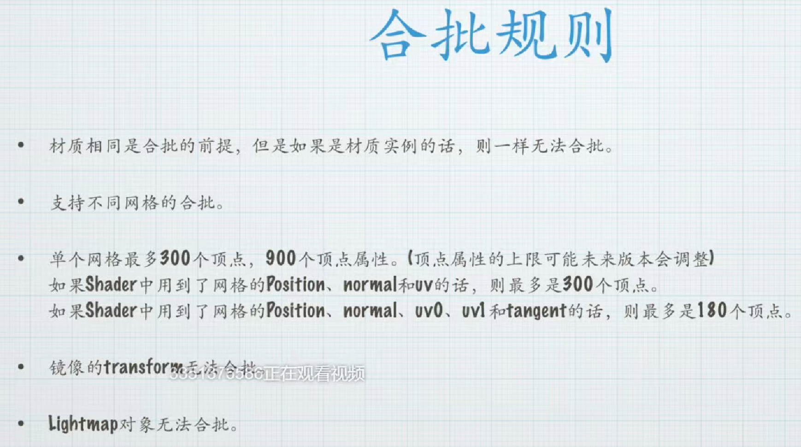
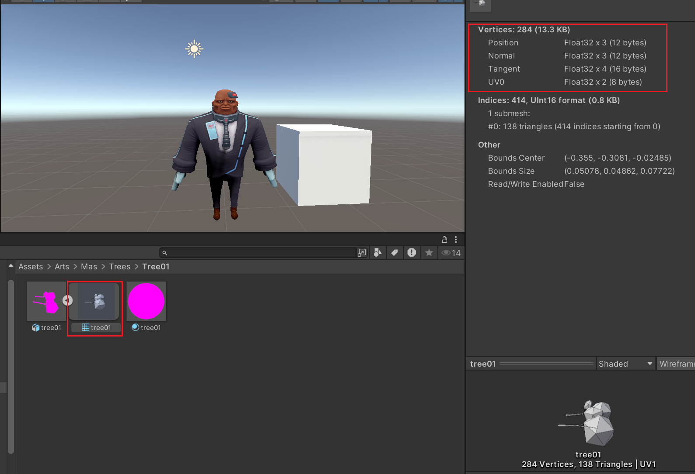

# 合批

动态合批：将多个独立绘制批次（n个）打包组合成单个批次

静态合批：与动态合批相同，必须使用同一材质球才能进行合批，相比动态合批规则更宽松，只需在面板标记设置即可。**推荐与Lightmap光照贴图配合使用。**
### 动态合批规则
关键是单个网格最多300个顶点，900个顶点属性。
如果只是在appdata中声明了属性，是不会算人合批规则的，只有在实际渲染过程中用到的顶点属性才会被计入。

  

选择物体的mesh可以查看其顶点属性
  

### 静态合批规则
**优点：**
显著减少绘制调用(Draw Call)

**缺点：**
合并后的大网格占用内存显著增加，实际测试中可能达到几MB级别

批次分割规则：当合并后的顶点数超过2^16时自动分新批次

核心条件：所有需要合批的对象必须使用完全相同的材质球

操作步骤：
- 选中场景中所有需要合批的对象
- 在Inspector面板统一指定相同材质
- 统一标记为static
  

