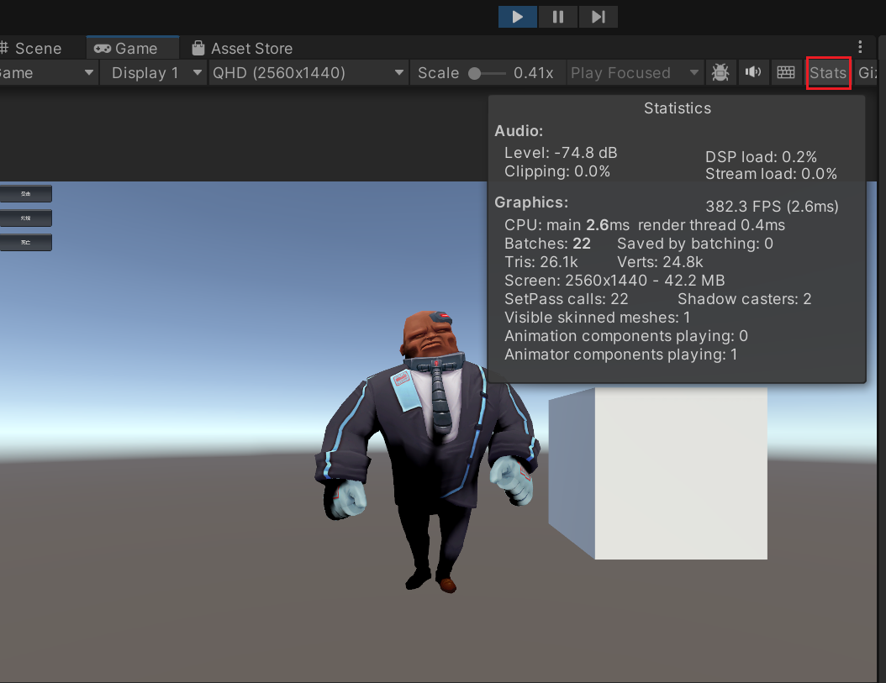
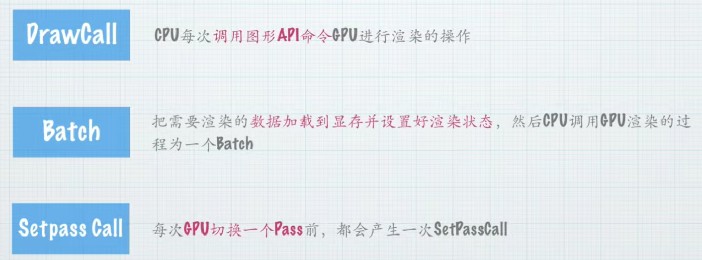

# C# 脚本相关

注意点
1. 内部名称与外部名称必须相同
   外部名称：test.cs
   内部名称（类名）：public class test: MonoBehaviour{}  
   冒号后表示继承，test为派生类，MonoBehaviour为基类
   **Unity中所有可挂载脚本必须直接或间接继承MonoBehaviour**，因为提供了Unity引擎调用的生命周期方法

- Start(): 在首次帧更新前调用
- Update(): 每帧调用一次
- OnCollision系列: 处理碰撞事件
- OnGUI(): 处理GUI绘制
```C
void OnGUI()
{
   GUI.Button(new Rect(float x,float y,float width,float height),string)
}
```

## 如何在代码中获和修改取材质
```C
void OnGUI()
{
   if (GUI.Button(new Rect(10, 10, 150, 50), "受击"))
   {
            SkinnedMeshRenderer mr = MyMonster.GetComponentInChildren<SkinnedMeshRenderer>();
            //需要明确：获取的是单个材质还是应用在所有物体上的材质
            //需要明确：获取的变量类型
            //需要明确：获取的变量名称
            var color =mr.sharedMaterial.GetColor("_Color");
            mr.sharedMaterial.SetColor("_Color",Color.green);

            Debug.Log(color);
   }
}
```


## 协程
类似于线程。并非真正开辟新线程，而是通过时间分片模拟并行效果。

- 基本概念：协程是一种特殊的函数，可以在特定位置暂停执行并在之后恢复，实现并行处理效果而不阻塞主线程。
  - IEnumerator：声明协程方法的返回类型
  - yield return：协程暂停点。协程不需要 return 值，只需要 yield return。
  - WaitForSeconds：常用等待指令，参数单位为秒
- 应用场景：适用于需要同时处理多个任务但又不希望影响主程序流程的情况，如角色受击闪白效果。

```C
//以上三个名称都是协程的固定用法
    void Start()
    {
        MyMonster = GameObject.Find("Character01");
        Debug.Log(MyMonster.transform);
        StartCoroutine(Wait());
        Debug.Log(1);
    }
    IEnumerator Wait()
    {
        yield return new WaitForSeconds(2);
        Debug.Log(2);
    }
```

实现逐帧调用

```C
//实现逐帧调用
IEnumerator getFired(float time)
{
    float _time = 0;
    while (true)
    {
        _time += Time.deltaTime;//每一帧的时间
        yield return new WaitForEndOfFrame(); //每一帧时停

        if (_time >= 2f)  //大于2s就退出循环
            yield break;//退出协程也需要用yield（等价于while中写）

        Color _color = Color.Lerp(Color.red, Color.black, _time / 2f);//在两秒内从黑变红，可以用插值制作需要的效果
        mat.SetColor("_Color", _color);
    }
}
```
## 协程控制变体

```C
while (true)
{
    yield return new WaitForEndOfFrame();
    _time += Time.deltaTime;
    if (_time >= time)
    {
        mat.SetFloat("_Clip", 0f);
        //mat.DisableKeyword("_DISSOLVEENABLED_ON");
        yield break;
    }
    mat.EnableKeyword("_DISSOLVEENABLED_ON");//控制材质面板开关Toggle，需要和subshader中声明的一致
    mat.SetFloat("_Clip", _time / time);
}
```

## Status
右上角stats可以查看渲染状态
  

**FPS**
（Frames Per Second）表示每秒渲染的帧数,

手游开发通常定为30FPS

PC端可能达到1000-2000FPS

- main：主线程耗时
- render thread：渲染线程耗时

网格数据：
- Tris：三角面数（示例场景默认1.7k）
- Verts：顶点数（示例场景默认5.0k）

屏幕信息：
- Screen：分辨率（如1586x892）
内存占用：16.2MB

### 批次
要降低消耗，重要的是降低批次，这样Drawcall和setpass call都会降低：

  

