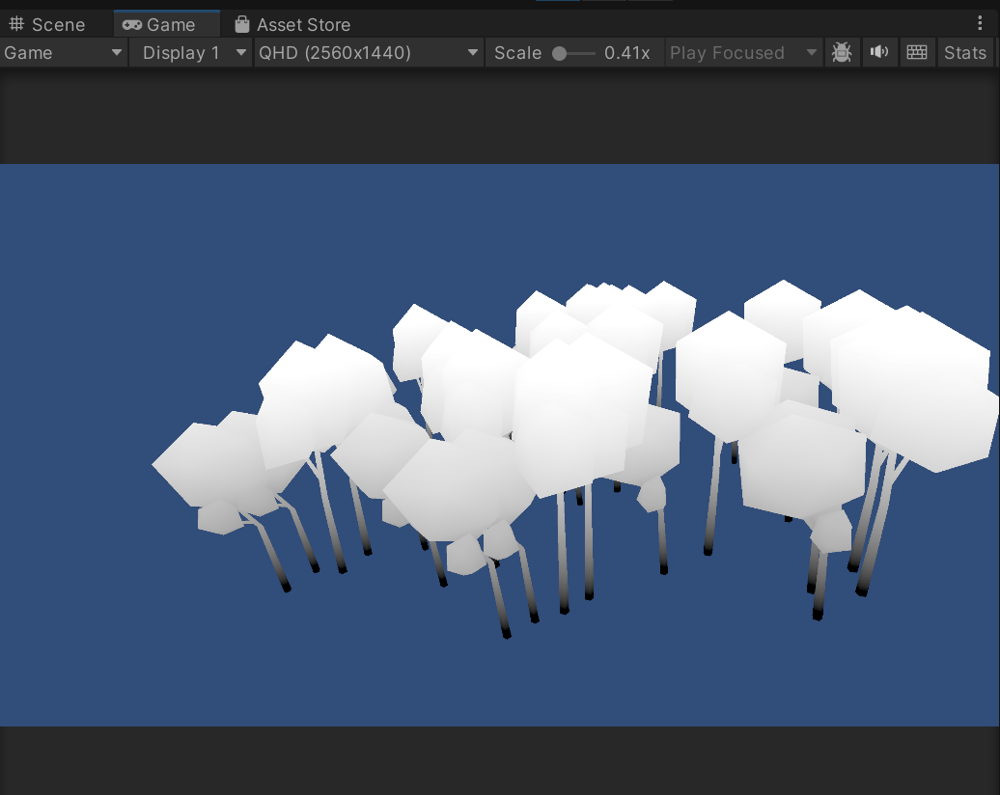
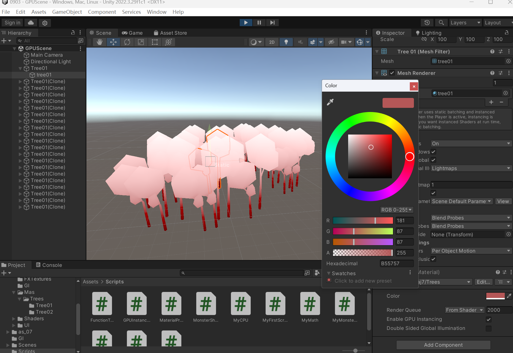
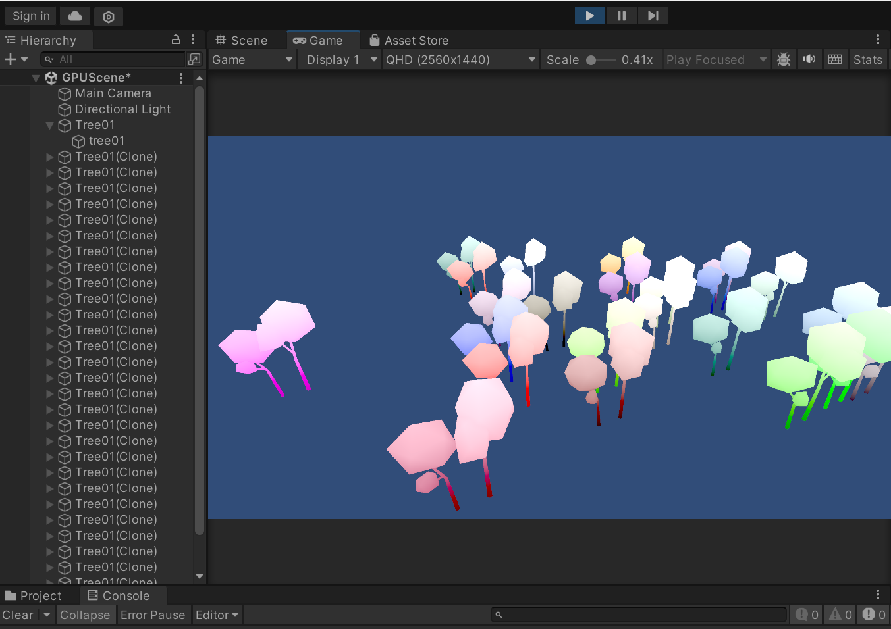

# GPU Instancing

批次合并效果：当场景中有多个相同模型时，GPU实例化可以将它们合并为少量批次（通常每批次最多500个对象），用于对多个对象(网格一样，材质一样，但是材质属性不一样)合批,单个合批最大上限为511个对象。

性能优化限制：超过500个对象时会自动分成第二个批次，存在一定的数量限制。

GPU Instancing**需要硬件支持+Shader支持+脚本支持**。

## Shader支持


使用材质属性块可以实现对每个生成的物体进行个性化定制，需要的步骤如下：

1. #pragma multi_compile_instancing 添加此指令后会使材质面板上曝露Instaning开关,同时会生成相应的Instancing变体
2. UNITY_VERTEX_INPUT_INSTANCE_ID 在顶点着色器的输入(appdata)和输出(v2f,可选项)中添加
3. UNITY_INSTANCING_BUFFER_START(arrayName) / UNITY_INSTANCING_BUFFER_END(arrayName) 将每个你需要实例化的属性都封装在这个常量寄存器中
4. UNITY_DEFINE_INSTANCED_PROP(type, name) 在上面的START和END间把需要的每条属性加进来
5. UNITY_SETUP_INSTANCE_ID(v); 需放在顶点着色器/片断着色器(可选)中最开始的地方,这样才能访问到全局的unity_InstanceID
6. UNITY_TRANSFER_INSTANCE_ID(v, o); 当需要将实例化ID传到片断着色器时,在顶点着色器中添加
7. UNITY_ACCESS_INSTANCED_PROP(arrayName, propName) 在片断着色器中访问具体的实例化变量

尝试只使用GPU Instancing但不使用材质属性块，如下：

注意：一定要设置好static物体，使用静态合批，并将脚本挂在camera上，否则很可能导致占用过大而闪退！！

  

  可以更换颜色

  

### 常量寄存器

如果除了位置以外，还想要对其他的属性进行个性化定制，如color或者其他float，则需要使用**常量寄存器**，具体步骤如上步骤。

```C
    //关键代码，在frag中使用变量需要做处理
    return i.wPos.y*0.15+UNITY_ACCESS_INSTANCED_PROP(prop,_Color );
```

## 脚本支持

使用材质属性块，可以在batch为1的前提下完成对每个新生成的物体的个性化渲染。

修改方式：必须通过MaterialPropertyBlock修改材质属性

批量修改原则：同一批次内修改的属性必须都在Shader的常量寄存器中定义

错误示范：修改未声明的属性会打断批次合并效果

  

``` C
//start(){}
for (int i = 0; i < Count; i++)
{
    Vector2 pos = Random.insideUnitCircle * Range;//生成单位圆
    GameObject tree = Instantiate(Prefab, new Vector3(pos.x, -5, pos.y), Quaternion.identity);//自动生成，并有一定角度的旋转

    //随机生成颜色
    Color newCol = new Color(Random.value, Random.value, Random.value, Random.value);

    //使用材质属性块:先声明，然后把要赋的类型给材质属性块，最后重新设置gameobject的材质属性块
    MaterialPropertyBlock prop = new MaterialPropertyBlock();
    prop.SetColor("_Color", newCol);
    tree.GetComponentInChildren<MeshRenderer>().SetPropertyBlock(prop);
    
    //会给每个生成的object都分配一次颜色然后通过不同的批次实现，非常耗费资源
    //tree.GetComponent<MeshRenderer>().material.SetColor("_Color", newCol);
}
```

