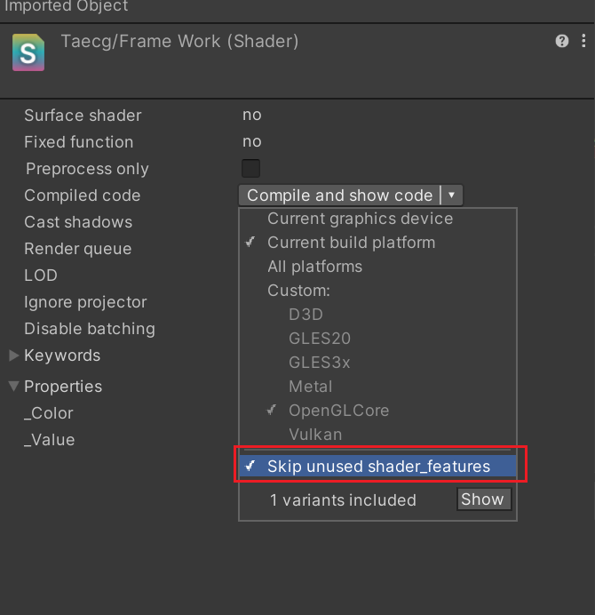
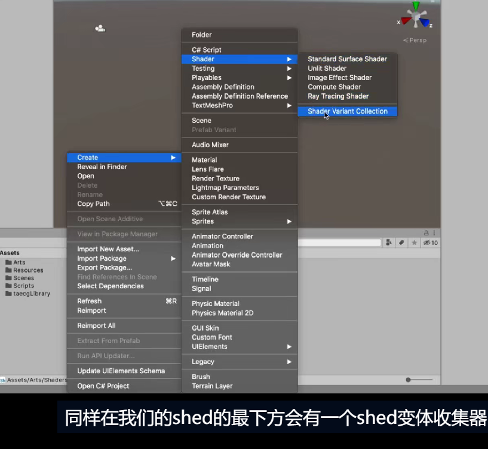
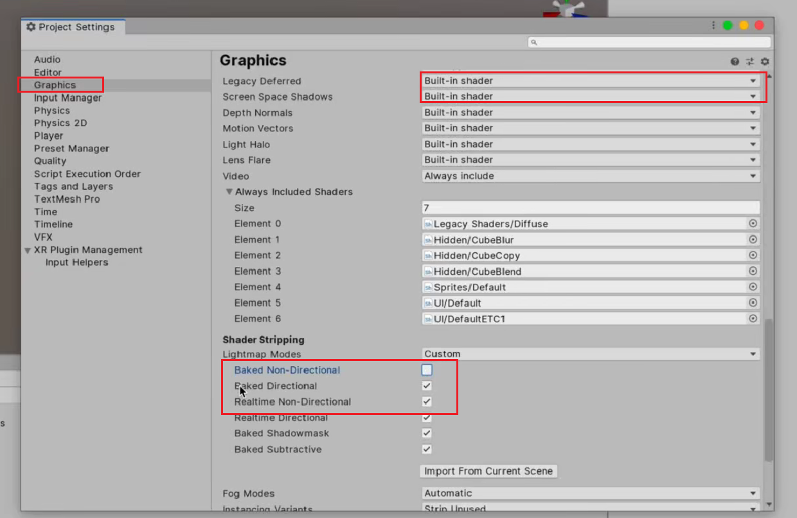
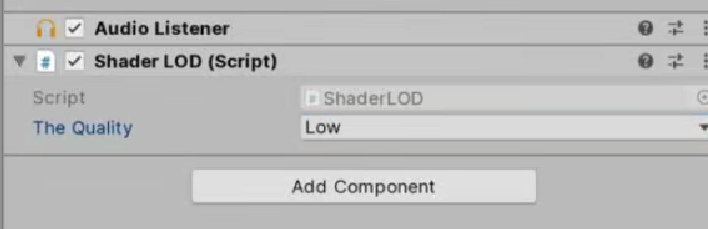

# 变体优化

#### 例子：雾效变体
```C
#pragma multi_compile_fog //默认。会定义三个变体
/* 优化方案一：*/
#pragma multi_compile _ _FOG_LINEAR //自定义，只有一个变体

/* 优化方案二：*/
# pragma skip_variants FOG_EXP FOG_EXP2 //直接跳过系统自动生成的两个变体
```
如果使用shader_feature，并勾选下方红框按键，就可以对每个deature只生成一个shader，节省性能，所以能用shader_feature不用complex。

 注意，shader_feature一般用于美术资源的开关，complex一般用于游戏程序的开关。
```C
#pragma shader_feature A B C
```
  

创建变体收集器可以把需要的变体在程序启动时就warmup，会增大native的内存，但对实时内存友好

  

可以在settings中把程序不会使用到的变体开关关闭
  

# Shader Model
### Unity的目标编译级别
```C
#pragma target x.x//指定编译目标级别
#pragma require xxx//声明需要的特定功能
```

版本特性:
- 2.0: 基本特性支持
- 2.5: 增加偏导函数支持
- 3.0: 2.5基础上增加10个插值器、LOD采样等,高版本逐步增加MRT、几何着色器等支持
- 
在Camera-ShaderLOD可以修改LOD的数目
  
