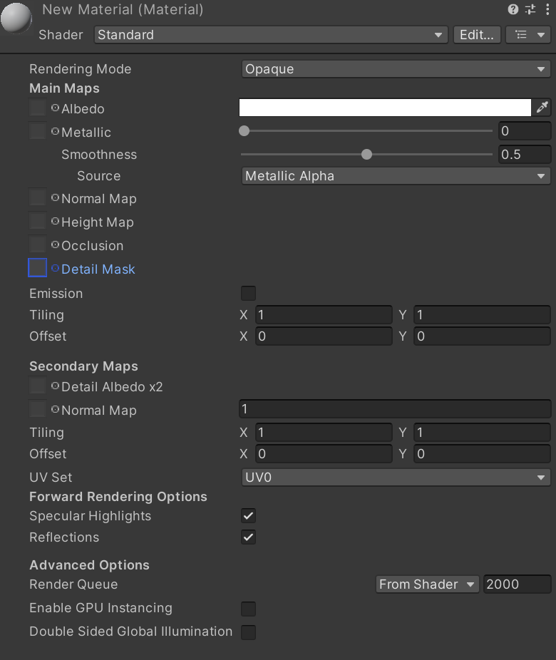
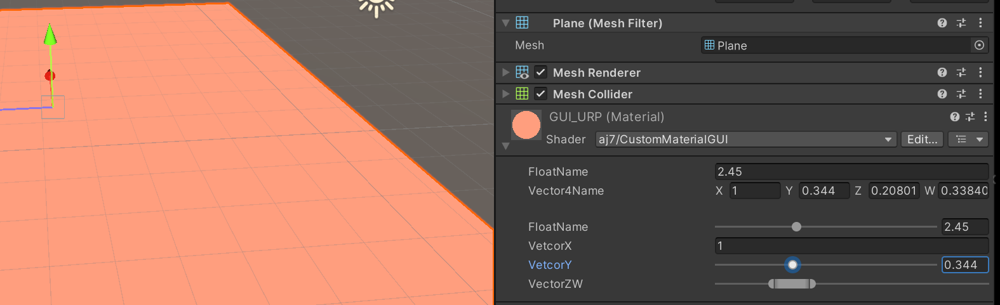

### CustomEditor GUI

**其实GUI的绘制相当于写前端，在这里你可以自定义变量出现的位置、长度、大小。**

想要自己在材质面板上做定义，需要：
    
1.在shader尾部添加```CustomEditor "CustomMaterialGUI"```

此时再看材质面板会多出一些东西


2.在脚本中重绘GUI

``` C#
using UnityEditor;

public class CustomMaterialGUI : ShaderGUI
{
    public override void OnGUI(MaterialEditor materialEditor, MaterialProperty[] properties)
    {
        //绘制原先的base面板
        base.OnGUI(materialEditor, properties);
    }
}
```


**P.S. 脚本放置目录**

目录规范,必须将GUI脚本放置在Editor文件夹内
特殊作用：
- 仅用于编辑器功能扩展
- 不会被打包进最终游戏
- Unity保留目录具有特殊处理逻辑


```C#
    public override void OnGUI(MaterialEditor materialEditor, MaterialProperty[] properties)
    {
        //base.OnGUI(materialEditor, properties);
        //获取相应属性
        floatProp = FindProperty("_Float", properties);
        //绘制相应属性
        materialEditor.FloatProperty(floatProp, "FloatName");
        //滑动条版本
        materialEditor.RangeProperty(floatProp, "FloatName");
    }

```
### 把vector拆开展示
方法是重新申明一个变量然后覆盖给vector
```C#
        //Make a text field for entering integers,注意一定要写返回值，不然拿不到这个数重新赋值
        vectorX = EditorGUILayout.IntField("VetcorX", vectorX);
        //重新赋值给vectorprop材质
        UnityEngine.Vector4 Vector4_new = new UnityEngine.Vector4(vectorX, vectorY, vectorZ, vectorW);
        vectorProp.vectorValue = Vector4_new;
```

### 滑动条和范围滑动条
都需要再获取之后同上，重新赋值。
```C#
        //滑动条版本 
        vectorY = EditorGUILayout.Slider("VetcorY", vectorY, 0, 1);
```
```C#
        //范围滑动条版本
        EditorGUILayout.MinMaxSlider("VectorZW", ref vectorZ, ref vectorW, 0f, 1f);

```


