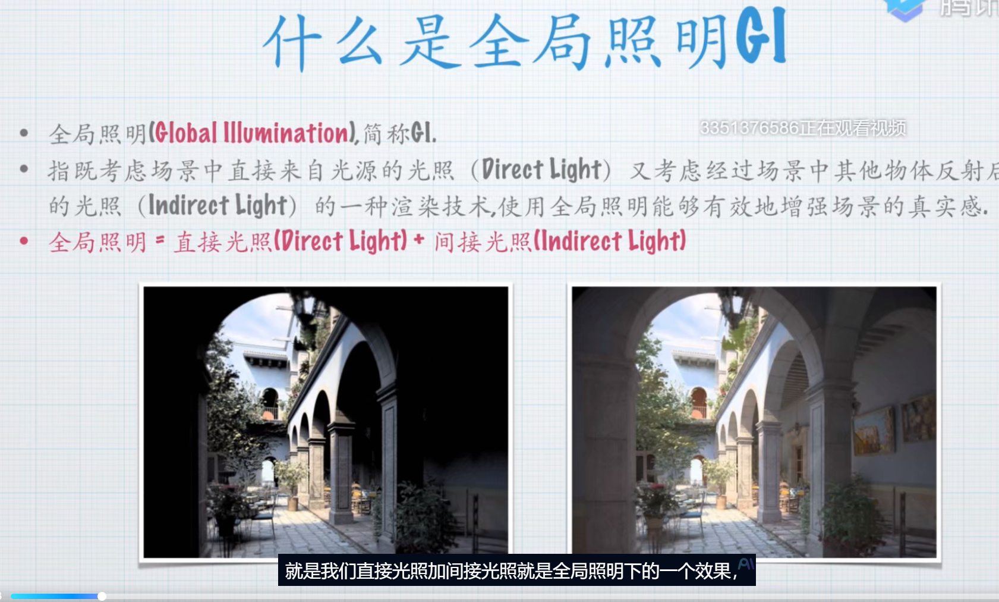

# GI

**烘焙和实时全局光照是只对静态物体有效**

**Baked Indirect模式：**
- 仅烘焙间接光照
- 直接光保持实时计算
- 适用场景：需要动态光源但保留GI效果的场景
 

**Subtractive模式：**
- 完全烘焙直接光和间接光
- 动态物体仅接收实时阴影
- 特点：关闭灯光后场景光照不变

### 阴影模式 

**Shadowmask模式：**
- 直接光和间接光分开烘焙
- 阴影单独存储在遮罩贴图
- 灯光强度变化影响阴影强度

工程设置：在Quality Settings中配置Shadowmask Mode
距离遮挡掩模 

**Distance Shadowmask：**
- 近处使用实时阴影,远处使用烘焙阴影
- 通过Shadow Distance参数控制过渡范围
- 性能优化：平衡视觉效果与性能消耗