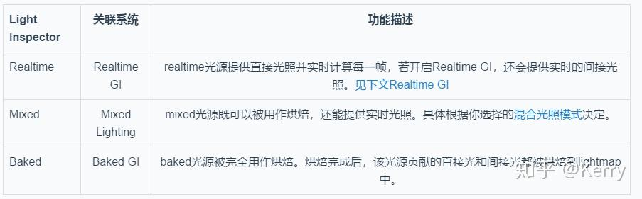
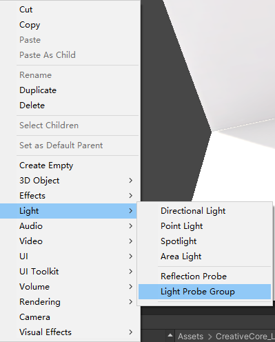
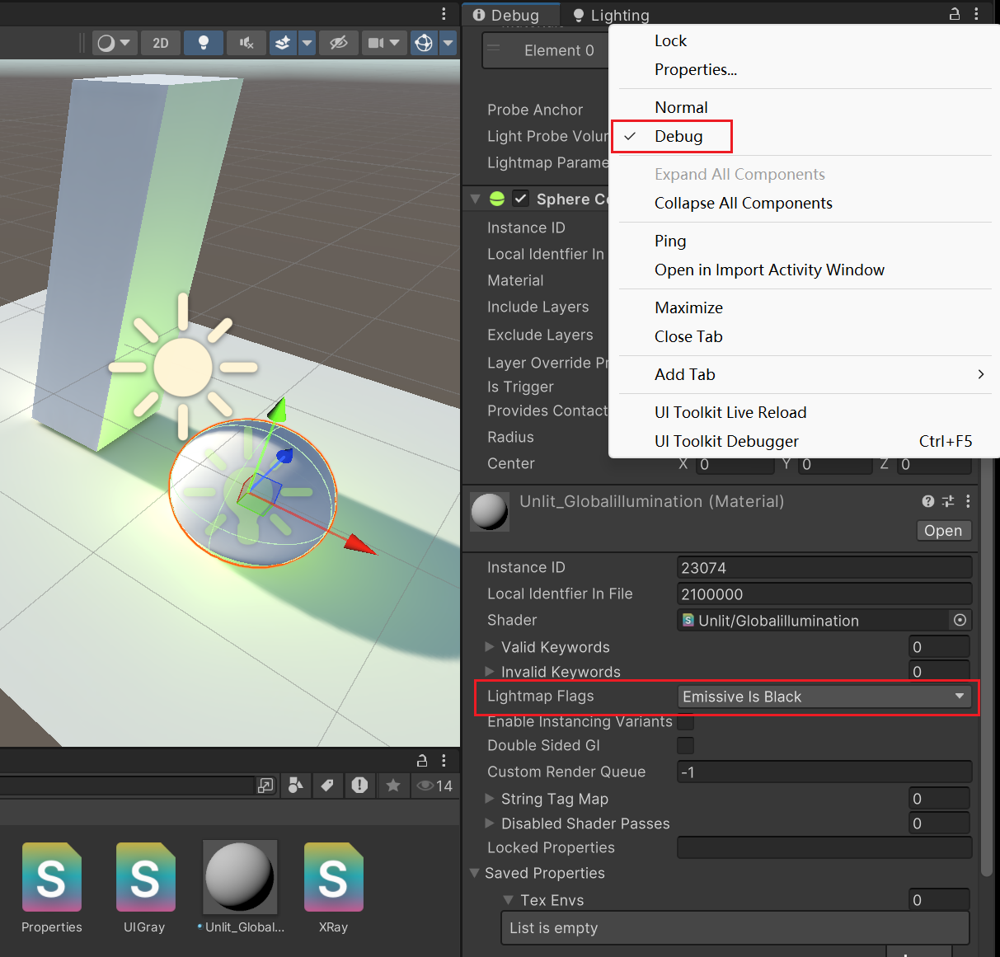

# GI


**烘焙和实时全局光照是只对静态物体有效**

实现GI有两种方案Realtime GI和Baked GI，对应的最终实现的形式为Dynamic Lightmap动态光照贴图和Lightmap光照贴图。

### 光照模式(Lighting Modes)
选中灯光，在Inspector面板中，你可以指定光源的光照模式，这个光照模式定义了该光源的预期用途。



**Mixed Lighting**
>典型应用一：灯光的间接光部分被烘焙到lightmap中，烘焙完成后，该光源还能继续参与实时光照计算，以提供材质的法线高光效果。 

>典型应用二：将灯光对静态物体产生的阴影烘焙到单独的lightmap中，这种lightmap叫做ShadowMask，在运行时，根据ShadowMask，对动态物体产生的实时阴影能够与烘焙阴影更好地混合。

场景中的所有混合灯光使用相同的混合光照模式(Mixed Lighting Mode)，需要在Lighting面板Mixed Lighting选项的Lighting Mode中进行选择，有Subtractive、Baked Indirect、ShadowMask、DistanceShadowMask四种模式。

**Subtractive模式**
- 完全烘焙直接光和间接光
- 动态物体仅接收实时阴影
- 特点：关闭灯光后场景光照不变
- 
会将Mixed灯光的直接照明、间接照明、阴影信息全部烘焙到Lightmap中去，这一点跟Baked GI是一样。

Subtractive模式也是四种混合光照模式中，唯一会将直接照明烘焙到lightmap的模式。

```C#
    //BakedGI为例
    #if defined(LIGHTMAP_ON) 
    o.lightmapUV.xy = v.texcoord1 * unity_LightmapST.xy + unity_LightmapST.zw; // 计算光照贴图的UV坐标
    #endif
```
**Baked Indirect模式：**
- 仅烘焙间接光照
- 直接光保持实时计算，Mixed灯光会继续为所有物体提供实时直接照明和实时阴影
- 适用场景：需要动态光源但保留GI效果的场景
 

**Shadowmask模式：**
- 直接光和间接光分开烘焙
- 阴影单独存储在遮罩贴图
- 灯光强度变化影响阴影强度

工程设置：在Quality Settings中配置Shadowmask Mode
距离遮挡掩模 

在ShadowMask模式下：
静态GameObjects通过ShadowMask接收来自其他静态GameObjects的阴影。他们也会从动态GameObjects中获得实时阴影，但是只有阴影距离(Shadow Distance)内的阴影。

**Distance Shadowmask：**
- 近处使用实时阴影,远处使用烘焙阴影
- 通过Shadow Distance参数控制过渡范围
- 性能优化：平衡视觉效果与性能消耗
  
我们在烘焙的时候，动态物体收到的光照影响是不能直接烘焙进 bakedLightMap，用实时光照就会产生强大的额外开销。所以光照探针，是对lightMap的补充，

###  光照探针
光探测器（光照探针 Light Probe）存储有关场景中照明的“烘焙”信息。

光照贴图存储有关光线照射场景中表面的光照信息，但光照探测器存储有关光线穿过场景中空白空间的信息。

说白了，光照贴图只存储 mesh 表面的光影信息；而光照探针，存储空白空间的光影信息，包括直接光和间接光（反射光），是对光照贴图的补充

### 光照探针组 Light Probe Group
光照探针组就是一组光照探针，默认是一个立方体，4*2一组，共八个光照探针组成。

可以通过编辑，增加或删除光照探针，也可以随意移动光照探针位置。




### 间接光的产生Meta Pass

关于Unity里自发光材质的烘焙，一个是要加上Meta Pass，一个是要设置材质的Lightmap Flags设置为BakedEmissive

实现间接光反弹（物体对其他物体产生间接光照效果）

* 核心方法：通过添加**Meta Pass**实现间接光计算

* Pass特性：
仅在烘焙时使用，不影响实时渲染
负责提取光照贴图、GI(发射、反照率)信息


实操控制物体自发光的间接光照：打开debug模式，Lightmap Flags可以控制各种模式下的间接光，设置为None则不产生间接光