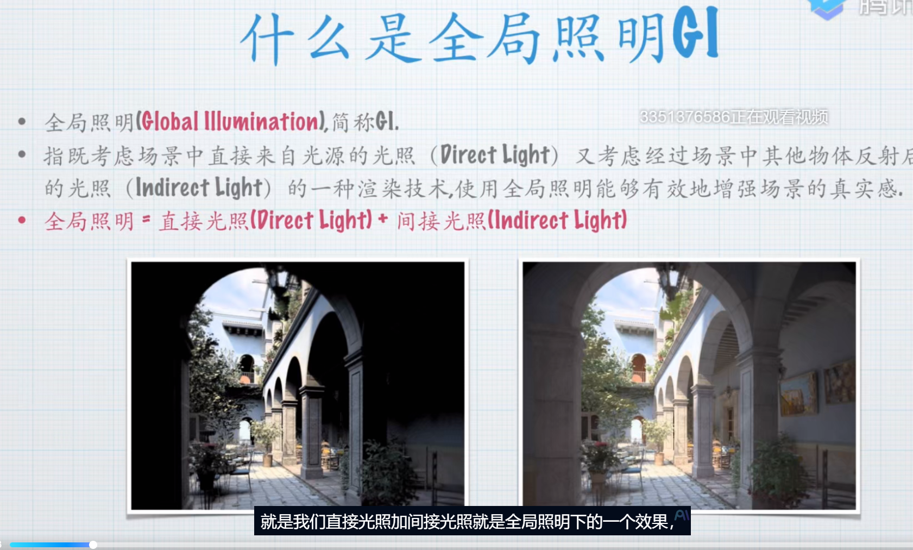
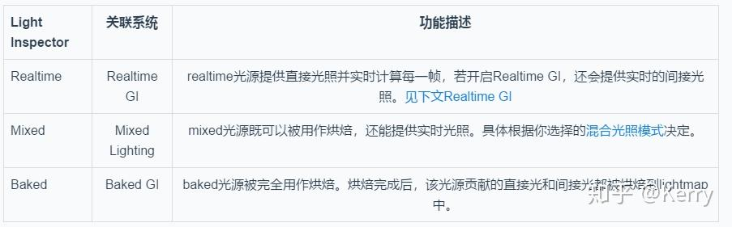
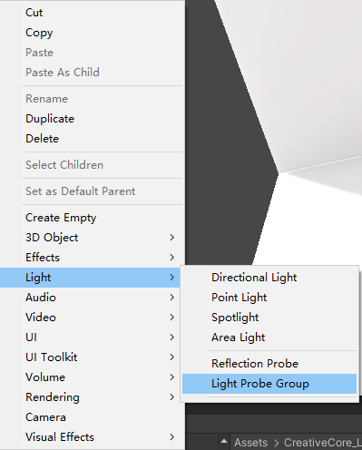
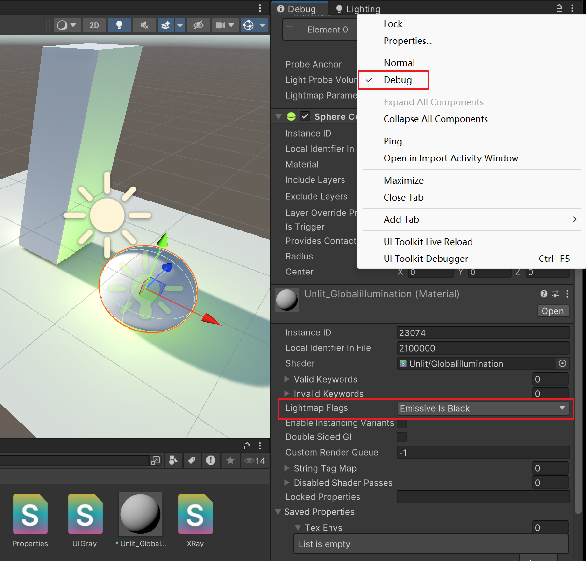

# 全局光照（Global Illumination, GI）



## 概述

**全局光照（GI）** 是指模拟光线在场景中多次反射和散射的效果，使物体不仅能接收直接光照，还能接收来自其他物体反射的间接光照，从而呈现更真实的光照效果。

**重要限制：** 烘焙和实时全局光照仅对静态物体有效。动态物体需要使用光照探针来接收GI信息。

### GI实现方案

Unity提供两种GI实现方案：

| 方案 | 说明 | 最终形式 | 适用场景 |
|------|------|----------|----------|
| **Realtime GI** | 实时计算全局光照 | Dynamic Lightmap（动态光照贴图） | 需要光照动态变化的场景，性能开销较大 |
| **Baked GI** | 预烘焙全局光照 | Lightmap（光照贴图） | 静态场景，性能最优，但无法动态改变光照 |

**选择建议：**
- 移动平台/性能优先：使用Baked GI
- PC/高端设备且需要动态光照：使用Realtime GI或Mixed Lighting

### 光照模式（Lighting Modes）

选中灯光，在Inspector面板中可以指定光源的光照模式，这个模式定义了该光源的预期用途和计算方式。



Unity提供三种光照模式：
- **Realtime（实时）**：每帧实时计算，完全动态，性能开销最大
- **Baked（烘焙）**：完全预烘焙，静态，性能最优但无动态效果
- **Mixed（混合）**：结合实时和烘焙，平衡性能和动态效果

#### Mixed Lighting（混合光照）

混合光照是Unity GI系统的核心功能，允许部分光照信息被烘焙，同时保留部分实时效果。

**典型应用场景：**

> **应用一：** 灯光的间接光部分被烘焙到lightmap中，烘焙完成后，该光源还能继续参与实时光照计算，以提供材质的法线高光效果（Normal Specular）。

> **应用二：** 将灯光对静态物体产生的阴影烘焙到单独的lightmap中，这种lightmap叫做ShadowMask。在运行时，根据ShadowMask，对动态物体产生的实时阴影能够与烘焙阴影更好地混合。

**重要提示：** 场景中的所有混合灯光使用相同的混合光照模式（Mixed Lighting Mode），需要在`Window > Rendering > Lighting`面板的`Mixed Lighting`选项中统一选择。


#### 1. Subtractive（减法）模式

**工作原理：**
- 完全烘焙直接光和间接光到Lightmap
- 动态物体仅接收实时阴影
- **特点：** 关闭灯光后场景光照不变（因为光照已完全烘焙）

**技术细节：**
Subtractive模式会将Mixed灯光的直接照明、间接照明、阴影信息**全部**烘焙到Lightmap中去，这一点跟Baked GI完全一样。它是四种混合光照模式中，**唯一会将直接照明烘焙到lightmap的模式**。

**适用场景：**
- 静态场景为主，动态物体较少
- 性能要求极高（如移动平台）
- 不需要光照动态变化

**Shader中的实现：**
```C#
// Baked GI示例：在Shader中采样光照贴图
#if defined(LIGHTMAP_ON) 
    // 计算光照贴图的UV坐标
    // unity_LightmapST是Unity提供的缩放和平移参数，用于将模型UV映射到光照贴图UV
    o.lightmapUV.xy = v.texcoord1 * unity_LightmapST.xy + unity_LightmapST.zw;
#endif
```
#### 2. Baked Indirect（烘焙间接光）模式

**工作原理：**
- **仅烘焙间接光照**到Lightmap
- **直接光保持实时计算**，Mixed灯光会继续为所有物体提供实时直接照明和实时阴影
- 直接光照可以动态变化（颜色、强度等）

**适用场景：**
- 需要动态光源但保留GI效果的场景
- 需要改变光照颜色、强度但场景结构相对固定
- 移动平台上的较好选择（性能优于完全实时）

**性能特点：**
- 间接光计算成本已被烘焙承担
- 直接光仍需要实时计算，但开销较小
- 适合中等性能要求

#### 3. Shadowmask（阴影遮罩）模式

**工作原理：**
- 直接光和间接光分开烘焙
- 阴影单独存储在**ShadowMask贴图**中
- 灯光强度变化会影响阴影强度（因为是实时阴影）

**技术细节：**
- 静态GameObjects通过ShadowMask接收来自其他静态GameObjects的阴影
- 静态物体也会从动态GameObjects中获得实时阴影，但**只有阴影距离（Shadow Distance）内的阴影**

**工程设置：**
需要在`Edit > Project Settings > Quality`中配置Shadowmask Mode，有两个选项：
- **Shadowmask**：完全使用ShadowMask
- **Distance Shadowmask**：混合模式（见下）

#### 4. Distance Shadowmask（距离阴影遮罩）模式

**工作原理：**
- **近处使用实时阴影**，远处使用烘焙阴影
- 通过**Shadow Distance**参数控制过渡范围
- 性能优化：在视觉效果与性能消耗之间取得平衡

**优势：**
- 近处阴影质量高（实时计算）
- 远处阴影成本低（使用烘焙）
- 可以根据性能需求调整Shadow Distance

**选择建议对比表：**

| 模式 | 直接光 | 间接光 | 阴影 | 性能 | 动态性 |
|------|--------|--------|------|------|--------|
| Subtractive | 烘焙 | 烘焙 | 烘焙 | ⭐⭐⭐⭐⭐ | ⭐ |
| Baked Indirect | 实时 | 烘焙 | 实时 | ⭐⭐⭐⭐ | ⭐⭐⭐ |
| Shadowmask | 实时 | 烘焙 | 实时+烘焙 | ⭐⭐⭐ | ⭐⭐⭐⭐ |
| Distance Shadowmask | 实时 | 烘焙 | 混合 | ⭐⭐⭐ | ⭐⭐⭐⭐ |
  
## 光照探针（Light Probe）

### 为什么需要光照探针？

**核心问题：**
- Lightmap只能存储**静态物体表面**的光照信息
- **动态物体**无法使用Lightmap（因为它们在运行时可以移动）
- 如果对动态物体使用完全实时光照，会产生巨大的性能开销

**解决方案：** 光照探针是对Lightmap的补充，专门用于动态物体。

### 光照探针的概念

**光探测器（光照探针 Light Probe）**存储有关场景中照明的"烘焙"信息。

**关键区别：**
- **光照贴图（Lightmap）**：存储光线照射**场景表面**的光照信息（只能用于静态Mesh表面）
- **光照探针（Light Probe）**：存储光线穿过**空白空间**的光照信息（用于动态物体的空间位置）

**通俗理解：**
- Lightmap：只存储 mesh 表面的光影信息
- Light Probe：存储**空白空间**的光影信息，包括直接光和间接光（反射光），是对Lightmap的补充

### 光照探针的工作原理

当动态物体在场景中移动时，Unity会：
1. 找到物体周围最近的光照探针
2. 通过插值计算出该位置的光照信息
3. 将这些信息应用到动态物体上

这样动态物体就能接收GI效果，而无需进行昂贵的实时GI计算。

**适用场景：**
- 动态物体需要在复杂的间接光照环境中移动
- 室内场景（光照比较复杂，有多重反射）
- 需要动态物体与静态场景光照效果统一

**参考文章：** https://zhuanlan.zhihu.com/p/347708855
### 光照探针组（Light Probe Group）

光照探针组是场景中一组光照探针的集合。

**默认配置：**
- 默认是一个立方体排列
- 4×2一组，共八个光照探针组成

**编辑方式：**
- 可以通过编辑增加或删除光照探针
- 可以随意移动光照探针位置
- 建议在光照变化明显的位置（如墙角、明暗交界处）放置更多探针

**放置建议：**
- 在光照变化剧烈的地方（如门口、窗户附近）放置密集的探针
- 在光照均匀的地方可以放置较少的探针
- 探针之间保持合理距离，避免过度密集（浪费性能）或过于稀疏（效果不佳）




## 间接光的产生 - Meta Pass

### 自发光物体的间接光

当物体具有自发光材质（Emissive Material）时，这些光线会影响周围物体，产生间接光照效果。这就是"**间接光反弹**"。

### Meta Pass的作用

**核心方法：** 通过添加**Meta Pass**来实现间接光计算。

**Pass特性：**
- **仅在烘焙时使用**，不影响实时渲染性能
- 负责提取光照贴图、GI信息（发射光、反照率等）
- 告诉Unity烘焙系统：这个材质在GI计算中应该贡献多少光照

### 实现步骤

要让自发光材质参与GI烘焙，需要：

1. **添加Meta Pass到Shader：**
   - 在Shader中添加一个特殊的Pass，用于GI信息提取
   - 这个Pass只在烘焙时执行

2. **设置材质属性：**
   - 将材质的**Lightmap Flags**设置为`BakedEmissive`
   - 这样Unity才知道这个材质需要参与GI计算

**实操控制：**
- 打开Debug模式（`Lighting > Settings > Debug`）
- `Lightmap Flags`可以控制各种模式下的间接光
- 设置为`None`则不产生间接光



**典型应用：**
- 霓虹灯、LED屏幕等自发光物体照亮周围环境
- 火焰、灯泡等光源物体产生间接光照
- 需要强调间接光效果的场景

## 光照模型（Lighting Model）

### 什么是光照模型？

光照模型是用来模拟物体表面如何被光线照亮的数学公式。它定义了如何计算物体表面的颜色和亮度。

### 光照模型的组成

一个完整的光照模型通常由三个部分组成：

1. **环境光（Ambient）**
   - 模拟从周围环境（如墙壁、其他物体）反弹过来的间接光
   - 它是一个常量，确保物体没有直接被光源照射的部分也不是完全漆黑的
   - 这是GI的基础，确保暗部也有一定的可见度

2. **漫反射（Diffuse）**
   - 模拟光线撞击物体表面后，向各个方向均匀散射的现象
   - 这是物体本身呈现的颜色
   - 它的强度与**光线方向和表面法线的夹角**有关（遵循Lambert定律）

3. **镜面高光（Specular）**
   - 模拟光线在光滑表面上的反射，形成亮斑（高光）
   - 它的强度与**观察者的位置**密切相关
   - 让物体看起来有光泽和质感

### 两种常见光照模型

| 模型 | 包含部分 | 特点 |
|------|----------|------|
| **Lambert** | 环境光 + 漫反射 | 只模拟漫反射，物体看起来哑光 |
| **Blinn-Phong** | 环境光 + 漫反射 + 镜面高光 | 包含高光，物体看起来有光泽 |

**核心区别：** Lambert模型只包含前两部分，而Blinn-Phong模型则包含全部三部分。这就是它们最根本的区别。

### Lambert光照模型

Lambert模型描述的是一个**理想的漫反射体**，比如粉笔、粗糙的墙面。这种表面会将入射光均匀地散射到所有方向。

#### 核心思想

**漫反射的强度只取决于光线入射角，与观察者的位置无关。**

**光照强度规律：**
- 光线垂直照射时（入射角为0°）→ **最亮**
- 光线擦着表面照射时（入射角接近90°）→ **最暗**
- 当光线从背面照射时（入射角大于90°）→ **不接受光照**

这就是为什么同一个物体，面向光源的一面亮，背向光源的一面暗。

#### 数学公式

漫反射光的强度计算公式为：

```
Diffuse = Kd × LightColor × max(dot(N, L), 0)
```

**参数说明：**

| 参数 | 说明 |
|------|------|
| **Kd** | 物体的漫反射系数，其实就是物体的颜色（一个RGB向量） |
| **LightColor** | 光源的颜色和强度 |
| **N** | 物体表面该点的单位法线向量（垂直于表面） |
| **L** | 从该点指向光源的单位向量 |
| **dot(N, L)** | 计算法线向量N和光线向量L的点积，几何意义是衡量两个向量的夹角余弦值（cosθ） |
| **max(..., 0)** | 确保结果不为负数（背面不接受光照） |

**点积的几何意义：**
- `dot(N, L) = |N| × |L| × cos(θ)` = `cos(θ)`（因为N和L都是单位向量）
- 当N和L方向一致（入射角0°）时，cos(0°) = 1，最亮
- 当N和L垂直（入射角90°）时，cos(90°) = 0，最暗
- 当N和L反向（入射角>90°）时，cos(θ) < 0，被max函数限制为0

#### 优缺点总结

**优点：**
- 计算非常简单，性能开销小
- 适合实时渲染
- 模拟粗糙表面的效果很好

**缺点：**
- 无法表现镜面高光，因此物体看起来是"哑光"的，缺乏光泽感
- 所有方向的观察者看到的效果都一样（因为没有高光）

**适用场景：**
- 表现粗糙、无光泽的物体
- 如：木头、石头、粉笔、布料等
- 移动平台的低配渲染

### Blinn-Phong光照模型

Blinn-Phong模型是对早期Phong模型的改进。它在Lambert的漫反射基础上，**增加了一个镜面高光项**。这个高光的强度不仅取决于光线方向，还强烈依赖于观察者的视角。

#### 核心改进

Blinn-Phong的巧妙之处在于引入了一个"**半程向量（Half Vector）**"来计算高光：
- 比原始Phong模型（直接计算反射向量和视线向量的夹角）**计算效率更高**
- 视觉效果更好，高光更柔和自然

#### 完整公式

```
FinalColor = Ambient + Diffuse + Specular
```

**各组成部分：**

1. **环境光（Ambient）**
   ```
   Ambient = Ka × LightColor
   ```
   - Ka：环境光系数，通常是个很小的值（如0.1）
   - 确保暗部也有基本可见度

2. **漫反射（Diffuse）**
   ```
   Diffuse = Kd × LightColor × max(dot(N, L), 0)
   ```
   - 和Lambert模型的计算公式**完全一样**
   - 与观察者位置无关

3. **镜面高光（Specular）**
   ```
   Specular = Ks × LightColor × pow(max(dot(N, H), 0), Shininess)
   ```
   这是Blinn-Phong的关键部分！

**参数说明：**

| 参数 | 说明 |
|------|------|
| **Ks** | 物体的镜面反射系数，通常是一个浅灰色或白色，表示高光的颜色 |
| **N** | 物体表面该点的单位法线向量 |
| **H** | **半程向量**，是光线向量L和视线向量V的角平分线方向的单位向量<br>计算公式：`H = normalize(L + V)` |
| **L** | 从该点指向光源的单位向量 |
| **V** | 从该点指向观察者（相机）的单位向量 |
| **dot(N, H)** | 计算法线N和半程向量H的点积<br>这个值越大，说明视线方向越接近光线的完美反射方向，高光就越强 |
| **pow(..., Shininess)** | pow是幂函数，Shininess是光泽度系数（也叫反光度）<br>Shininess越大，高光越集中、越亮<br>通常范围：32-256 |

#### 半程向量（Half Vector）的理解

**为什么使用半程向量？**

原始Phong模型需要计算：
- 反射向量R（从L反射得到的向量）
- 然后计算R和V的夹角

Blinn-Phong只需要：
- 计算半程向量H = normalize(L + V)
- 然后计算N和H的夹角

**直观理解：**
- 当视线V越接近完美反射方向时，H就越接近法线N
- dot(N, H)就越大
- 高光就越强

这就是为什么从特定角度观察光滑表面时，能看到亮点（高光）。

#### 优缺点总结

**优点：**
- 计算比原始Phong模型更高效（半程向量的计算比反射向量简单）
- 能产生逼真的高光效果，让物体看起来有光泽
- 在PBR（基于物理的渲染）流行之前，它是绝对的主流
- 适合表现金属、塑料、陶瓷等有光泽的材质

**缺点：**
- 仍然是一个经验模型，不完全符合物理规律
- 不如PBR材质真实（PBR基于物理原理，能更准确地模拟材质属性）

**适用场景：**
- 需要表现有光泽的物体（金属、塑料、玻璃等）
- 性能要求中等，需要较好视觉效果
- 在PBR材质不可用的场景中作为替代方案

### 两种模型的对比

| 特性 | Lambert | Blinn-Phong |
|------|---------|-------------|
| **计算复杂度** | 低 | 中等 |
| **视觉效果** | 哑光 | 有光泽 |
| **高光** | 无 | 有 |
| **性能** | 最优 | 良好 |
| **适用材质** | 粗糙材质 | 光滑材质 |
| **与视角关系** | 无关 | 相关（高光部分） |

---

## 总结

### 核心概念回顾

1. **全局光照（GI）**：模拟光线多次反射，产生更真实的光照效果
   - 对静态物体：使用Lightmap
   - 对动态物体：使用Light Probe

2. **光照模式选择**：
   - 完全静态场景 → Baked GI 或 Subtractive
   - 需要动态光照 → Baked Indirect 或 Shadowmask
   - 性能优先 → 使用烘焙模式
   - 视觉效果优先 → 使用实时或混合模式

3. **光照探针**：连接静态GI和动态物体的桥梁，让动态物体也能接收间接光照

4. **Meta Pass**：让自发光材质参与GI计算，产生间接光照效果

5. **光照模型**：
   - **Lambert**：简单高效，适合粗糙材质
   - **Blinn-Phong**：增加高光，适合光滑材质

### 实际应用建议

**性能优化路线图：**
1. 优先使用Baked GI（性能最好）
2. 动态物体使用Light Probe（而非完全实时计算）
3. 根据需求选择Mixed Lighting模式
4. 合理放置Light Probe（不要过度密集）
5. 使用Distance Shadowmask平衡阴影质量和性能

**常见问题：**
- **Q: 为什么动态物体看起来没有间接光？**  
  A: 需要放置Light Probe Group，并在动态物体的Renderer组件中启用"Use Light Probes"

- **Q: 自发光物体没有照亮周围？**  
  A: 需要添加Meta Pass到Shader，并设置材质的Lightmap Flags为BakedEmissive

- **Q: 如何选择Mixed Lighting模式？**  
  A: 参考文档中的对比表格，根据性能需求和动态性需求选择

### 延伸学习

- **PBR（基于物理的渲染）**：更先进的渲染技术，Unity的Standard Shader就是基于PBR的
- **Enlighten系统**：Unity的GI系统（已被废弃，现在主要使用Progressive Lightmapper）
- **Lightmap UV**：需要为静态物体设置第二套UV用于光照贴图