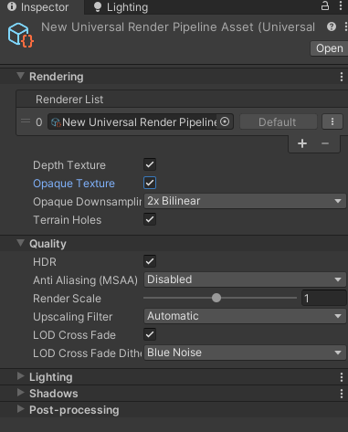
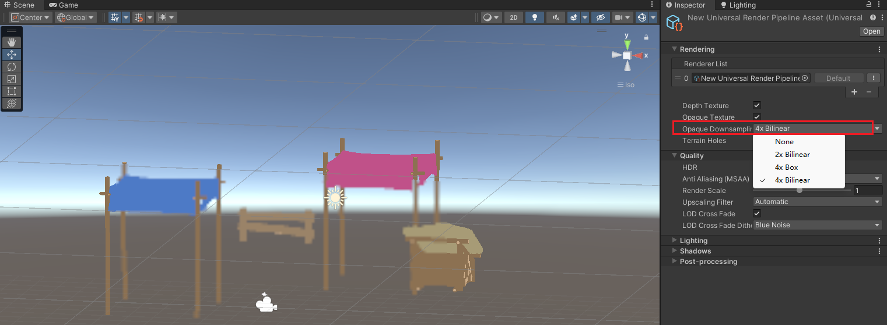

## URP下的抓屏
在BuildIn下，应该使用grabpass

在URP下打开Opaque Texture
  
```C
TEXTURE2D(_CameraOpaqueTexture); 
SAMPLER(sampler_CameraOpaqueTexture); 

...

frag(){
    ...
//Opaque Tex
half4 opaqueMap = SAMPLE_TEXTURE2D(_CameraOpaqueTexture, sampler_CameraOpaqueTexture, screenUV);
return 1-0.3*opaqueMap;//只为了看效果使用该公式
}
                
```
### 降采样
  
