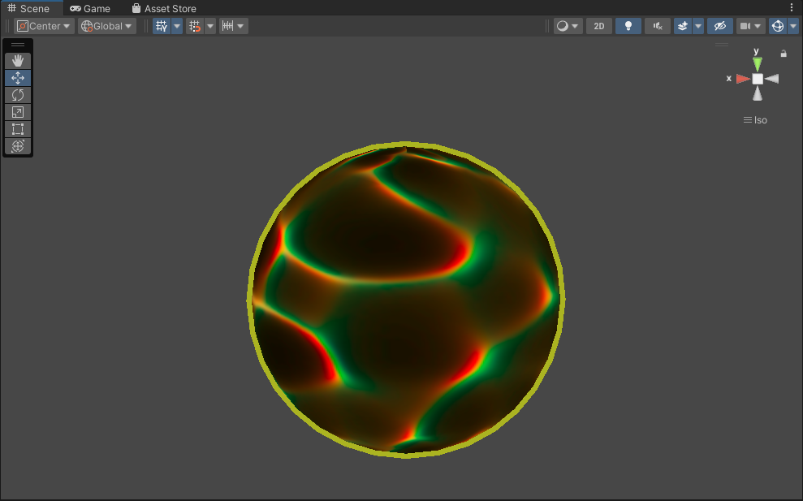
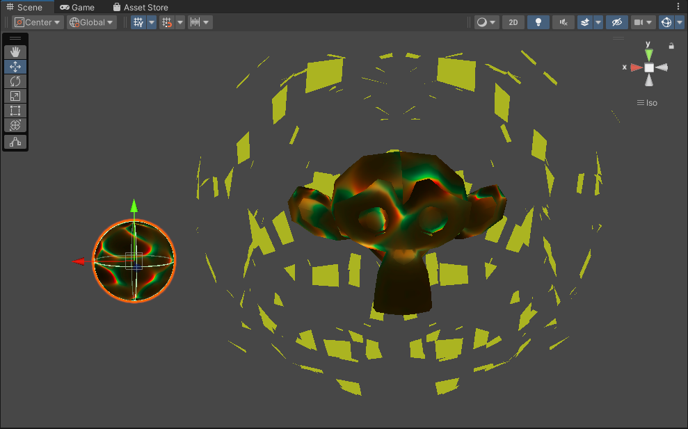

# 外轮廓描边(待补充)

本节基于模型的描边方法，

## 背景
学习：[在shader中实现五种描边方法] : https://zhuanlan.zhihu.com/p/410710318#

1. 基于观察角度和表面法线 通过视角方向和表面法线点乘结果来得到轮廓线信息。 简单快速，但局限性大。

2. 过程式几何轮廓线渲染。 核心是两个Pass：第一个Pass用来渲染轮廓；第二个Pass正常渲染正面。 快速有效，适应于大多数表面平滑的模型，但不适合立方体等平整模型。


  
实现原理：

其实就是把前面的模板测试换成了剔除操作。正常渲染的时候剔除背面渲染正面，第二次顶点扩张之后剔除正面渲染背面，这样渲染背面时由于顶点外扩的那一部分就将被我们所看见，而原来的部分则由于是背面且不透明所以不会被看见，形成轮廓线渲染原理。因此从原理上也能看出，这里得到的轮廓线不单单是外轮廓线。

pass1核心代码：顶点着色器中，给物体原先的物体坐标加上一个法线方向的offset，即可完成**顶点外扩**。
```
float3 normal = normalize(v.normalOS);
float3 offset = normal * _OutlineThickness;
float4 positionOS_new = float4(v.positionOS.xyz + offset, 1.0);
```

```GLSL

Pass1{}  //实现轮廓效果，使用cull front

Pass2{}  //实现轮廓内部效果，使用cull end

/*
Pass2
{
    Name "Pass"
    Tags { "LightMode" = "UniversalForward" } 
    //用于前向渲染路径，所有的灯光都在这一个pass中执行，包括GI、自发光、雾效.(在不需要光照的pass中，可以不写LightMode)
    Cull Back
    ...(可以实现Lit或Unlit)
}
*/
```
```Tags { "LightMode" = "UniversalForward" } ```这一句至关重要！！！！！！在URP中不是使用Forwardbase的。


*P.S同时也得知了，在unity中出现紫色材质但没有报错，一般都是URP和buildin的配置问题*

缺陷是对于法线不平整的模型，如多面体和猴头不适用，只能用于简单模型。
  


3. 基于图像处理。 可以适用于任何种类的模型。但是一些深度和法线变化很小的轮廓无法检测出来，如桌子上一张纸。
   

4. 基于轮廓边检测。 检查这条边相邻的两个三角面片是否满足：(n0·v > 0) ≠ (n1·v > 0)。这里n0和n1分别表示两个相邻三角面片的法向，v是从视角到该边上任意顶点的方向。本质是检查相邻两个三角是否一个面向视角，另一个背向视角。 可以控制轮廓线的风格渲染。缺点是轮廓是逐帧单独提取的，帧与帧之间会出现跳跃性。

5. 混合上述方法。 例如，首先找到轮廓线，把模型和轮廓边渲染到纹理中，再使用图像处理识别轮廓线，并在图像空间进行风格化渲染。

todo:
1. 改变外轮廓描边的形状，比如尖刺壮，或者甚至可以贴图控制
2. URP下的lit
3. 能不能做成billboard，这样在内部加上文字，可以模仿对话框？并且时刻朝向用户

学习