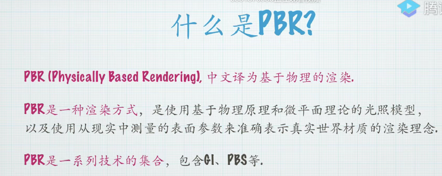
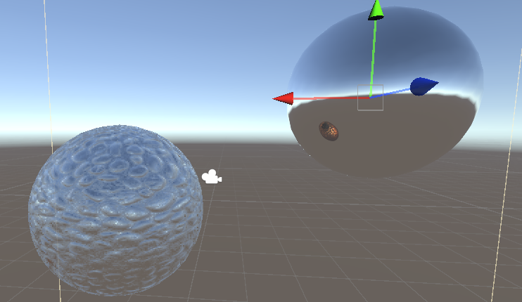
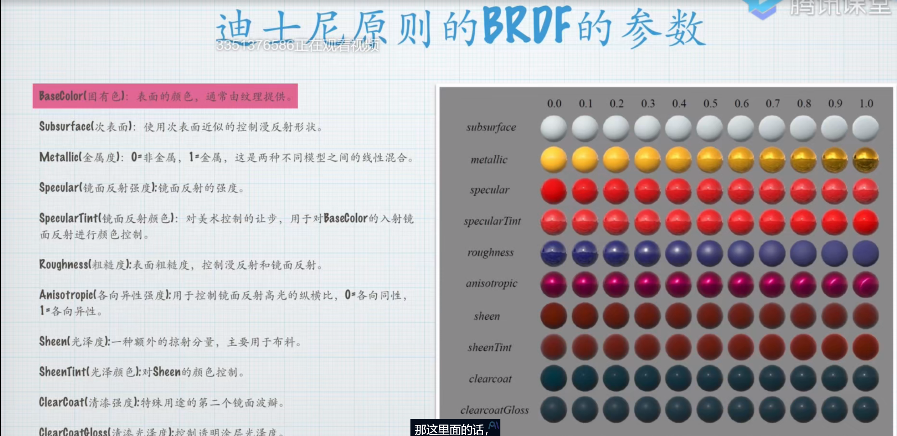
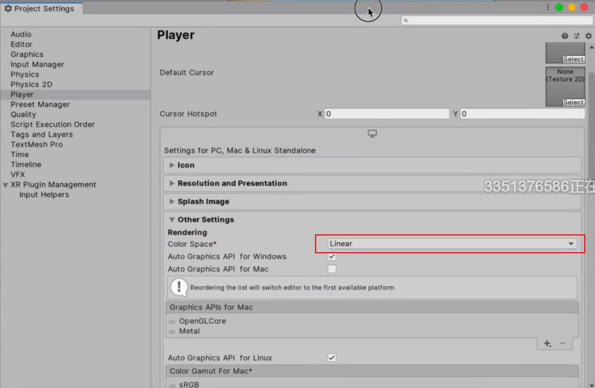
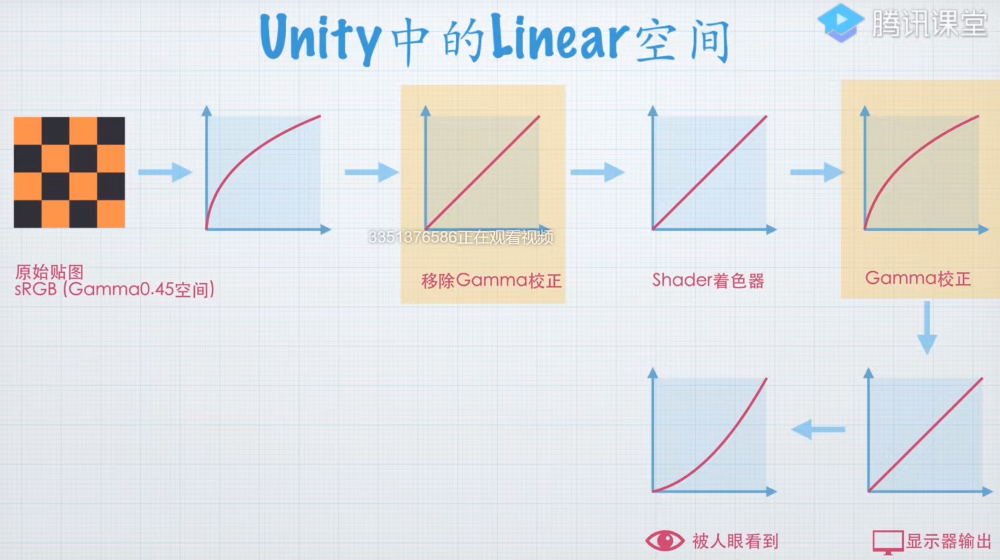
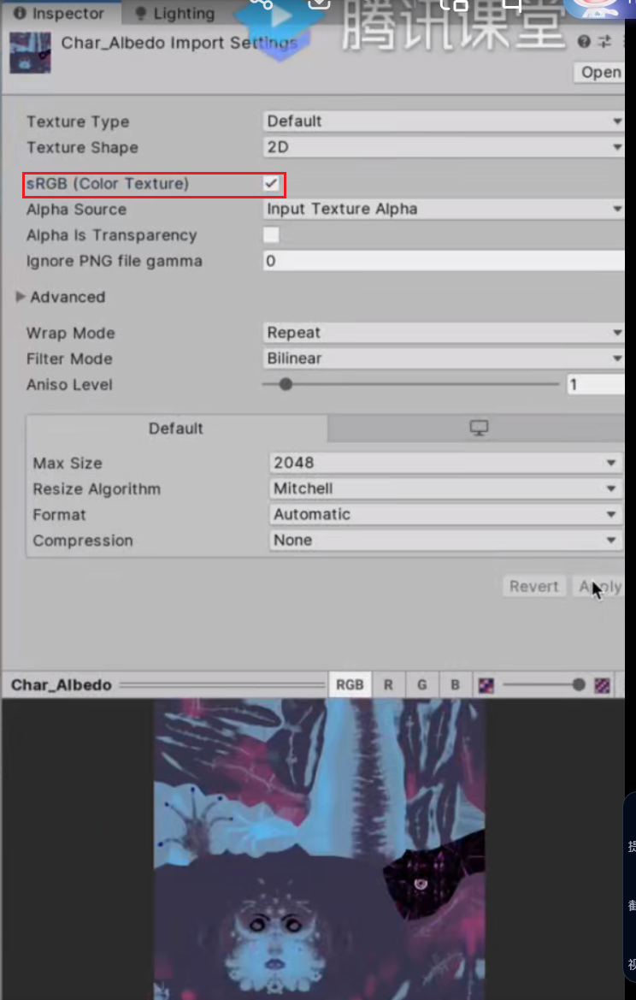

# PBR

  

### PBS

### 反射探针采样

见shader参考大全Lighting不分
``` C
    //反射探针中当前激活的CubeMap存储在unity_SpecCube0当中，必须要用UNITY_SAMPLE_TEXCUBE进行采样，然后需要对其进行解码
    half4 cubemap_reflect = UNITY_SAMPLE_TEXCUBE (unity_SpecCube0, R);
    half3 skyColor = DecodeHDR (cubemap_reflect, unity_SpecCube0_HDR);
    return fixed4(skyColor, 1.0);
```
效果如下图，左下角为采样，右上为反射探针
  


### 双向反射分布函数BRDF
  


实操
做PBR之前先转移到线性空间

  

  

由于上图的原因，Linear空间下会自动对sRGB做解码操作，先移除gamma校正，使用完数据后重新gamma校正。所以对于线性空间下的贴图需要实现勾选下图中的sRBG才能获得正确的结果

  
