# 基于物理的渲染（Physically Based Rendering, PBR）

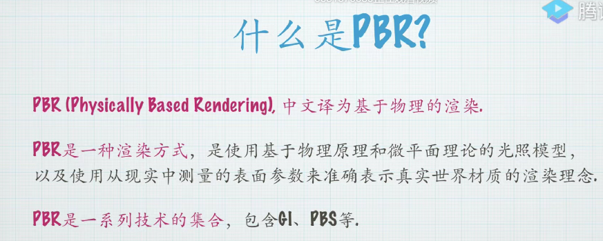

## 概述

**基于物理的渲染（PBR）**是一种渲染技术，它基于物理原理来模拟光和材质的交互，相比传统的Blinn-Phong等经验模型，能够产生更真实、更一致的光照效果。

### PBR vs 传统光照模型

| 特性 | 传统模型（如Blinn-Phong） | PBR |
|------|---------------------------|-----|
| **理论基础** | 经验模型，基于观察总结 | 基于物理原理 |
| **材质参数** | 自定义，不直观 | 物理属性（金属度、粗糙度等） |
| **环境适应** | 需要手动调整 | 自动适应环境光照 |
| **真实性** | 需要经验调参 | 更接近真实世界 |
| **一致性** | 不同环境效果可能不一致 | 在不同光照下表现一致 |

### PBR的核心优势

1. **物理准确**：材质参数基于真实世界的物理属性
2. **环境适应**：自动适应不同的光照环境
3. **参数直观**：Metallic（金属度）、Smoothness（光滑度）等参数易于理解
4. **一致性**：同一材质在不同环境下保持视觉一致

### PBR的关键组件

- **PBS（Physically Based Shading）**：基于物理的着色模型
- **BRDF（Bidirectional Reflectance Distribution Function）**：双向反射分布函数
- **IBL（Image Based Lighting）**：基于图像的光照（通过反射探针实现）
- **线性空间渲染**：正确的颜色计算空间

## PBS（Physically Based Shading）

**PBS（基于物理的着色）**是PBR的着色核心，它描述了材质表面如何与光线交互。

### PBS的主要特点

1. **能量守恒**：材质不会产生能量，反射的光不会超过入射光
2. **菲涅尔效应**：观察角度不同，反射强度也不同（掠射角反射更强）
3. **微表面理论**：表面由无数微小的镜面组成，粗糙度影响这些微表面的分布

### PBS vs 传统Shading

传统Blinn-Phong模型的问题：
- 高光强度可能超过入射光（违反能量守恒）
- 材质参数不直观（如Specular Color、Shininess）
- 需要针对不同环境调整参数

PBS的优势：
- 自动保证能量守恒
- 参数直观（Metallic、Roughness/Smoothness）
- 在不同环境下自动适配

## 反射探针（Reflection Probe）

反射探针用于实现**IBL（基于图像的光照）**，它捕获周围环境的信息，为物体提供真实的反射和间接光照。

### 反射探针的工作原理

反射探针在场景中捕获360度的环境信息，生成一个**CubeMap（立方体贴图）**。物体在渲染时，根据视角方向从CubeMap中采样环境光信息。

### 反射探针采样代码

在Shader中，反射探针的采样方法如下：

```C
// 反射探针中当前激活的CubeMap存储在unity_SpecCube0当中
// 必须要用UNITY_SAMPLE_TEXCUBE进行采样，然后需要对其进行解码
half4 cubemap_reflect = UNITY_SAMPLE_TEXCUBE(unity_SpecCube0, R);
half3 skyColor = DecodeHDR(cubemap_reflect, unity_SpecCube0_HDR);
return fixed4(skyColor, 1.0);
```

**参数说明：**
- `unity_SpecCube0`：Unity提供的反射探针CubeMap纹理
- `R`：反射方向向量（通常通过`reflect(-viewDir, normal)`计算）
- `UNITY_SAMPLE_TEXCUBE`：Unity宏，用于采样立方体贴图
- `DecodeHDR`：解码HDR（高动态范围）数据，因为反射探针通常是HDR格式

**参考：** 详见Shader参考大全Lighting部分

效果如下图，左下角为采样结果，右上为反射探针：
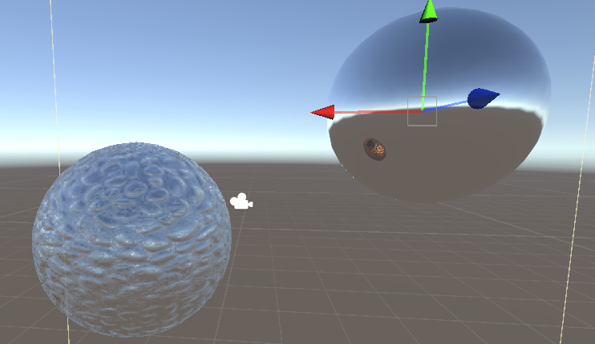


## 双向反射分布函数（BRDF）

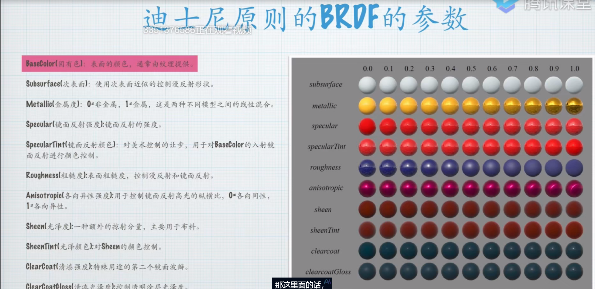

**BRDF（Bidirectional Reflectance Distribution Function，双向反射分布函数）**是PBR的核心数学模型，它描述了光线从某个方向入射后，向各个方向反射的分布情况。

### BRDF的组成

BRDF通常由三个主要部分组成（Cook-Torrance模型）：

```
BRDF = (D × F × G) / (4 × (N·L) × (N·V))
```

或者写成：

```
BRDF = (D × F × V) / (4 × (N·L) × (N·V))
```

其中：
- **D（Normal Distribution Function）**：法线分布函数，描述微表面的法线分布
- **F（Fresnel Term）**：菲涅尔项，描述不同角度的反射强度
- **G（Geometry Term）/ V（Visibility Term）**：几何项/可见性项，描述微表面的遮挡和阴影

### 为什么需要三个项？

| 项 | 作用 | 影响的视觉效果 |
|----|------|----------------|
| **D项** | 控制高光的大小和形状 | 粗糙度越高，高光越分散；光滑表面高光集中 |
| **F项** | 控制反射强度随视角的变化 | 掠射角（侧面看）反射更强，正面看反射较弱 |
| **G/V项** | 处理微表面的相互遮挡 | 粗糙表面有更多阴影，影响高光强度 |

## 线性空间和Gamma校正

### 为什么需要线性空间？

**重要提示：** 做PBR之前必须先转移到线性空间（Linear Space）！

**原因：**
1. **物理计算的准确性**：光线的强度是线性叠加的，必须在线性空间进行计算
2. **颜色混合的正确性**：在线性空间混合颜色才能得到正确结果
3. **光照计算的一致性**：PBR的物理公式在线性空间下才能正确工作

### Gamma校正的概念

**Gamma校正**是显示器和人眼视觉特性导致的：
- 显示器对输入信号进行gamma编码（通常gamma = 2.2）
- 为了在显示器上正确显示，图像需要预先进行gamma校正
- 标准sRGB格式的图像已经包含gamma校正

**问题：**
如果在非线性空间（sRGB）进行光照计算，会导致：
- 颜色混合错误（暗部变亮）
- 光照计算不准确
- 高光效果不正确

### Unity中的设置

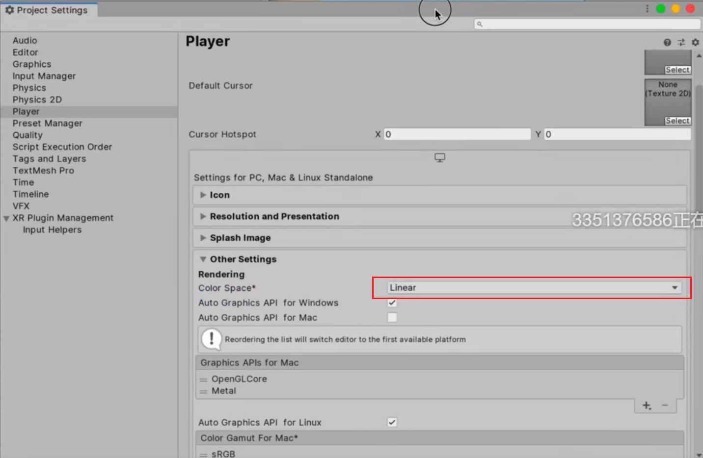

在`Edit > Project Settings > Player > Other Settings > Rendering`中，将**Color Space**设置为**Linear**：

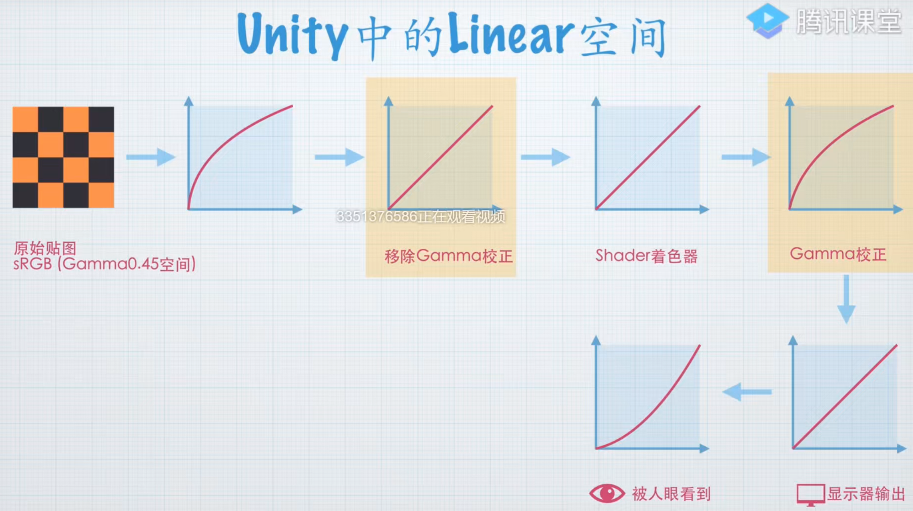

### 贴图的sRGB设置

**关键点：** 在Linear空间下，Unity会自动对sRGB格式的贴图做解码操作：
1. 采样时：先移除gamma校正（从sRGB转换到线性空间）
2. 计算后：重新应用gamma校正（从线性空间转换回sRGB用于显示）

因此，对于**颜色贴图（Albedo）**，需要勾选**sRGB**选项，让Unity自动处理：

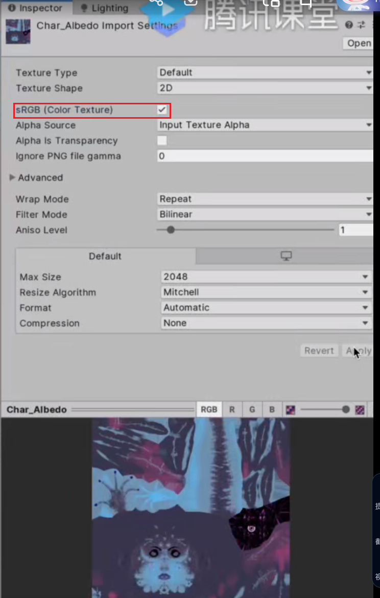

**贴图类型对应的设置：**

| 贴图类型 | sRGB设置 | 原因 |
|----------|----------|------|
| **Albedo（基础色）** | ✅ 勾选 | 颜色信息需要gamma校正 |
| **Metallic/Smoothness** | ❌ 不勾选 | 数据贴图，不是颜色信息 |
| **Normal Map（法线贴图）** | ❌ 不勾选 | 数据贴图 |
| **Roughness Map** | ❌ 不勾选 | 数据贴图 |
| **AO（环境光遮蔽）** | ❌ 不勾选 | 数据贴图 |

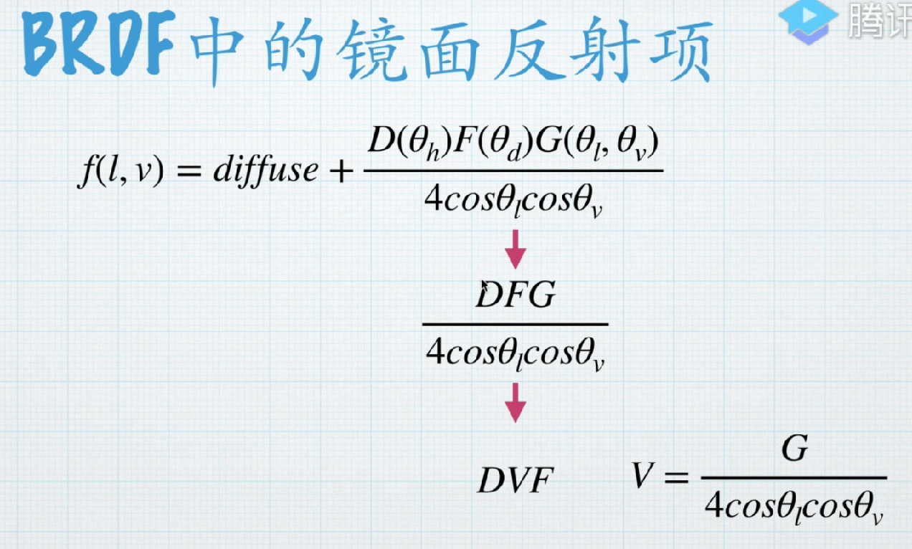

### BRDF在Shader中的实现

以下是Unity中BRDF的核心计算代码（GGX模型）：

```C
#if UNITY_BRDF_GGX
    // GGX模型的实现
    // 注意：roughness为0意味着完全没有镜面反射，使用max(roughness, 0.002)来匹配HDRP的roughness重映射
    roughness = max(roughness, 0.002);
    
    // V项：几何项/可见性项（Smith Joint GGX）
    float V = SmithJointGGXVisibilityTerm(nl, nv, roughness);
    
    // D项：法线分布函数（GGX/Trowbridge-Reitz）
    float D = GGXTerm(nh, roughness);
#endif

// 镜面反射中D和V的计算
// 乘以π的原因：漫反射项应该除以π（能量归一化），为了保持公式平衡，镜面反射项乘以π
// specularTerm = D × V × π（Fresnel项在后面单独应用）
float specularTerm = V * D * UNITY_PI; // Torrance-Sparrow模型

// 完整的镜面反射颜色计算
// 完整公式：DFG / (4 × cos(θl) × cos(θv))
// 其中：specularTerm = D × V × π（DF项）
// F为FresnelTerm，lh是半程向量（light + view的归一化）
half3 specularColor = specularTerm * light.color * FresnelTerm(specColor, lh);
```

**代码说明：**

| 变量 | 说明 |
|------|------|
| `roughness` | 粗糙度（0=smooth光滑，1=rough粗糙） |
| `nl` | 法线N和光线L的点积（dot(N, L)） |
| `nv` | 法线N和视线V的点积（dot(N, V)） |
| `nh` | 法线N和半程向量H的点积（dot(N, H)） |
| `lh` | 光线L和半程向量H的点积（dot(L, H)） |
| `specColor` | 镜面反射颜色（F0，基础反射率） |

**为什么乘以π？**

这是为了保持能量守恒。完整的BRDF公式中：
- 漫反射项需要除以π来归一化
- 为了公式平衡，镜面反射项乘以π
- Unity的实现方式是将π放在镜面反射项中


### D项：法线分布函数（Normal Distribution Function）

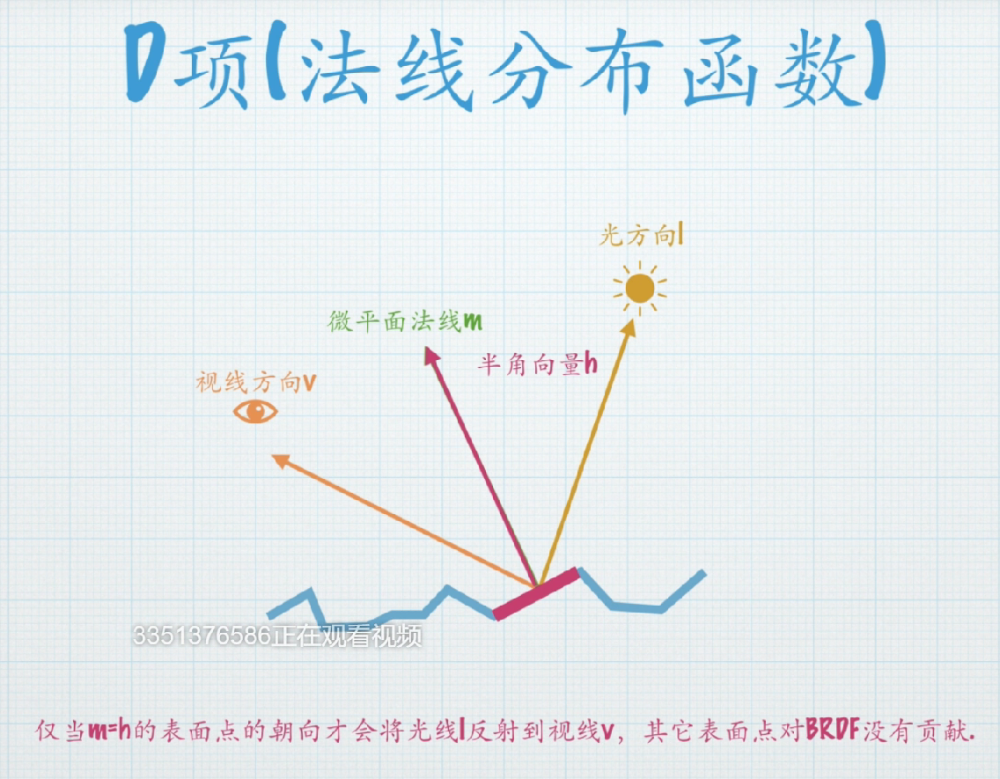

**D项**描述微表面法线的分布情况，它决定了高光的大小和形状。

**GGX/Trowbridge-Reitz分布：**
这是Unity使用的法线分布函数，它的特点是：
- 在镜面反射方向附近有很强的峰值
- 长尾分布（Long Tail），模拟真实材质的反射特性
- 比Blinn-Phong的高光更柔和、更真实

**粗糙度对D项的影响：**
- **粗糙度低（光滑表面）**：法线分布集中在镜面反射方向 → 高光小且集中
- **粗糙度高（粗糙表面）**：法线分布分散 → 高光大且模糊

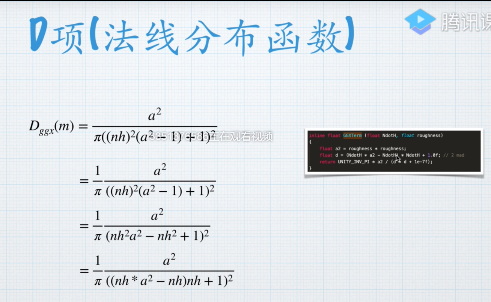

**直观理解：**
想象表面由无数小镜子组成：
- 光滑表面：所有小镜子都朝向同一方向 → 反射集中
- 粗糙表面：小镜子朝向随机 → 反射分散

### F项：菲涅尔项（Fresnel Term）

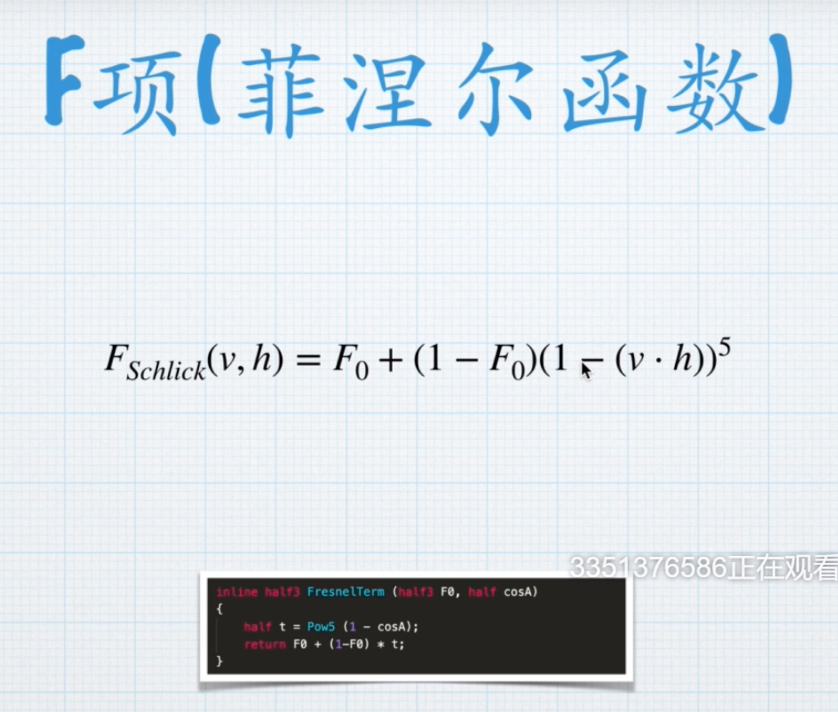

**F项**描述了不同观察角度下的反射强度，这是真实世界中的重要现象。

**菲涅尔效应：**
- **正面观察**（垂直表面）：反射较弱，大部分光被吸收/折射
- **掠射角观察**（侧面观察）：反射很强，几乎完全反射
- 这就是为什么水面在远处（掠射角）看起来很亮，在脚下（垂直）能看到水底

**Schlick近似：**
Unity使用Schlick的简化公式来计算菲涅尔项：
```
F = F0 + (1 - F0) × (1 - (H·V))^5
```

其中：
- `F0`：垂直入射时的反射率（基础反射率）
  - 非金属：约0.04（4%）
  - 金属：根据金属类型，通常是金属的albedo颜色

**Metallic工作流：**
- **Metallic = 0**（非金属）：F0 = 0.04（电介质常数）
- **Metallic = 1**（金属）：F0 = Albedo颜色（金属本身的颜色）

### G项：几何项（Geometry Term）

**G项**（也称为Visibility Term，可见性项）处理微表面之间的相互遮挡和阴影。

**Smith Joint GGX：**
Unity使用Smith Joint GGX模型，它考虑了：
- **微表面的自遮挡**：粗糙表面有更多凹陷，产生阴影
- **微表面的自阴影**：光线可能被微表面的突起遮挡

**影响：**
- 粗糙度越高，遮挡越多 → 反射强度降低
- 掠射角时，遮挡更明显 → 影响Fresnel效果

**三项的综合效果：**

| 表面类型 | D项（高光大小） | F项（反射强度） | G项（遮挡） |
|----------|----------------|----------------|-------------|
| **光滑金属** | 小且集中 | 强（掠射角） | 少 |
| **粗糙金属** | 大且模糊 | 强（掠射角） | 多 |
| **光滑非金属** | 小且集中 | 弱（掠射角稍强） | 少 |
| **粗糙非金属** | 大且模糊 | 弱 | 多 |

## BRDF的优势和特点

### 自动环境适配

BRDF的一个重要优势是：**可以直接在Lighting Environment中修改Cubemap等参数，Shader会自动适配，不需要修改内部参数。**

**实际应用：**

如下图，在Custom定制模式下，使用一张新的Cubemap环境贴图，可以立即改变物体表面的IBL（基于图像的光照）效果，**不需要修改任何Shader参数**：

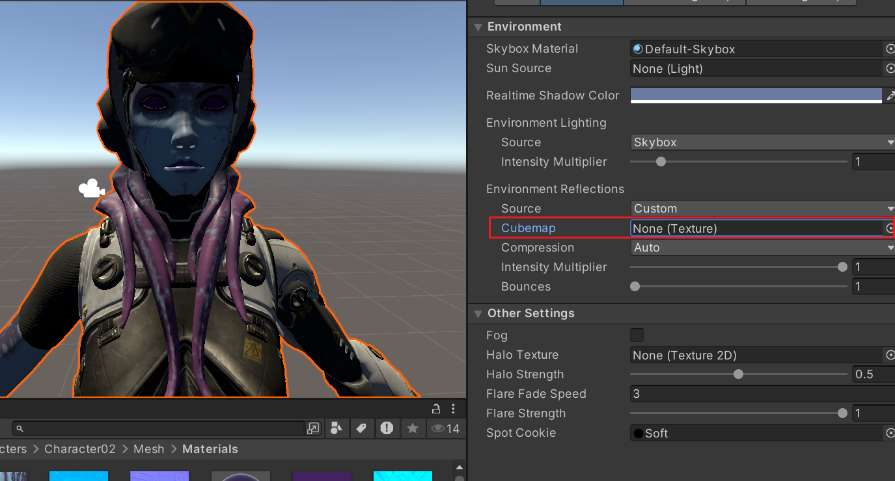

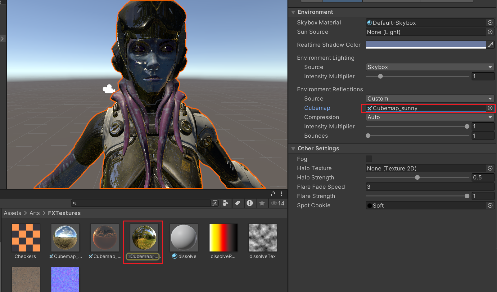

**为什么可以这样做？**

1. **物理一致性**：PBR基于物理原理，材质参数（Metallic、Roughness）在不同环境下保持一致性
2. **自动计算**：BRDF公式自动处理不同光照环境的变化
3. **能量守恒**：系统自动保证反射不会超过入射光

### 与GI的配合

BRDF与Unity的GI系统完美配合：
- **间接漫反射**：通过Lightmap或Light Probe提供
- **间接镜面反射**：通过Reflection Probe提供
- **直接光照**：通过实时光源计算

所有这些都通过BRDF公式统一计算，保证了视觉一致性。

---

## 总结

### PBR核心概念回顾

1. **PBS（基于物理的着色）**：基于物理原理的着色模型，保证能量守恒和菲涅尔效应
2. **BRDF（双向反射分布函数）**：描述光线反射的数学模型
   - **D项**：控制高光大小和形状
   - **F项**：控制反射强度随视角的变化（菲涅尔效应）
   - **G/V项**：处理微表面的遮挡
3. **IBL（基于图像的光照）**：通过反射探针提供环境反射
4. **线性空间**：PBR必须在线性空间计算才能保证准确性

### 材质参数

PBR工作流中的关键参数：

| 参数 | 含义 | 取值范围 | 影响 |
|------|------|----------|------|
| **Albedo** | 基础颜色 | RGB | 非金属的漫反射颜色，金属的吸收颜色 |
| **Metallic** | 金属度 | 0-1 | 0=非金属，1=金属，影响F0 |
| **Smoothness/Roughness** | 光滑度/粗糙度 | 0-1 | 0=粗糙，1=光滑，影响D项 |
| **Normal Map** | 法线贴图 | -1到1 | 表面的细节凹凸 |
| **AO** | 环境光遮蔽 | 0-1 | 模拟凹陷处的阴影 |

### 实际应用建议

1. **工作流程**：
   - 使用Metallic工作流（最常用）
   - 确保项目设置为Linear空间
   - 正确设置贴图的sRGB标志

2. **参数设置**：
   - 非金属：Metallic = 0，Albedo = 材质本身的颜色
   - 金属：Metallic = 1，Albedo = 金属的反射颜色（通常是高饱和度颜色）
   - Smoothness根据材质特性设置（金属通常较高，如0.7-0.9）

3. **性能考虑**：
   - PBR比传统模型计算量大，但现代GPU已能很好支持
   - 使用Mipmap和压缩贴图可以减少带宽
   - 移动平台可以考虑简化版PBR

4. **常见问题**：
   - **Q: 为什么材质看起来不对？**  
     A: 检查是否在Linear空间，贴图的sRGB设置是否正确
   
   - **Q: 反射效果不自然？**  
     A: 确保场景中有反射探针，并且位置和大小设置合理
   
   - **Q: 高光过强/过弱？**  
     A: 调整Smoothness参数，或检查Light Intensity是否过高

### 延伸学习

- **PBR材质创建**：学习Substance Painter、Quixel等工具
- **HDRP/URP**：Unity的高清渲染管线和通用渲染管线，提供更高级的PBR功能
- **各向异性**：处理拉丝金属等特殊材质
- **次表面散射**：处理皮肤、蜡等半透明材质
