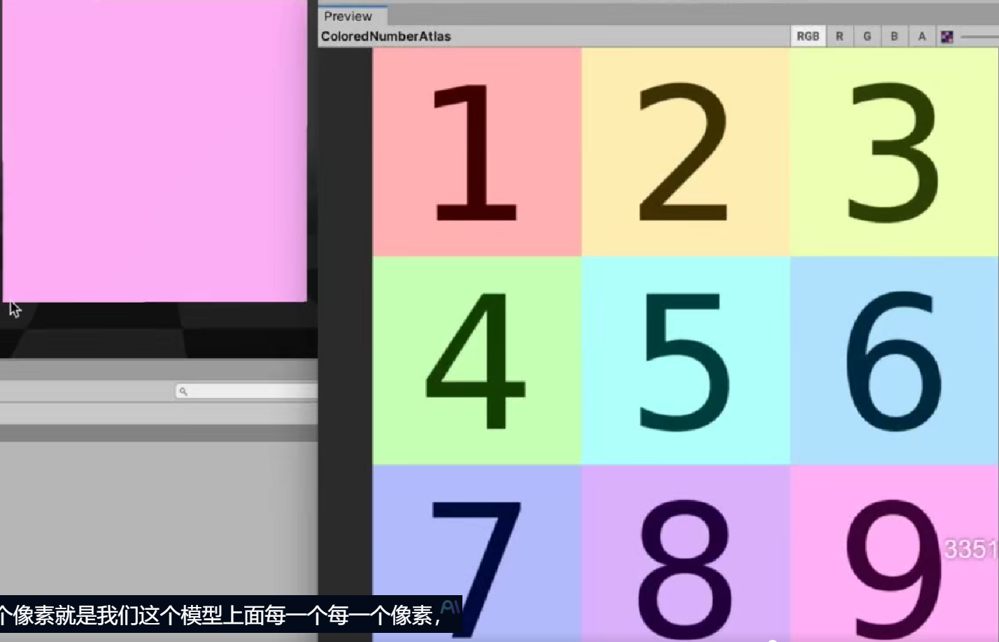
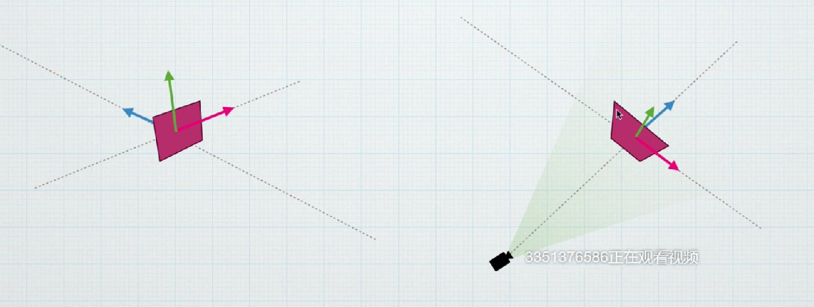
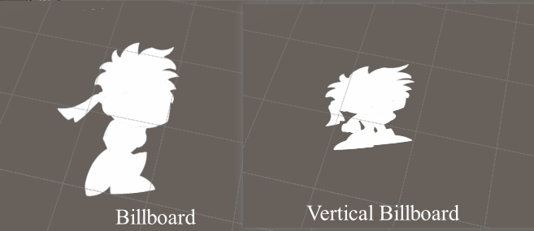

# 序列动画
**关键**
需要理解uv是从左下角开始算的，如图采样(0.9,0.2)得到的是9的粉色

  

接着需要通过一个线性映射来定位到我们想要的块```GetFrameIndex()```，然后计算：
1. 块的大小
2. 块的offset

```C
// 先获取小图片的序号。这里的关键是floor，第二则是使用int来防止精度问题
int GetFrameIndex()
{
    //half total = max(1, _Cols * _Rows);
    //关键，通过floor来织造一块时间停顿在一个图像上，然后立刻跳转，而不是缓慢平移
    int total = (int)(_Cols * _Rows);
    total = max(1, total);
    int idx = (int)floor(_Time.y * max(1, _FPS)) % total;
    
    return idx; 
}    
```

```C
//将UV映射到某一帧
float2 ComputeUV(float2 uv,int frameIndex)
{
    //Frame:[0,row*col-1].这里[0,8]
    int col = int(frameIndex % _Cols);
    int row = int(frameIndex / _Cols); //关键！！这句不能用floor，会有精度问题导致row值错误
    //0,0  1,0  2,0  0,1  1,1  2,1  0,2  1,2  2,2
    // 纹理帧从左上到右下排布，Unity UV 原点在左下，则可选择翻转行索引
    //0,2  1,2  2,2  0,1  1,1  2,1  0,0  1,0  2,0
    row = _Rows - 1 - row;
    float2 frameScale = float2(1/_Cols,1/_Rows);   
    float2 frameOffset=float2(col,row)*frameScale;

    // 这里假设输入 uv 在 0~1 内；若有平铺，可用 frac(uv)
    float2 uvInFrame = uv; 
    uvInFrame= uvInFrame * frameScale + frameOffset;

    return uvInFrame;

}
```
最后整合起来
```C
half4 frag (Varyings i):SV_Target
{
  half4 c;
  int frameIndex=GetFrameIndex();

  float2 uvFrame =ComputeUV(i.uv,frameIndex);
  //return uvFrame.y/4;
  half4 mainTex=SAMPLE_TEXTURE2D(_MainTex,sampler_MainTex,uvFrame);
  
  c=mainTex*_Color;
  //UseR
  c.rgb = _UseR>0.5 ? c.a : c.rgb;
  return c;
}
```

### BillBoard
实现移动画面面片始终朝向摄像机

思路：改变物体的本地坐标，让物体始终旋转对着相机。其实只要找出物体的基坐标系如何旋转了即可。

做完这个本地空间下的变换，再放到世界空间，这样才能避免受到物体本身旋转、缩放的影响。

  
  
 计算步骤:
1. 获取模型本地坐标系的基向量(i,j,k)
2. 计算相机视线方向向量
3. 通过向量运算确定使面片朝向相机的新基向量
应用顶点变换公式：
$$ P_{new}=i'*P_x +j'*P_y+k'*P_z $$

```C
float4 M ={
rightDir.x,upDir.x,viewDir.x,0,
rightDir.y,upDir.y,viewDir.y,0,
rightDir.z,upDir.z,viewDir.z,0,
0,0,0,1
}
float3 newVertex=mul(M,v.positionOS);
//向量乘法的形式
//newVertex=rightDir*v.positionOS.x+upDir*v.positionOS.y+viewDir*v.positionOS.z;

o.positionCS = TransformObjectToHClip(newVertex);
```


还可以实现不同轴向下的Billboard
```C
viewDir.y*=_BillboardType;  //判断是否为垂直billboard
```
  
