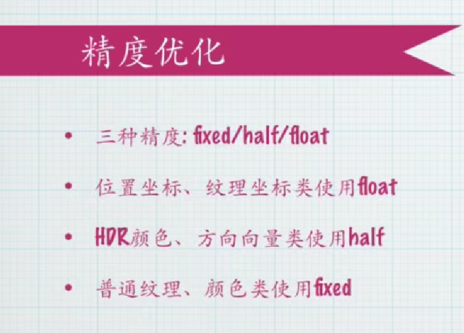
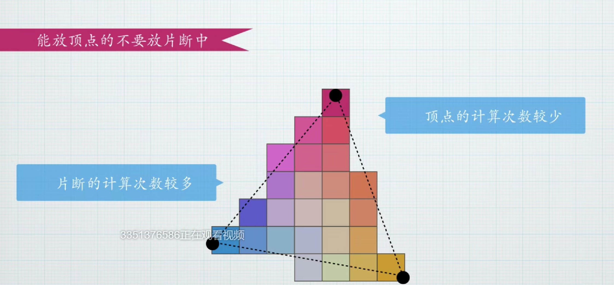
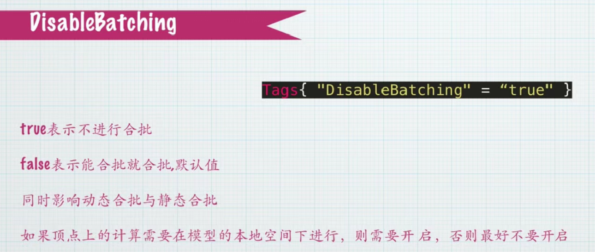
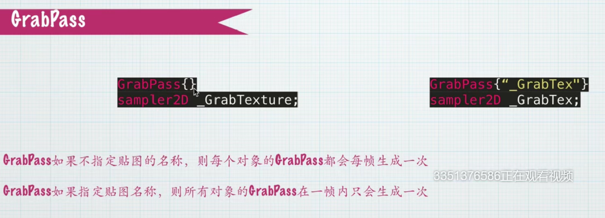

# Shader 通用优化规则

### 原则一 精度优化 
1. **三种精度的介绍**：fixed/half/float 

- 精度等级：从低到高依次为fixed（定点数）、half（半精度浮点数）、float（全精度浮点数）

- 硬件支持差异：PC端GPU会统一处理为float精度，移动端GPU部分支持half精度，旧移动设备才支持fixed
  

2. **不同精度的应用场景** 
- float适用场景：位置坐标（可能产生大位移）、纹理坐标（UV动画值变化范围大）
- half适用场景：HDR颜色（数值不会超出太多）、方向向量（小范围数值）
- fixed适用场景：普通纹理、非HDR颜色（值域0-1之间）
3. **精度使用的实际决定因素** 
- 平台适配原则：
PC平台可自由选择，最终都会转为float
现代移动端优先使用half
仅需支持OpenGL ES 2.0的旧设备才需考虑fixed
- 开发建议：新项目可抛弃fixed，主要使用half和float组合


### **原则二：能用顶点着色器就不要用片断！！**
  

### 原则三：不要用多个pass

### 原则四：小心使用AlphaTest和ColorMask

AlphaTest（clip函数）：
多数平台有性能优势,iOS/PowerVR GPU设备性能极差,必要场景（如树叶/渔网纹理）才使用

ColorMask：用于通道选择性输出

### 原则五：对不支持tiling和offset的贴图设置NoScaleOffset属性

### 原则六：DisableBatching 少用
  

定义: 禁用批处理的功能，通过在Shader的Tags中添加"DisableBatching"="true"指令不要用
两个物体本来会被合批，但是这样对导致分开渲染

### 原则七：GrabPass 少用，若用则需要指定贴图
作用机制: 抓取当前缓冲区数据并以贴图形式存储到shadow中，可用于采样实现扭曲或折射效果

一般用于水或特效扭曲

需要用右边这种方式
  

### 原则八：使用Shader多级细节（LOD）控制
同一Shader内集成高/中/低三档效果实现

### 原则九：谨慎用Overdraw 
定义: 表示屏幕像素被重复绘制的现象，多发生在半透明物体叠加渲染时。
```C
Tags{"RenderType"="Transparent"}
```
产生原因:
半透明物体需要从后往前渲染，导致同一像素可能被多次计算。例如1280×720屏幕中，理想情况应绘制921,600次，但实际可能绘制多个921,600次

颜色越亮表示overdraw越严重（黑色表示无overdraw）

### 原则十：减少变体数量

- 内存占用影响: 变体数量直接影响ShaderLab内存占用，在移动开发中内存资源极其宝贵，特别是低端机型的硬件配置往往非常有限

- Standard材质问题: Unity内置的Standard材质会产生大量变体（可能达到成千上万个），这将显著增加内存压力。尽量使用自己定义的材质
  
# Shader编译目标渲染器

Unity的目标渲染器允许开发者只需编写一份Shader代码，即可自动编译生成适用于不同平台的多个版本。我们可以排除特定目标渲染器，来减少Shader编译体量，缩短编译时间，降低内存占用

```C
//排除某些
#pragma exclude_renderers
//留下某些
#pragma only_renderers gles metal

```
Shader参考大全
仅编译指定平台的Shader
1. d3d11 - Direct3D 11/12
2. glcore - OpenGL 3.x/4.x
3. gles - OpenGL ES 2.0
4. gles3 - OpenGL ES 3.x
5. metal - iOS/Mac Metal
6. vulkan - Vulkan
7. d3d11_9x - Direct3D 11 9.x feature level, as commonly used on WSA platforms
8. xboxone - Xbox One
9. ps4 - PlayStation 4
10.psp2 - PlayStation Vita
11.n3ds - Nintendo 3DS
12.wiiu - Nintendo Wii U


# GPU 逻辑渲染管线
### 原则十一：少用if else
所有处理单元执行相同指令但处理不同数据
当遇到if/else分支时，部分单元执行if分支，其他单元执行else分支，所有单元必须等待最慢的分支执行完毕。**分支会导致所有可能路径都被执行**，增加计算时间，因此会导致速度慢。

当所有处理结果都为true或false时效率才会最高。

因此，需要注意：
- 尽量避免shader中使用分支判断(if/else)
- 少循环语句(for/while)的使用


并行处理特点：
1. GPU擅长批量处理相同指令但不同数据
2. 控制单元少而运算单元多，与CPU架构形成对比
3. 片段处理通常以2×2像素为基本单位