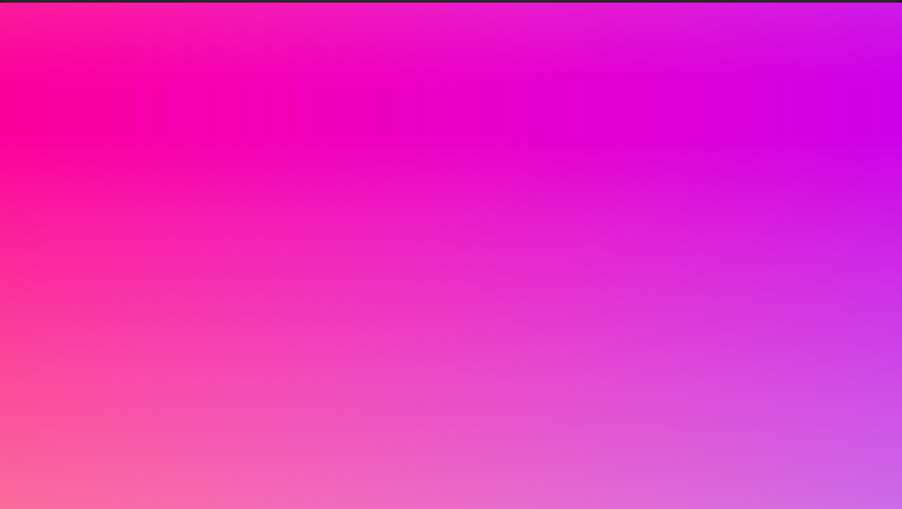
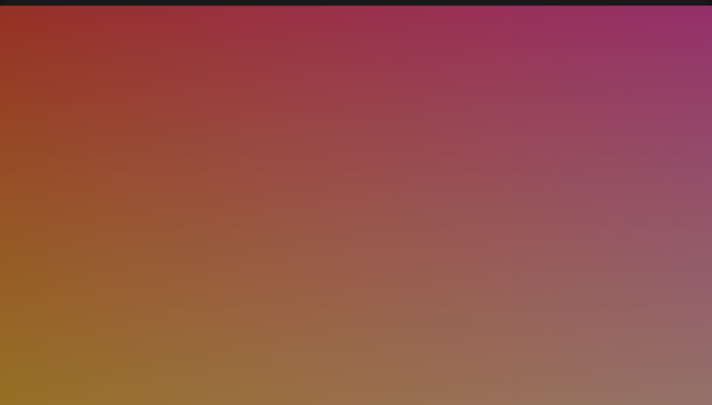
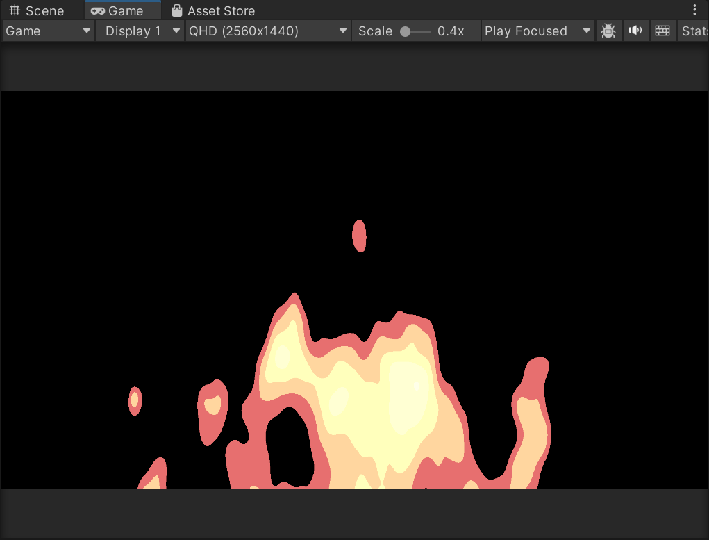
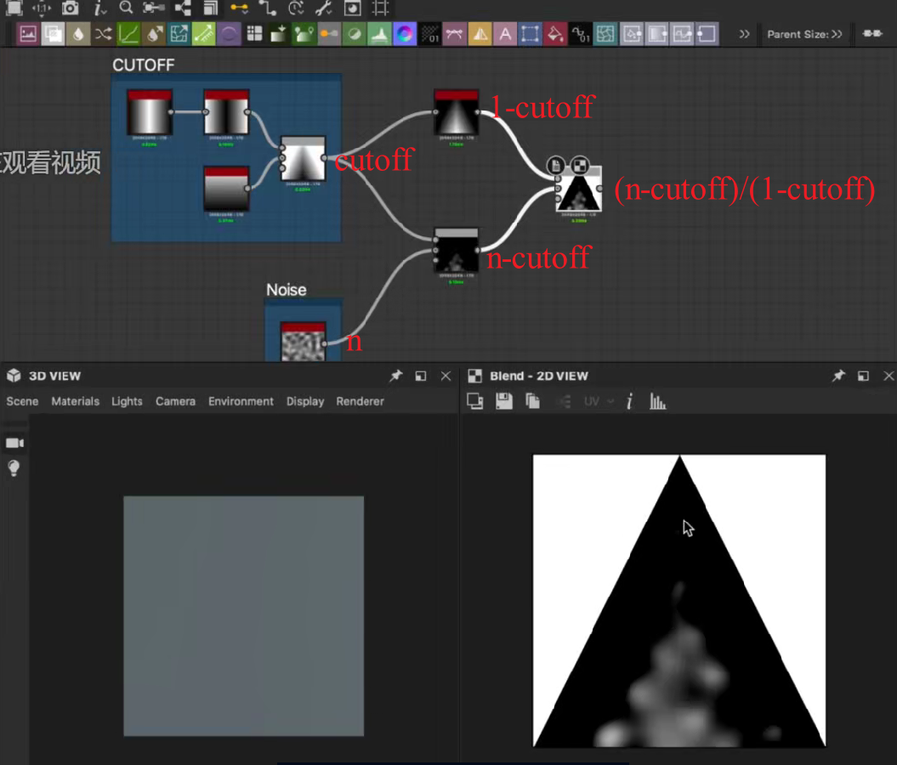
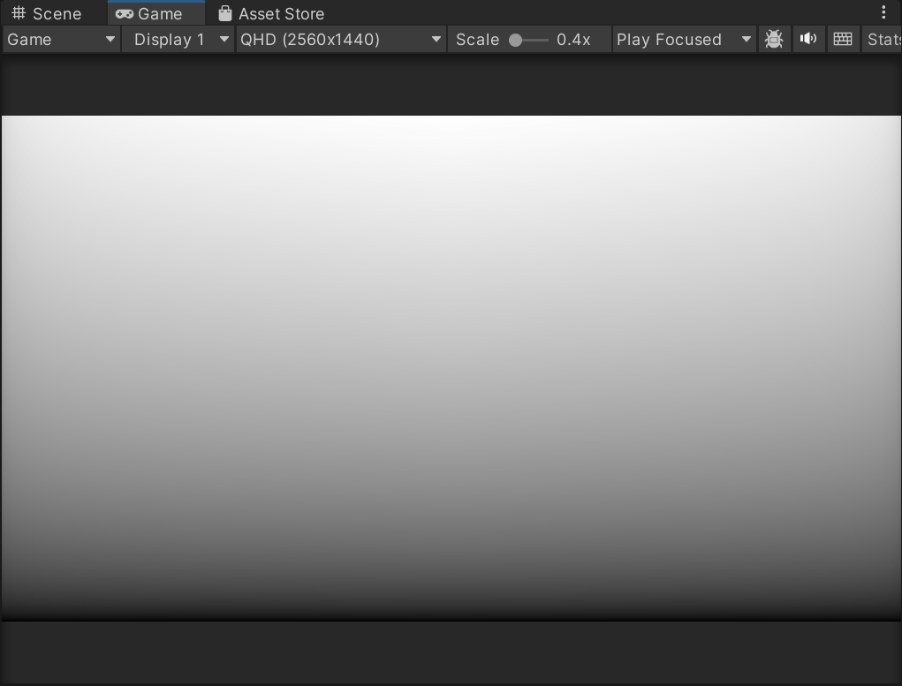
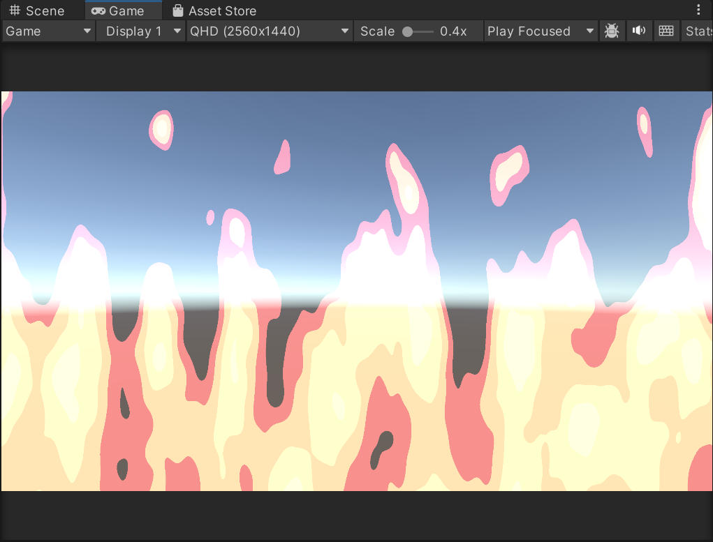
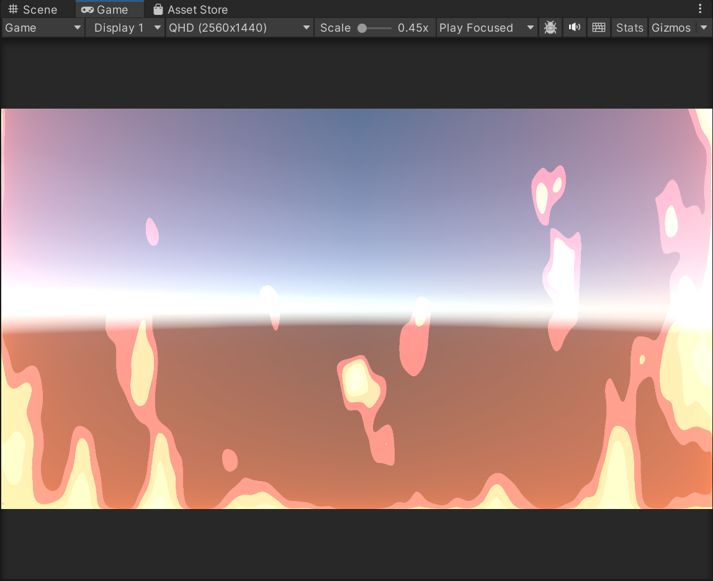

## ShaderToy

### ShaderToy复刻 

**尝试复刻余弦渐变色彩效果**
屏幕颜色随时间变化而渐变改变：https://www.shadertoy.com/new

  
  

```C
fixed4 frag (v2f i) : SV_Target
{
    float3 col =0.5 + 0.5*cos(_Time.y + i.uv.xyx+ float3(0,2,4)); //关键
    return float4(col,1.0);
}
```

**解析关键句**：
float3 col =0.5 + 0.5*cos(_Time.y + i.uv.xyx+ float3(0,2,4));

基础波形生成：cos()函数产生周期性波动

空间变化：i.uv.xyx使波形随屏幕位置变化

时间变化：_Time.y使波形随时间推移

色彩分离：float3(0,2,4)使RGB通道相位错开

范围标准化：0.5 + 0.5*将输出映射到0-1范围

1. 空间变化维度 i.uv.xyx
i.uv.xyx 创建了一个三维向量 (u, v, u)，其中：

    u = 水平方向的UV坐标（0到1）

    v = 垂直方向的UV坐标（0到1） 

        水平渐变：颜色随X坐标变化

        垂直渐变：颜色随Y坐标变化

        对角线效应：由于使用了u和v的组合，会产生对角线方向的渐变

2. 时间变化维度 _Time.y
   
        _Time.y 提供第四维度——时间，使整个色彩图案动态变化：

        每经过一段时间，所有点的颜色相位都在变化

        产生流动、波动的视觉效果


### 复刻一个ShaderToy

需要注意看注释！！！！有时候注释的提示比自己想有用多了

1. 先尽量复刻。若复刻途中报错，从后往前逐步输出，看少了哪一步就会有不同的画面，则问题出在这一步骤上
2. 弄清楚关键步骤，各个函数都是做什么的。这一步同样要多利用输出，去看这个步骤输出的是什么
3. 进入函数看具体值。逐行。
   
4. 刚开始不要过于集中在算法怎么实现上。要学会好平衡，学会利用工具。
   
### 卡通火
  

#### GetDepth()
以下函数是 Unity Shader 中实现“色调分离”（Posterization）效果的经典代码，常用于创造风格化的颜色边缘或卡通渲染（Cel-Shading）中的色阶效果。

这个 getDepth 函数接收一个 0-1 范围的输入值 n（通常代表灰度、高度或深度信息），然后将其量化为有限的几个色阶，最终返回一个也是 0-1 范围的、但只有几个特定值的输出。

```C
float getDepth(float n)
{            
    //given a 0-1 value return a depth,                
    //remap remaining non-cutoff region to 0 - 1
    //这一步的效果是： 创造了一个“死区”，_Cutoff 以下的所有输入被floor处理后最终都会被归入最低的色阶（通常是0）。
    float d = (n - _Cutoff) / (1.0 - _Cutoff);                     
    //step it 色调分离
    d = floor(d*_Step)/_Step;                
    return d;
}
```
- float d = (n - _Cutoff) / (1.0 - _Cutoff); 

       (n - _Cutoff)：将输入值 n 向下平移 _Cutoff。如果 n < _Cutoff，结果会是负数。

      /(1.0 - _Cutoff)：将上一步的结果重新映射到 [0, 1] 区间。

      当 n = _Cutoff 时，d = 0；当 n = 1.0 时，d = 1。
- d = floor(d*_Step)/_Step;  

    第一步：d * _Step
      将 [0, 1] 区间的 d 放大 _Step 倍，映射到 [0, _Step] 区间。

      _Step 的含义：它不是指阶梯的数量，而是指阶梯的间隔数。阶梯的数量是 _Step + 1。

      例如 _Step = 3，意味着把 [0,1] 分成 3 个间隔，从而产生 4 个色阶（0.0, 0.333, 0.666, 1.0）。

    第二步：floor(d * _Step)
     
      floor() 函数是向下取整。它会砍掉小数部分，只保
      留整数。这一步将连续的放大后的值，“强行”归类到有限的几个整数上。

    第三步：/ _Step

      将取整后的整数结果再除以 _Step，将其重新压缩回 [0, 1] 区间。

Substance中调试如下：

  


#### 色相(H)、饱和度(S) 和明度(V)
```C
//对卡通火着色   
float3 hsv = float3(d *0.17,0.8 - d/4., d + 0.8);
col = hsv2rgb(hsv);
```

### 调整火焰形态

可以通过调整_CutOff 来得到不同形状的火焰:```_Cutoff *=pow(1-abs(i.uv.x*2-1),0.07);```
制作出不同的噪声图
  

  

加fireglow还可以模拟出屏幕边缘的颜色效果
```C
//做一张屏幕周围暗，中间亮的图，若对fireGlow加时间变换，还可以模拟出忽明忽暗的效果。
  fixed4 fireGlow= (1-_Cutoff)*fixed4(1,0.161,0,1);
  ...
  //用*=还是+=看效果
  col+=mainTex;
  col+=fireGlow;
```

  
