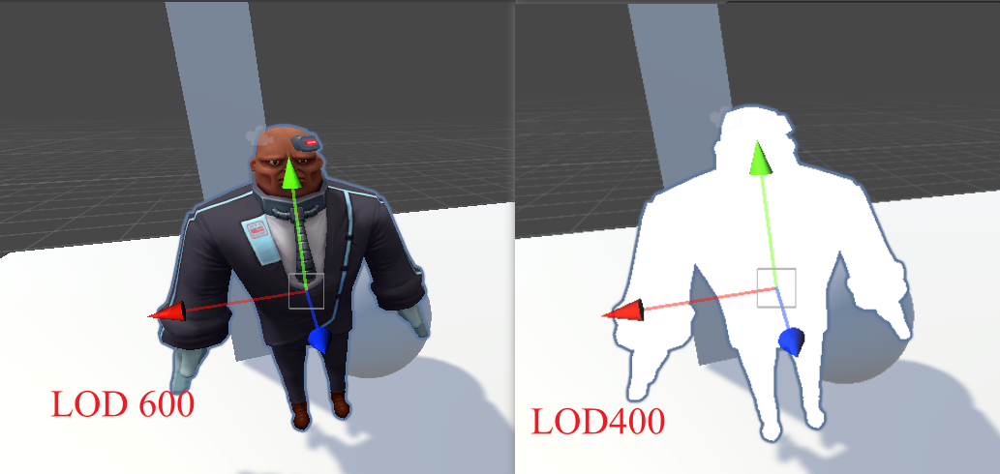

# 阴影（缺少接受阴影笔记）

### 核心步骤
  * 深度图生成：在光源位置设置虚拟相机，开启深度测试/写入，生成ShadowMap（存储最近物体深度值）
  * 阴影判定：将渲染片段转换到光源空间，比较当前深度与ShadowMap采样值，若当前深度更大则判定为阴影
  * 技术对比：
  * 实时阴影：动态生成（如ShadowMapping），适用于移动物体
  * 烘焙阴影：预生成静态纹理，适用于固定场景
  
  

**CSM（级联阴影）** 
  * 作用：近处高精度、远处低精度的分级阴影处理（CSM技术）
  * 设置路径：Project Settings→Quality→Shadow Cascades（可选None/Two/Four）

### 生成阴影实现
**方法一：新写一个pass**

添加 Tag{"LightMode" = "ShadowCaster"}
1. appdata中声明float4 vertex:POSITION;和  half3 normal:NORMAL;这是生成阴影所需要的语义.
2. v2f中添加V2F_SHADOW_CASTER;用于声明需要传送到片断的数据.
3. 在顶点着色器中添加TRANSFER_SHADOW_CASTER_NORMALOFFSET(o)，主要是计算阴影的偏移以解决不正确的Shadow Acne和Peter Panning现象.
4. 在片断着色器中添加SHADOW_CASTER_FRAGMENT(i)       

**方法二：Fallback**

使用内部函数已有的shader来制作深度图，
Fallback应该放在所有Pass定义之后，SubShader之外

```
  Subshader{
    ...
  }
  Fallback "Legacy Shaders/VertexLit" 
```

# shader的LOD 

核心作用：用于实现Shader的高中低配分级，根据项目硬件需求划分不同性能等级的渲染效果

- 应用场景：在项目规划阶段，针对不同硬件类型(如手机/PC)配置不同复杂度的Shader版本

- 实现方式：通过LOD指令控制Unity运行时自动切换不同SubShader，在脚本处可选择不同quality
- 数值规范：
正确排序：建议按数值从大到小排列（如600→400→200）

```
void Update()
{
    switch(QualitySettings.currentLevel)
    {
        case QualityLevel.High:
            Shader.globalMaximumLOD = 600;
            break;
        case QualityLevel.Medium:
            Shader.globalMaximumLOD = 400; 
            break;
        case QualityLevel.Low:
            Shader.globalMaximumLOD = 200;
            break;
    }
}
```
  
  
