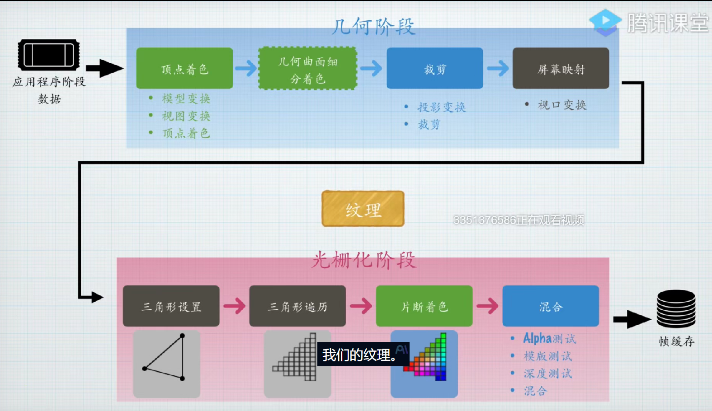
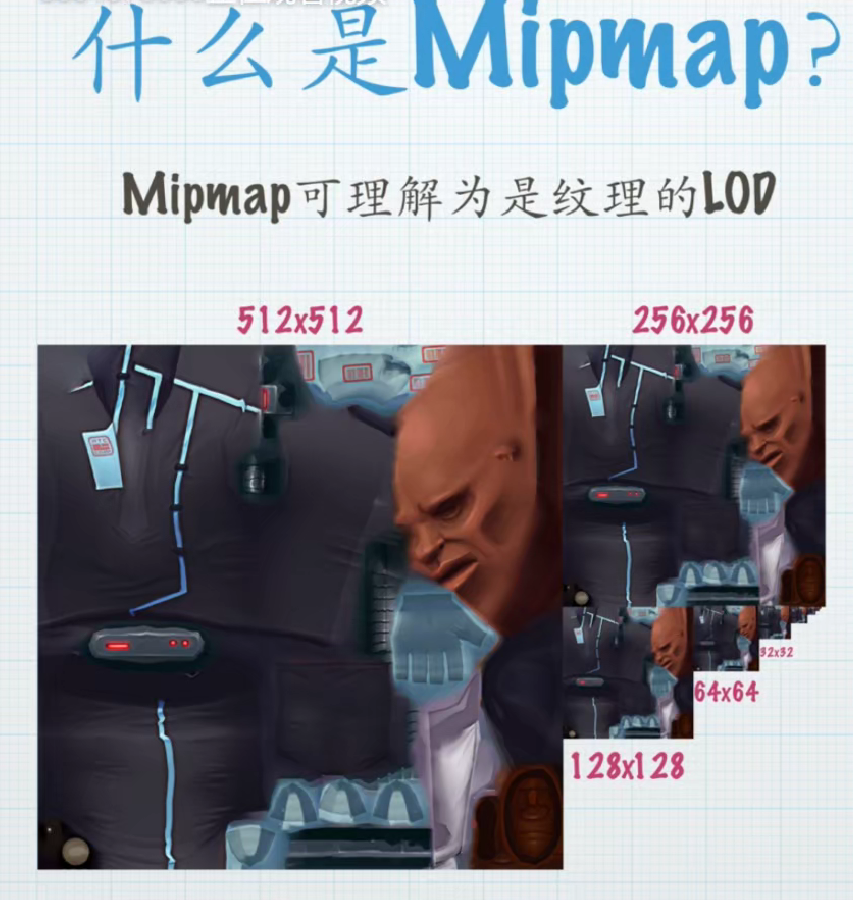
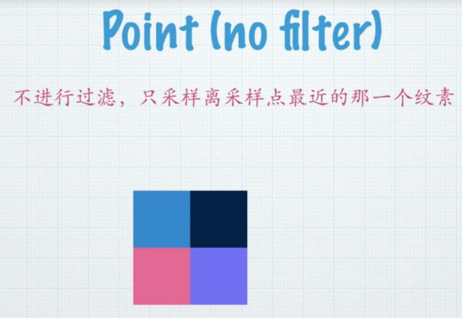
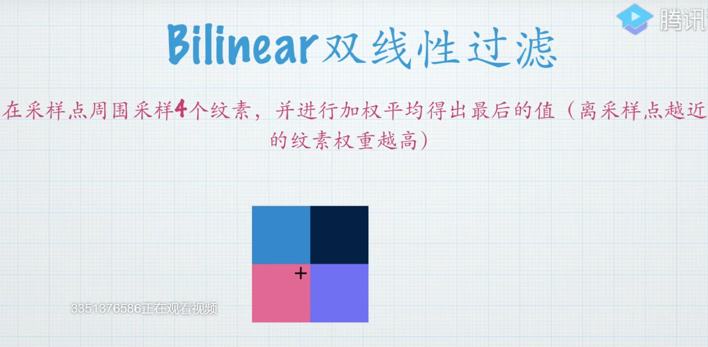
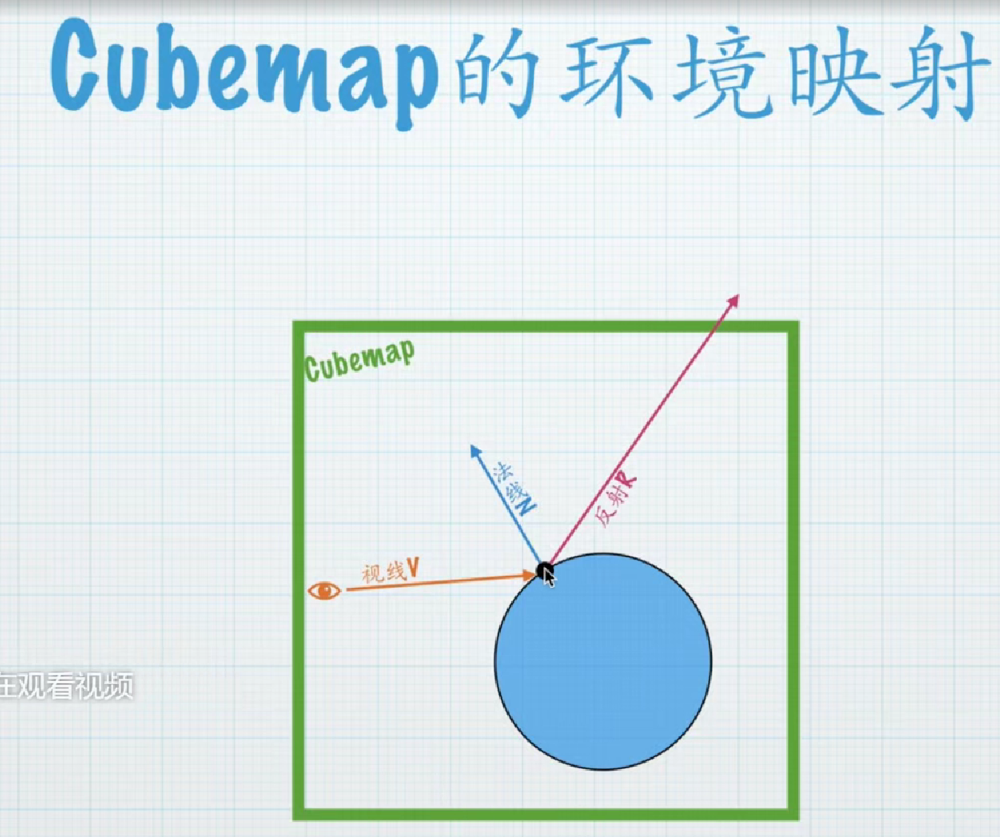
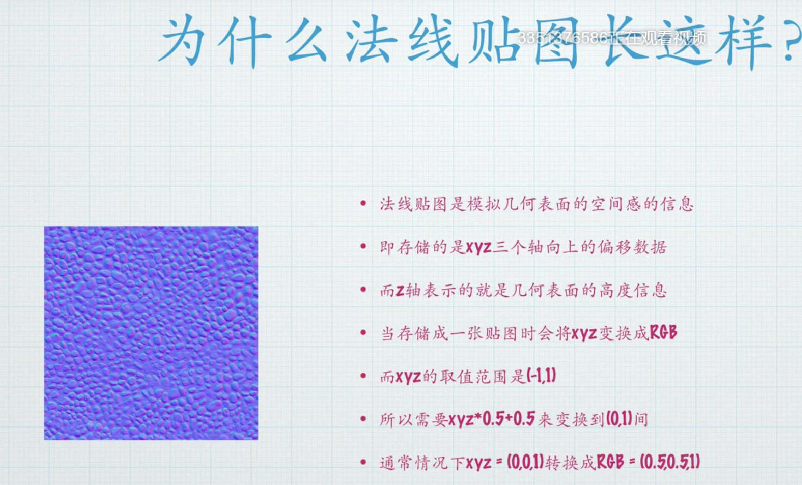
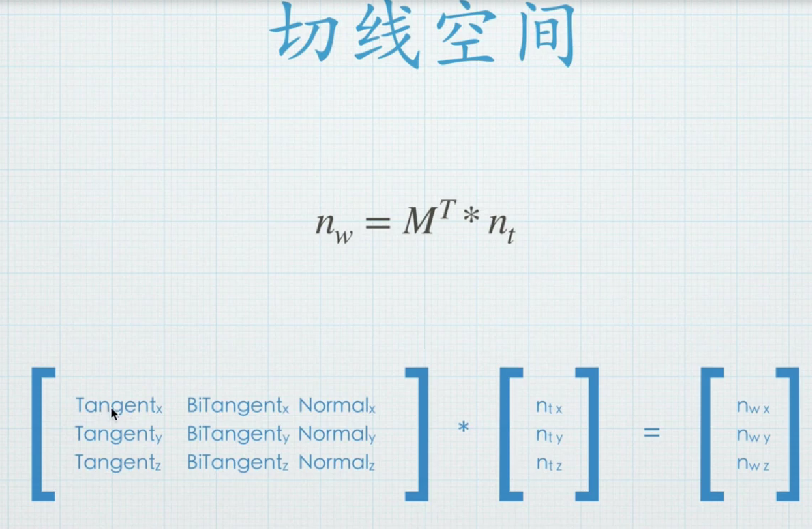

# 纹理

**复习渲染管线的各个阶段**

  

## 多级渐远Mipmap
**工作原理**: 可以理解为纹理的LOD，根据视角远近加载不同精度的贴图，近处用大图，远处用小图
  


优点：1.解决摩尔纹问题。2.配合质量设置来分级加载，减少不同配置下的内存

缺点：现存增加30%
```   C        
fixed4 frag (v2f i) : SV_Target
{
    float4 mipMapUV= float4(i.uv,0,_Mipmap);
    //第二个参数为float4类型，xy为uv坐标，z为0，w为mipmap等级
    fixed4 c = tex2Dlod(_MainTex, mipMapUV);
    return c;
}
```

## 过滤
在真正贴纹理之前需要过滤。

**核心问题**: 纹理纹素与屏幕像素不存在一一对应关系

**具体表现**:
- 显示器分辨率（如1920×1080）与贴图分辨率（如512×512）不同
- **屏幕像素可能覆盖纹理上的单个或多个纹素**
- 纹理可自由缩放导致对应关系动态变化

因此通过过滤算法确定像素最终显示颜色

### 过滤方法
1. 点过滤
   


采样原理: 直接取离采样点最近的单个纹素值

示例说明:
当屏幕像素（加号标记）落在4个纹素组成的区域时，仅采用最近纹素（左下角红色）的颜色值，完全忽略其他相邻纹素的影响

特点: 会产生明显锯齿，但计算量最小

2. 双线性过滤



采样方式: 采集采样点周围4个纹素进行加权平均

权重规则:
距离采样点越近的纹素权重越高，通过插值计算最终颜色值

2. 三线性过滤


增强特性: 在双线性过滤基础上增加Mipmap层级过渡处理

采样复杂度:
需要采样8个纹素（相邻Mipmap级别的各4个）
进行三维插值计算（空间XY方向+Mipmap层级）

适用场景: 特别适合处理动态LOD变化的纹理渲染

总结:以上三种颜色过渡的效果从差到好，性能开销从低到高。

```C#
fixed4 frag (v2f i) : SV_Target
{
    #ifdef _WRAPMODE_REPEAT
        //重复模式。取uv的小数部分即可
        i.uv = frac(i.uv);
    #endif
    #ifdef _WRAPMODE_CLAMP
        //夹紧模式。取uv的0-1范围
        i.uv = clamp(i.uv,0,1);
    #endif
    float4 mipMapUV= float4(i.uv,0,_Mipmap);
    //tex2Dlod函数可以指定mipmap等级采样贴图            
    //第二个参数为float4类型，xy为uv坐标，z为0，w为mipmap等级
    fixed4 c = tex2Dlod(_MainTex, mipMapUV);
    return c;
}
```

### CubeMap


```C#
samplerCUBE _CubeMap;
...

//Cube采样,关键是用什么uv来采样？答案是本地空间坐标.下一步则是使用视线反射来做环境映射
fixed4 cubemap=texCUBE(_CubeMap,i.localPos);

//环境映射
//V,N,R
fixed3 V= UnityWorldSpaceViewDir(i.worldlPos);
fixed3 N=normalize(i.normal);
fixed3 R=reflect(-V,N);
//Cube采样,关键是用什么uv来采样？答案是本地空间
cubemap=texCUBE(_CubeMap,R);                
return cubemap;
```


## 法线贴图



## 法线空间
定义：以顶点为原点构建的独立坐标空间，既非本地空间也非世界空间

构成要素：
- X轴：顶点切线(Tangent)
- Y轴：顶点副切线(BiTangent)，又称副法线(BiNormal)
- Z轴：顶点法线(Normal)
- 矩阵表示：由切线(T)、副切线(B)、法线(N)组成的TBN矩阵
  
（法线可以由法线贴图得到，切线可以由法线贴图的uv得到，因此我们的问题是如何得到B）

统一在世界空间下计算时，需将法线贴图数据转换到世界坐标系。

公式如下：
核心公式：
$$ m · n_w =n_t $$
* m ：切线空间变换矩阵
* n_w ：世界空间法线
* n_t ：切线空间法线（来自法线贴图）

又因为m是正交矩阵
$$ m · m^T =E $$
所以
$$ n_w= m^T ·n^t $$



具体实现见shader大全。
做完切线空间后，就可以把法线贴图应用于所有物体上了
