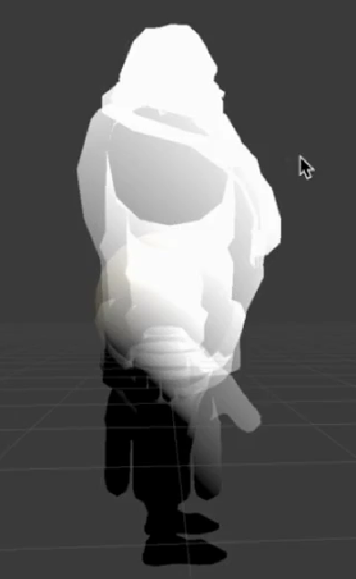

# Tips
1. 有时候会需要做一张从上到下的黑白渐变贴图，或者从左到右，可以考虑使用模型的本地坐标。
    并且可以扩展到用```i.ObjectPosWS.y+i.ObjectPosWS.z;```，能够得到3D上斜切效果。
      

2. 想做循环动画，会需要用到三角函数
   
   例如```sin(_Time.y)```可以做直线效果。
   
   如果需要曲线运动，则需要做扰动，可以考虑用自身的坐标来扰动，这样模型的各个部分就自动有了不同的动画```v.vertex.x+=sin(v.vertexOS.y+_Time.y)```。(详见URP.md)

3. 用uv或者OS坐标得出(0,1)范围再制作想要的纹理图
例子：棋盘格，得到黑白白黑的效果
``` C
  half2 uv_check= floor(i.uv*2)/2;
  c= frac(uv_check.x+uv_check.y)*2;
```
4.  经典遮罩制作方法
```C
half mask =i.ObjectPosOS.y+0.5;
c*=mask;
```