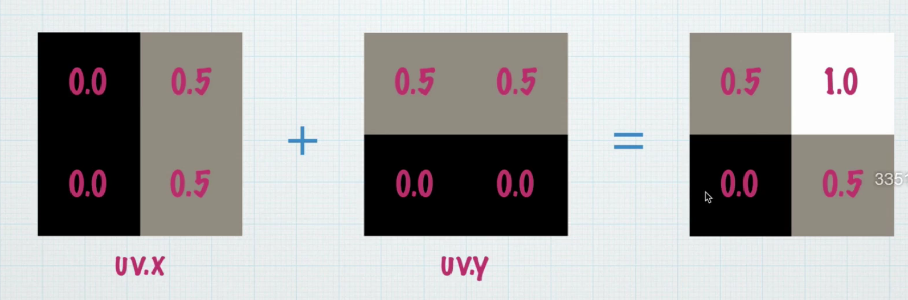
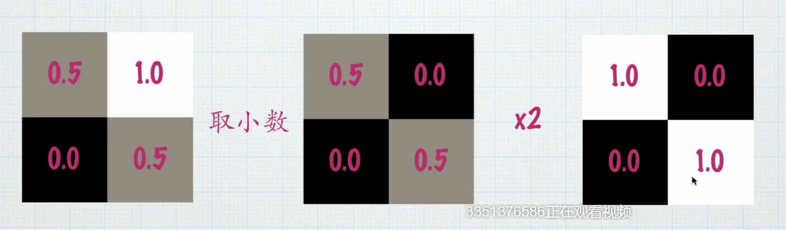

# UGUI

### 案例：棋盘格shader制作

理论：





### 代码控制button，toggle与slider
在开始时添加Listener响应事件，并将脚本拖入到canvas面板上，然后添加Button和Toggle。
toggle则需要传入一个bool作为参数表示开关是否被按下：

```C
    public Button button01;
    public Toggle toggle01;
    public Slider slider01;

    void Start()
    {
        button01.onClick.AddListener(OnButton01);
        toggle01.onValueChanged.AddListener(OnToggle01);
        slider01.onValueChanged.AddListener(OnSlider01);

    }
    void OnButton01()
    {
        ...
    }
    void OnToggle01(bool isOn)
    {
        ...
    }
    void OnSlider01(float value)
    {
       ...
    }
```

### UI调用并修改其他脚本参数
在Slider的listener函数中加入character的事件响应，需要用getComponent，而script被添加进角色后，就属于这个角色的component了：

```character.GetComponent<RotateSelf>();```

### UI修改shader