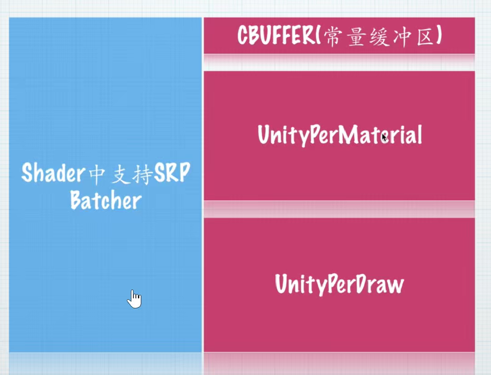
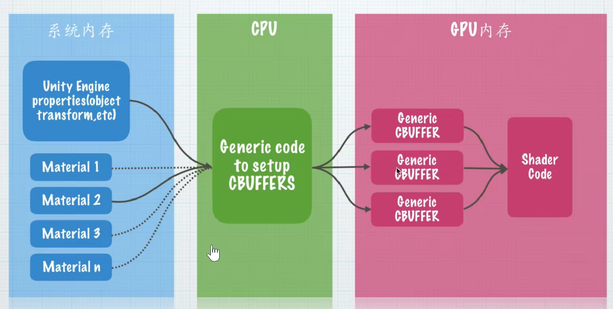
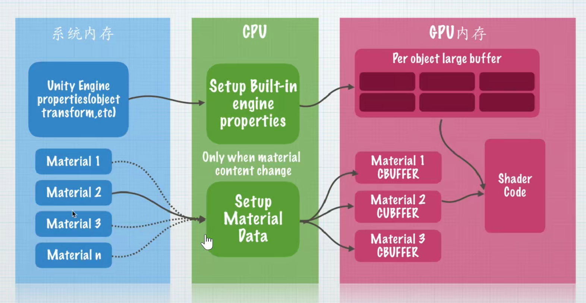
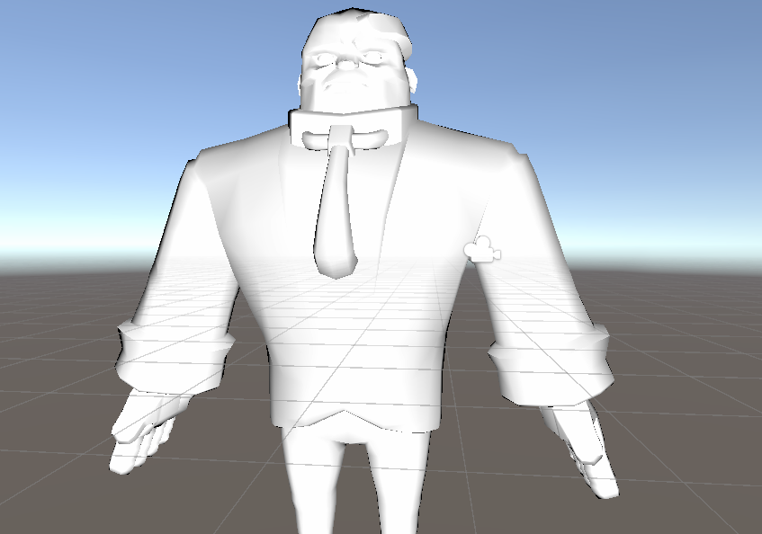
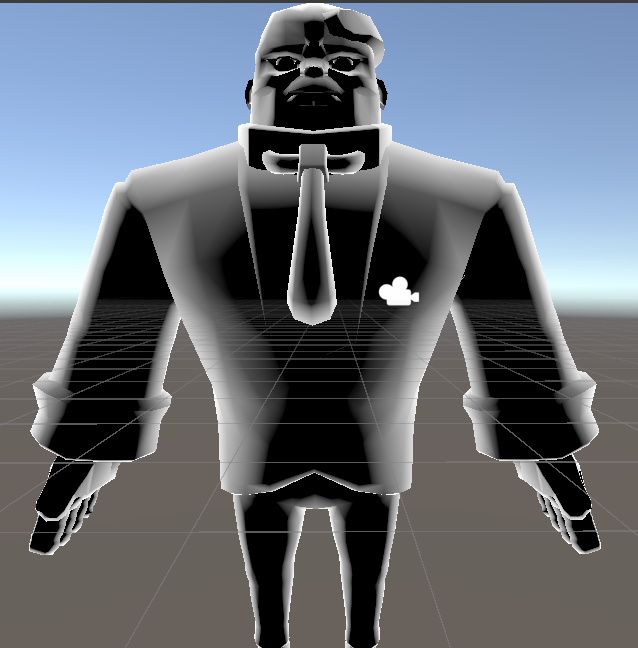
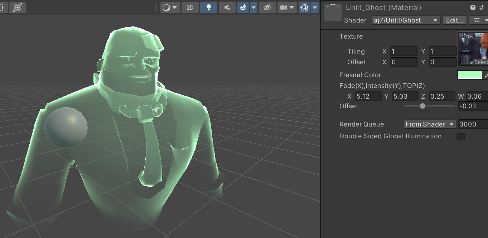
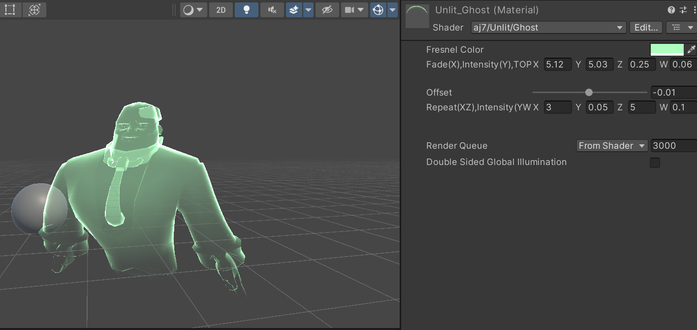

# URP

### Universal Render Pipeline

Universal：代表通用性，可适配多平台
Render Pipeline：表明其本质是渲染管线技术

### 添加并切换URP渲染器
  

  在projectSettings中修改
  

### 部分重要代码
GetVertexPositionInputs函数位于Core.hlsl文件中
输入模型本地空间坐标positionOS
返回包含四种空间坐标的结构体：
- positionWS: 世界空间坐标
- positionVS: 视图空间坐标
- positionCS: 裁剪空间坐标
- positionNDC: 归一化设备坐标

模型空间→世界空间
世界空间→视图空间
视图空间→裁剪空间

URP中的顶点着色器输出结构体与Built-in渲染管线基本相同，只是名称不同


### 数据类型变化

 URP中已弃用fixed类型，只保留half和float
位置/UV坐标使用float
其他情况使用half


### SRP Batcher机制
仅适用于可编程渲染管线（SRP），包括URP和HDRP，不兼容内置渲染管线（Build-in Render Pipeline）

工作原理：
- 将材质属性数据保留在GPU显存中，避免每帧重复上传
- 通过常量缓冲区实现材质参数的批量处理
- 减少CPU到GPU的通信开销
  
性能优势：
- 显著降低Draw Call数量
- 特别适合大量使用相同Shader不同参数的场景
  
启用条件：
1. 必须为静态网格,不支持带骨骼动画的蒙皮网格
2. 必须正确定义UnityPerMaterial常量缓冲区,UnityPerDraw: 存放Unity内置变量(自动处理)
UnityPerMaterial: 存放材质属性(需手动配置)
  
  

3. 所有材质属性必须声明在同一个CBUFFER中
  

### 常量缓冲区CBUFFER
可以存在GPU显存中，和GPU的传输特别快
```C
CBUFFER_START(UnityPerMaterial)
half4 _Color;
CBUFFER_END
```


声明要求：
- 包含Properties中所有非贴图属性
- 使用与Properties中完全一致的变量名
  
注意事项：
- 贴图类型属性不需要放入CBUFFER
- 缓冲区内容会在材质球之间共享
- 修改缓冲区内容会影响所有使用该Shader的材质

**普通渲染管线**

  

**URP渲染管线**

PerObjectBuffer: 存放每个物体的引擎数据
CBUFFER: 为每个材质生成独立常量缓冲区

  


### 纹理与采样器的分离

采样器是用于纹理采样的设置组合，包含重铺模式(Wrap Mode)和过滤模式(Filter Mode)两种关键设置

**定义纹理和采样器**

``` C
//sampler2D _MainTex;
TEXTURE2D(_MainTex);    //纹理的声明，如果是编译到GLES2.0平台，则相当于sampler2D _MainTex;否则就相当于Texture2D _MainTex;
float4 _MainTex_ST;
// SAMPLER(sampler_MainTex);  //采样器的定义，如果是编译到GLES2.0平台，默认相当于空，否则就相当于samplerState sampler_MainTex;

//#define smp sampler_MainTex
#define smp _linear_clampU_mirror  //改变后者能得到不同的采样器，并且覆盖纹理材质在inspector上的设置
SAMPLER(smp);   //声明对应的采样器

...

// fragment shader
half4 mainTex=SAMPLE_TEXTURE2D(_MainTex,smp,i.uv);
```

优势：同时使用一个采样器，可以无视采样贴图的数量限制

## URP案例：鬼魂的制作
案例：边缘光（鬼魂）效果=边缘光+半透明

## URP下的法线

分析：边缘发光效果其实与lambert光照“相反”，因为本身是中间亮两头暗，但边缘发光则是中间暗两头亮

```max(0,dot(N,L))```如下:

  
  
```1-max(0,dot(N,L))```如下:

  

鬼魂初步实现：
```C
half4 frag (Varyings i) : SV_Target
{
    // sample the texture
    half4 c = tex2D(_MainTex, i.uv);
    half3 N = normalize(i.normalWS);   //要重新做归一化，因为经过了插值
    //顶点到相机的方向！！做点积的话要到统一顶点！！
    half3 V =normalize(_WorldSpaceCameraPos-i.worldPosWS);
    //为什么要max(0,)?因为物体的背面也有法线，这个时候视线看过去和它的点积是负数，我们不希望有这种情况，因为从背后看是看不到模型的，所以统一限定为1
    //为什么要dot(N,V)?因为菲涅尔，人的视线越垂直于物体，看到的光就越少，越平行于物体看到的光就越多
    half dotNV=saturate(dot(N,V));
    return 1-dotNV;
    return c;
}
```

**QA**

1. 为什么 ```1 - dotNV``` 会产生边缘亮效果？

  视线方向 (V)
  
    ↑
    |   物体表面
    |  / 
    | / 法线 (N)
    |/ 
    •--- 表面点

**当视线垂直于表面（正对表面）时**：
N 和 V 方向接近一致 → dotNV ≈ 1 → 1 - dotNV ≈ 0 → 输出黑色（中间暗）

**当视线平行于表面（看边缘）时**：N 和 V 接近垂直 → dotNV ≈ 0 → 1 - dotNV ≈ 1 → 输出白色（边缘亮）

2. 菲涅尔现象是？

  菲涅尔（Fresnel）描述的是：当你从不同角度观察一个表面时，反射强度会变化——越接近“掠射角（grazing angle）”（看向边缘），反射越强；越接近“正面”反射越弱。所以视觉上常见的现象是：物体边缘一圈更亮（水面、高光边缘、能量护盾、X 光描边等）。

  ### URP下的菲涅尔效果
  制作半透明效果，需要```Blend One One```和```Tags{"Queue"="Transparent"}```
  
  循序渐进：
  1. 做出最简单的菲涅尔效果saturate(dot(N,V))
  2. 让中间更透明，两边边缘更明显（用pow）
  3. 创建offset使得模型下半部分飘动的的空白大小可控制
  4. 创建斜切的从上到下黑白遮罩，使鬼魂在z方向也有斜着过渡的消失效果，需要用到物体的本地空间坐标
  5. **插值**原来的菲涅尔效果与基于高度的颜色效果（_FresnelColor * mask），实现平滑过渡。有底端的原始的菲涅尔边缘发光效果，有高处的基于高度的颜色效果。
   
 ```C
half4 frag (Varyings i) : SV_Target
{
    half4 c;
    half3 N = normalize(i.normalWS);   //要重新做归一化，因为经过了插值
    //顶点到相机的方向！！做点积的话要到统一顶点！！
    half3 V =normalize(_WorldSpaceCameraPos-i.worldPosWS);
    //为什么要max(0,)?因为物体的背面也有法线，这个时候视线看过去和它的点积是负数，我们不希望有这种情况，因为从背后看是看不到模型的，所以统一限定为1
    //为什么要dot(N,V)?因为菲涅尔，人的视线越垂直于物体，看到的光就越少，越平行于物体看到的光就越多
    half dotNV=1-saturate(dot(N,V));
    //加大这种程度，就需要使得(0,1)区间内的y值中间小两头高，所以采用指数函数
    half4 fresnel=pow(dotNV,_Fresnel.x)*_Fresnel.y*_FresnelColor;
    
    //创建从上到下的黑白遮罩
    half mask = saturate( i.ObjectPosWS.y+i.ObjectPosWS.z+_Offset);//凡是乘等于c的变量，都要注意它的正负性和是否范围(0,1)

    //c=fresnel*mask+mask*0.1*_FresnelColor;//加上后面的之后上面的模型和下面的模型的菲涅尔效果也是不同的

    fresnel =lerp(fresnel,_FresnelColor*mask,mask*_Fresnel.z);
    c=fresnel*mask;
    return c;
}
 ```
实现效果：

  

  ### URP下的顶点偏移
  通过修改顶点着色器中模型本地空间坐标(v.vertexOS)来实现顶点偏移，所有后续渲染管线阶段都会使用修改后的坐标。

  想做循环动画，会需要用到三角函数，例如
  ```sin(_Time.y)```可以做直线效果。

  tips:在对顶点坐标进行裁剪等等操作之前就改变物体坐标。想要让它在哪个方向上不动，就把那个方向作为参数参与到三角函数中去。

  ```C
  //顶点偏移动画
  v.vertex.x+=sin((v.vertex.y+_Time.y)*_Animation.x)*_Animation.y;  
  //里面xz调节动画速度，外面yw调节动画移动幅度
  v.vertex.z+=sin((v.vertex.y+_Time.y)*_Animation.z)*_Animation.w;  
```

   最终实现效果，像海草一样飘动的鬼魂
  

