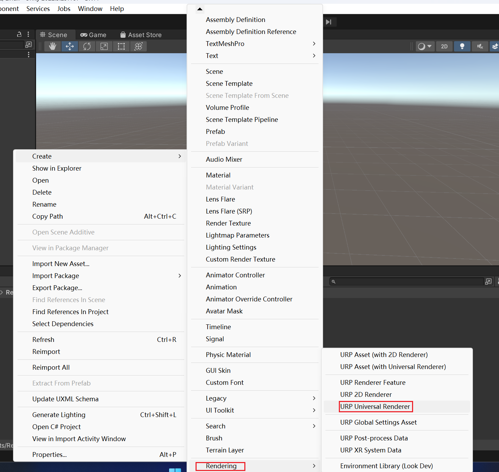
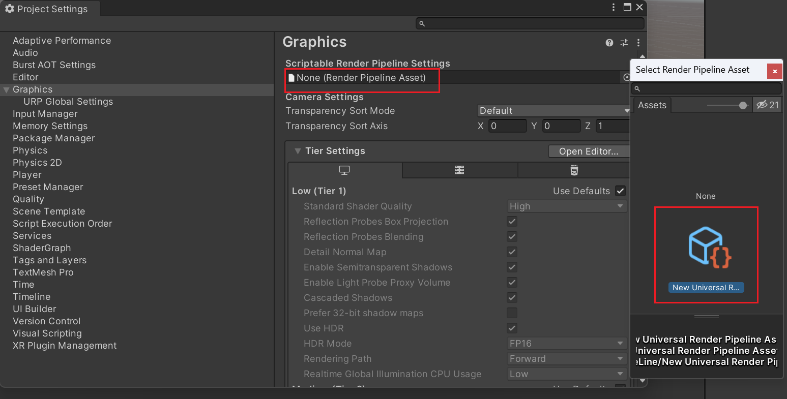

# URP

### Universal Render Pipeline

Universal：代表通用性，可适配多平台
Render Pipeline：表明其本质是渲染管线技术

### 添加并切换URP渲染器
  

  在projectSettings中修改
  

### 部分重要代码
GetVertexPositionInputs函数位于Core.hlsl文件中
输入模型本地空间坐标positionOS
返回包含四种空间坐标的结构体：
- positionWS: 世界空间坐标
- positionVS: 视图空间坐标
- positionCS: 裁剪空间坐标
- positionNDC: 归一化设备坐标

模型空间→世界空间
世界空间→视图空间
视图空间→裁剪空间

URP中的顶点着色器输出结构体与Built-in渲染管线基本相同，只是名称不同

### 数据类型变化

 URP中已弃用fixed类型，只保留half和float
位置/UV坐标使用float
其他情况使用half