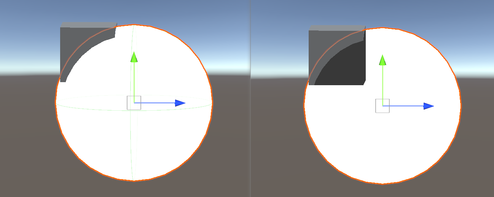
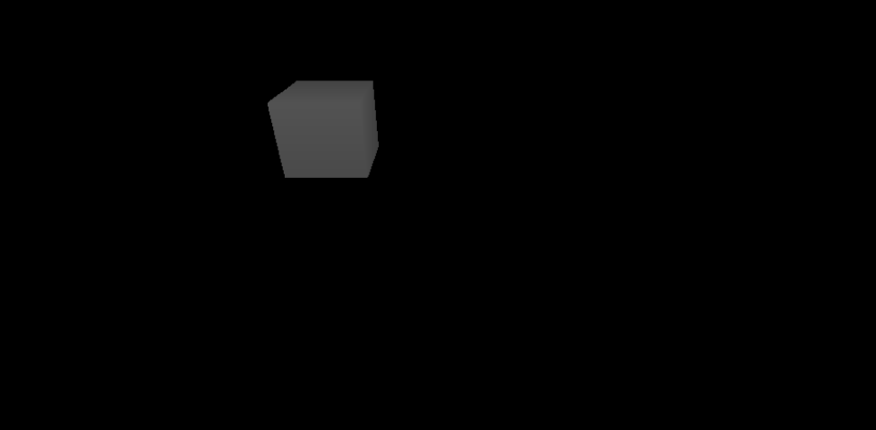
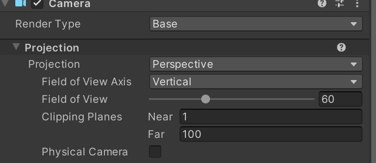
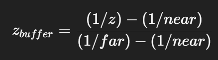
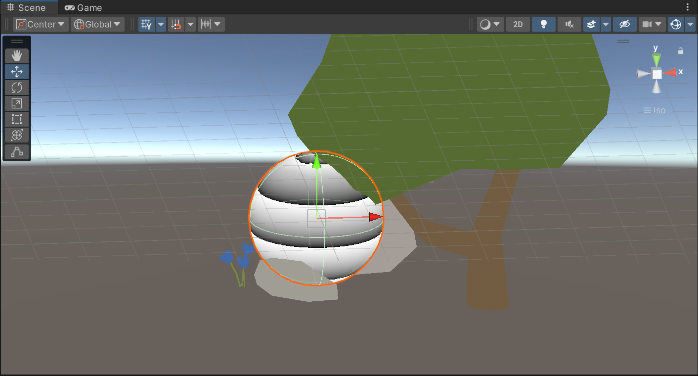
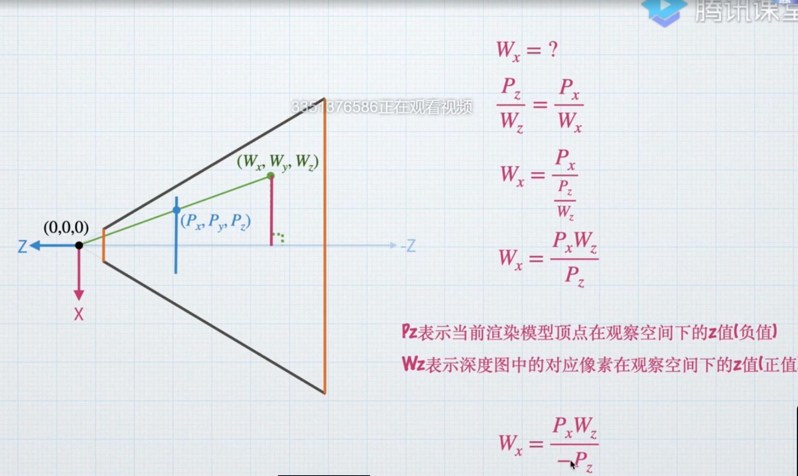
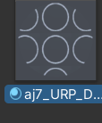
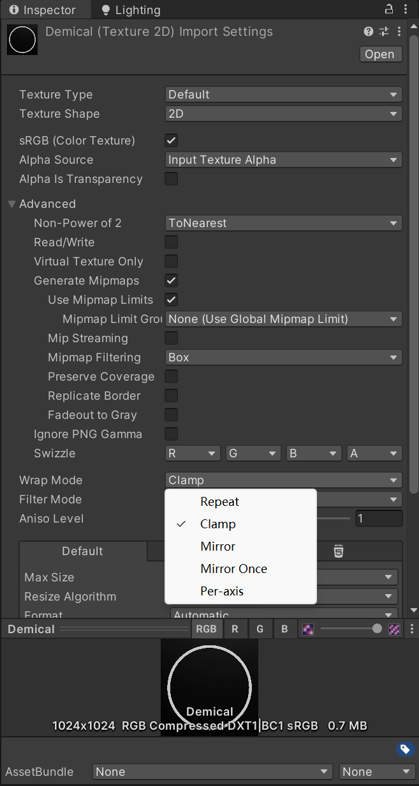
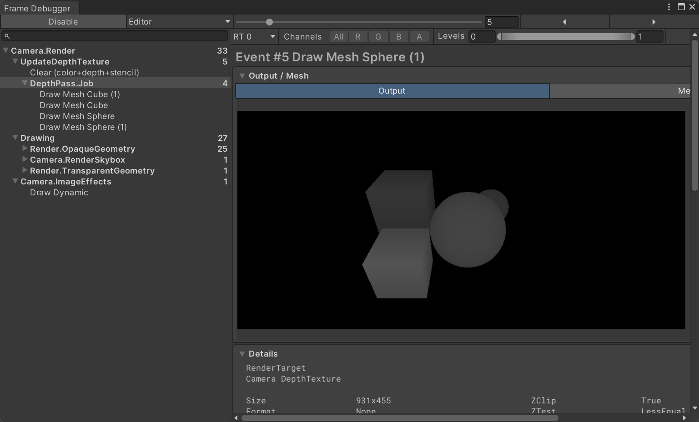

## URP下的抓屏
在BuildIn下，应该使用grabpass

在URP下打开Opaque Texture
  
```C
TEXTURE2D(_CameraOpaqueTexture); 
SAMPLER(sampler_CameraOpaqueTexture); 

...

frag(){
    ...
//Opaque Tex
half4 opaqueMap = SAMPLE_TEXTURE2D(_CameraOpaqueTexture, sampler_CameraOpaqueTexture, screenUV);
return 1-0.3*opaqueMap;//只为了看效果使用该公式
}
                
```
### 降采样
  


## 能量罩

### 交接处高亮
虽然我使用的深度图在frame debugger中是draw procedual，老师的则是draw dynamic，但还是可以照常使用贴图并测试
```C
half4 frag (Varyings i):SV_Target
{
    float2 screenUV = i.positionCS.xy / _ScreenParams.xy;
    half4 depthMap = SAMPLE_TEXTURE2D(_CameraDepthTexture, sampler_CameraDepthTexture, screenUV);
    half depth = LinearEyeDepth(depthMap.r, _ZBufferParams);
    return depth;
}
```
右图为反映深度图的贴图
  
### Q1
在做深度图的时候，相机的clipping planes非常重要，因为float浮点数有精度问题，只在靠近0的时候特别精确否则会导致相机深度图全部呈现黑色
  

  

在 Unity（尤其是 URP）中，_CameraDepthTexture 保存的是 非线性深度值（通常在 0 到 1 之间）：
绝大多数的“深度分辨率”集中在 摄像机近裁剪面（near plane）附近；
  

离摄像机越远，深度变化越不明显。

如果你的 near plane 很小（例如 0.1）而 far plane 很大（例如 1000），那么几乎所有的像素深度值都会非常接近 1，看起来几乎全黑。

举例：

    near = 0.1  
    far  = 1000

一个距离为 1 的物体，其线性深度是 0.001，
但经过非线性映射后，它的深度纹理值大约是 0.9；
一个距离为 10 的物体，值大约是 0.99；
而 100 米远的物体接近 1.0。

所以只有调节,缩小 Far Clip Plane（例如从 1000 → 100），增大 Near Clip Plane（例如从 0.1 → 1），才能得到正常的```_CameraDepthTexture```

### Distort扭曲效果
```c=frac(i.uv.y*5+_Time.y);```

作用：首先制作一个类似于sin的循环效果，我们用frac函数来实现，另外通过*5来提高这种效果，最后加上时间流动制造动态效果
  


### 贴花Decal

  

技术实现
- 选择深度值较低的点（更"近"的表面）

- 避免贴花与场景对象穿插

- 获取场景中每个像素点的世界坐标

- 转换到面片模型的本地空间

- 用转换后的坐标作为UV采样贴图
实现
```C#
half4 frag (Varyings i):SV_Target
{
  half4 c;
  float2 screenUV = i.positionCS.xy / _ScreenParams.xy;

  half depthMap = SAMPLE_TEXTURE2D(_CameraDepthTexture, sampler_CameraDepthTexture, screenUV);
    
  //片段对应深度图中的像素在观察空间下的z值
  half depthZ = LinearEyeDepth(depthMap, _ZBufferParams);

  float4 depthVS =1;
  depthVS.xy=i.positionVS.xy*depthZ/-i.positionVS.z;
  depthVS.z=depthZ;
  //构建深度图上的像素在世界空间下的坐标
  float3 depthWS =mul(unity_CameraToWorld,depthVS);
  float3 depthOS =mul(unity_WorldToObject,float4(depthWS,1));
  //若为面片则.xy，若为方块则.xz
  float2 uv =depthOS.xz/_DecalScale+0.5;


  half4 mainTex=SAMPLE_TEXTURE2D(_MainTex,sampler_MainTex,uv);

  c=mainTex*_Color;
  return c;

            }
```
### Q2

```float2 uv =depthOS.xz/_DecalScale+0.5;```,若贴花的承载物为面片则.xy，若为方块则.xz ，这是为什么 ?

      1️⃣ depthOS.xy —— 沿 Z 轴方向投射

      当你用 .xy 时： 意味着你用的是模型的 X 轴、Y 轴 坐标来采样贴图。

      所以贴图是“贴”在 Z 轴垂直的面上。

      换句话说，贴花沿着 Z 轴投射。

      📘举例：

      你有一面“竖直的墙”，法线方向是 Z+。
      你想往它表面“贴”一个贴纸（Decal），那你就用 .xy。

      2️⃣ depthOS.xz —— 沿 Y 轴方向投射

      当你用 .xz 时： 你取的是物体坐标的 X 轴、Z 轴 分量。

      所以贴图是“贴”在 Y 轴垂直的面上（也就是地面）。

      换句话说，贴花沿着 Y 轴投射。

      📘举例：

      你要做一个“血迹”、“阴影”、“投射光斑”贴在地上，
      通常地面是 Y=0 平面，这时你就用 .xz。


| 贴花类型                 | 推荐坐标分量 | 投射方向 |
| ------------------------ | ------------ | -------- |
| 墙面贴花（如海报）       | `.xy`        | Z 轴方向 |
| 地面贴花（如血迹、阴影） | `.xz`        | Y 轴方向 |
| 侧面贴花（如门边、墙角） | `.yz`        | X 轴方向 |

### Q3

为什么材质上有那么多的贴图案，而非只有一个？

  

关键在于以下代码：
```C#
float2 uv = depthOS.xy + 0.5;
half4 mainTex = SAMPLE_TEXTURE2D(_MainTex, sampler_MainTex, uv);
```
把世界空间点投回物体坐标，但范围完全不确定。
如果模型比较大，比如在世界坐标中有多个单位大小，那么 depthOS.xy 的值可能是：[-5,5]。

这样采样 _MainTex 时，UV 会超出 [0,1] 区间，Unity 会自动“平铺”采样，于是图案被重复很多次。

关键是将纹理的形式改为```clamp```而非```repeat```

  
  
为了从根本上解决这个问题，我们直接在shader中修改采样器，使得采样方式强制为clamp即可
```C#
            #define smp _linear_clamp
            SAMPLER(smp);  
```

### BuildIn 管线下的贴花Decal
  

  在builIn 管线下地面会没有深度图。原因是缺少了一个ShadowCaster Pass，
  或使用Fallback "Diffuse"的简便方法
