# Water

## 深度
水的深度（越靠近水面颜色越深，反之越浅，越远越浅）

我们使用URP深度图来做。

首先在URP 资源下，打开depth和opaque图。

！！！！！！！！！！！！！！！！！！！！！！！！！！！！！！！！！！！！

写在最前面：做透明水面（尤其还要采样场景深度做水深差）时，**ZWrite Off 基本是必选项！！！！！！！！！**

！！！！！！！！！！！！！！！！！！！！！！！！！！！！！！！！！！

因为水是 Transparent（透明队列），它的正确渲染逻辑是：
- 先画不透明物体（写深度）
- 再画透明水面（只做颜色混合，不写深度）
如果水面 `ZWrite On`，它会把“水面这层”写进深度缓冲，后果是：
- 水面之后要渲染的像素/物体（尤其是透明/后处理/某些排序情况下的物体）会被 深度测试挡住
- 要靠 `_CameraDepthTexture` 做“水下渐变”，但被水面深度挡掉的那些像素看不到/不参与，视觉上就会变成**一片黑、没有渐变或断层**

更直白一句：**透明水要“看得到后面的东西”，就不能占用深度**。


```glsl
half depthTex=SAMPLE_TEXTURE2D(_CameraDepthTexture,sampler_CameraDepthTexture,screenUV);

//水体对应深度图中的像素在观察空间下的z值
half depthScene = Linear01Depth(depthTex, _ZBufferParams);
half depthWater =depthScene+i.positionVS.z;
```

### Linear01Depth和LinearEyeDepth的区别

**核心概念**

深度纹理（_CameraDepthTexture）存储的是非线性深度值（通常在 0-1 之间），精度分布不均匀：
- 近处精度高，远处精度低
- 大部分深度值集中在近裁剪面附近

这两个函数用于将非线性深度转换为线性深度，便于计算。


**Linear01Depth**

```glsl
half depthScene = Linear01Depth(depthTex, _ZBufferParams);
```
返回值：0-1 范围的线性深度
- 0 = 相机位置（近裁剪面）
- 1 = 远裁剪面

用途：
- 用于归一化计算
- 用于颜色插值（如深度雾效）
- 用于深度比较（0-1 范围便于比较）

**LinearEyeDepth**

返回值：**观察空间**下的线性深度值（单位：距离单位，不是 0-1）
- 返回的是从相机到物体的实际距离
- 范围取决于相机的近/远裁剪面设置

```glsl
half depthTex = SAMPLE_TEXTURE2D(_CameraDepthTexture, sampler_CameraDepthTexture, screenUV);
half depthEye = LinearEyeDepth(depthTex, _ZBufferParams);
// depthEye 范围: [Near, Far]（例如 0.1 到 1000）
// 返回的是实际距离值
```

用途：
- 需要实际距离时使用
- 计算水面深度差
- 基于距离的效果（如距离衰减）

效果如下：

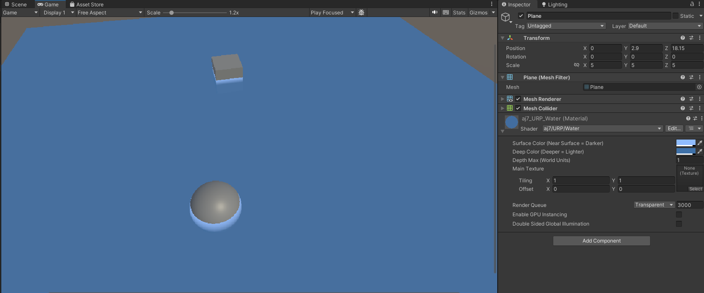

## 泡沫(卡通)

```glsl
//制作一个边缘
half foamMask =step(foamRange,foamTex);
half4 foam = foamMask * _FoamColor;
return foam + WaterColor;
```

- `foamRange =depthWater * _FoamRange;`：把“水深差”映射成一个阈值（越深阈值越大）
- `foamTex`：泡沫噪声（0~1）
- `pow(foamTex, foamNoise)`：调噪声分布（让亮点更集中/更稀疏）
- `step(foamRange, foamTex)`：硬阈值，噪声超过阈值就出泡沫（1），否则没有（0），这一步是关键

这会在水-物体交界附近形成“碎边线”


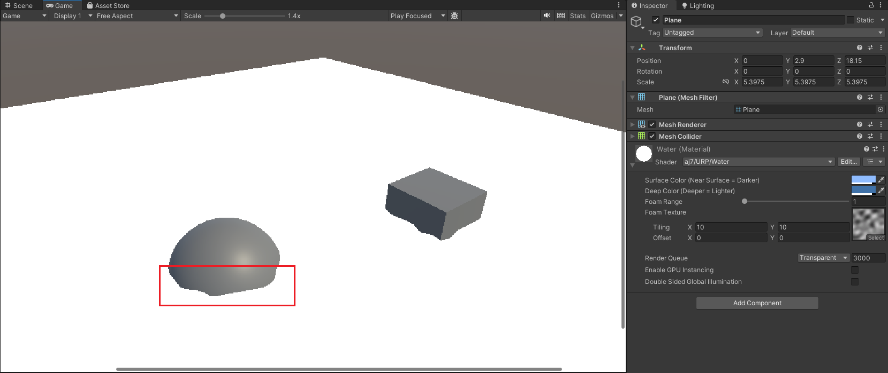

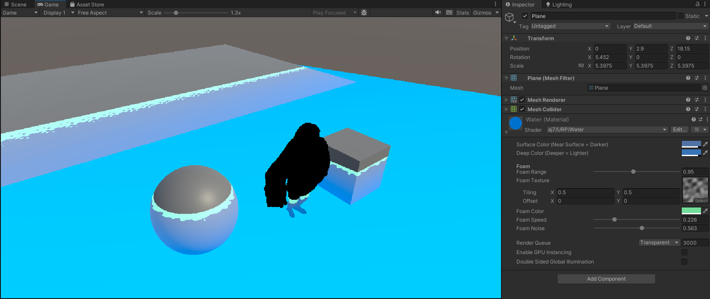


## 扭曲
目标：只让**水面下方**的画面产生折射/扰动（看起来像水在晃）。

原理：先用一张噪声/扭曲贴图得到“偏移后的屏幕UV（distortUV）”，再用抓屏 `_CameraOpaqueTexture` 去采样这个 UV。为了避免水面上方也被扭曲，需要再用深度判断：若扭曲后的采样点不在水下（`depthDistortWater < 0`），就回退到原始 `screenUV`（不扭曲）。

```glsl
//得到扭曲坐标
half4 distortTex = SAMPLE_TEXTURE2D(_DistortTex,sampler_DistortTex,i.uv.xy);
float2 distortUV=lerp(screenUV,distortTex.xy,_Distort);
//抓屏
half depthDistortTex = SAMPLE_TEXTURE2D(_CameraDepthTexture,sampler_CameraDepthTexture,distortUV).r;
half depthDistortScene = LinearEyeDepth(depthDistortTex, _ZBufferParams);
half depthDistortWater = depthDistortScene + i.positionVS.z;
//判断采样点样点在不在水下
float2 opaqueUV = depthDistortWater < 0 ? screenUV : distortUV;
half4 cameraOpaqueTex = SAMPLE_TEXTURE2D(_CameraOpaqueTexture,sampler_CameraOpaqueTexture,opaqueUV);
```

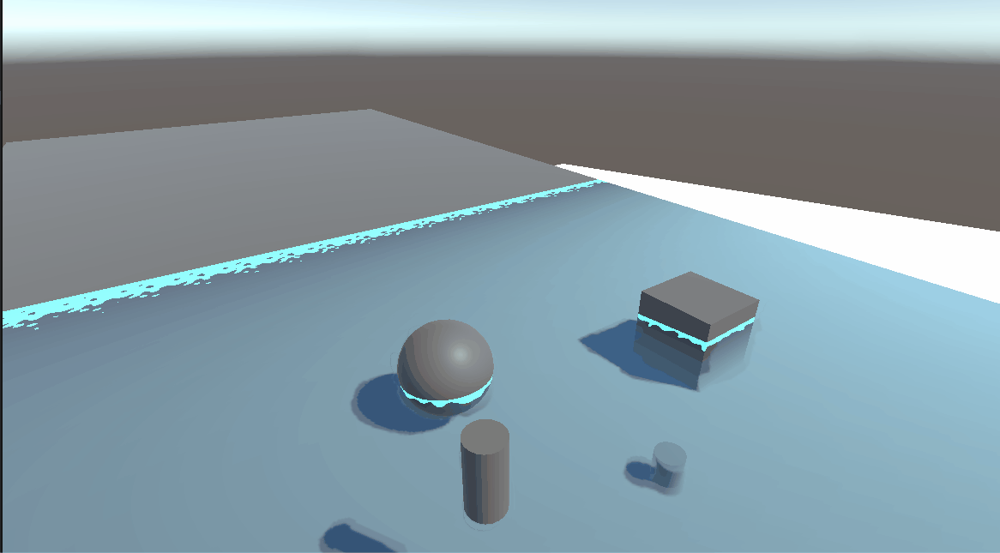

## 高光
加一个Blinn-Phong，除此之外用发现贴图来制造波光粼粼的水面感。这里可以直接和扭曲贴图共用一张法线贴图。给两个Tex相反的流动方向

```glsl

//vert中计算得到水下扭曲纹理的流动UV
//o.normalUV.xy=TRANSFORM_TEX(v.uv,_NormalTex)+_Time.y*_WaterSpeed*float2(1,1);
//o.normalUV.zw=TRANSFORM_TEX(v.uv,_NormalTex)+_Time.y*_WaterSpeed*float2(-1,1);

half4 normalTex1 = SAMPLE_TEXTURE2D(_NormalTex,sampler_NormalTex,i.normalUV.xy);
half4 normalTex2 = SAMPLE_TEXTURE2D(_NormalTex,sampler_NormalTex,i.normalUV.zw);
half4 normalTex = normalTex1*normalTex2;

//2、水的高光
//Specular=SpecularColor*Ks*pow(max(0,dot(N,H)),shineness)
half3 N = normalize(i.normalWS);
N=normalTex;
//URP获取平行主灯
Light light = GetMainLight();
half3 L = light.direction;
half3 V = normalize(_WorldSpaceCameraPos.xyz - i.positionWS.xyz);
half3 H = normalize(L+V);
half4 specular = _SpecularColor * _SpecularIntensity * pow(saturate(dot(N,H)),_SpecularSmoothness);
```
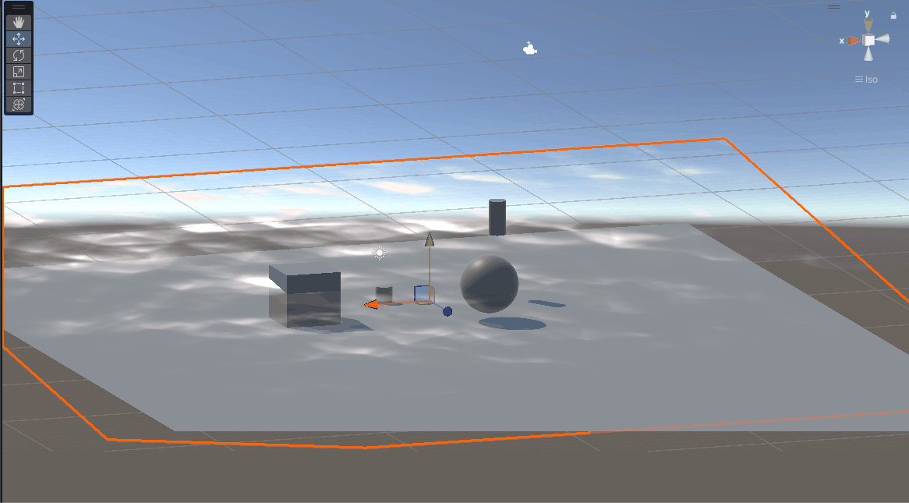


### 反射

简单，加上一个CUBEMAP，采样贴图

然后给反射加上菲涅尔效应
越垂直视线越弱，越平行实现越强

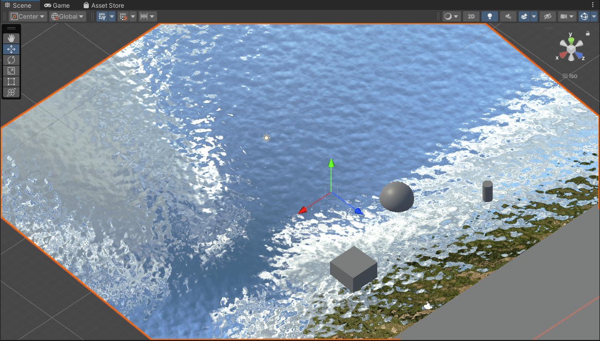

加上菲涅尔后
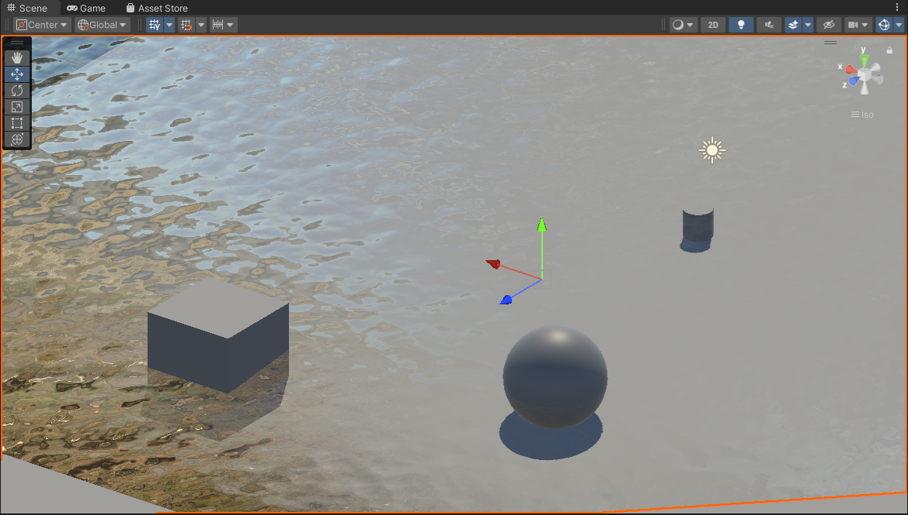

目前这个效果已经很不错了，可以拿来做效果
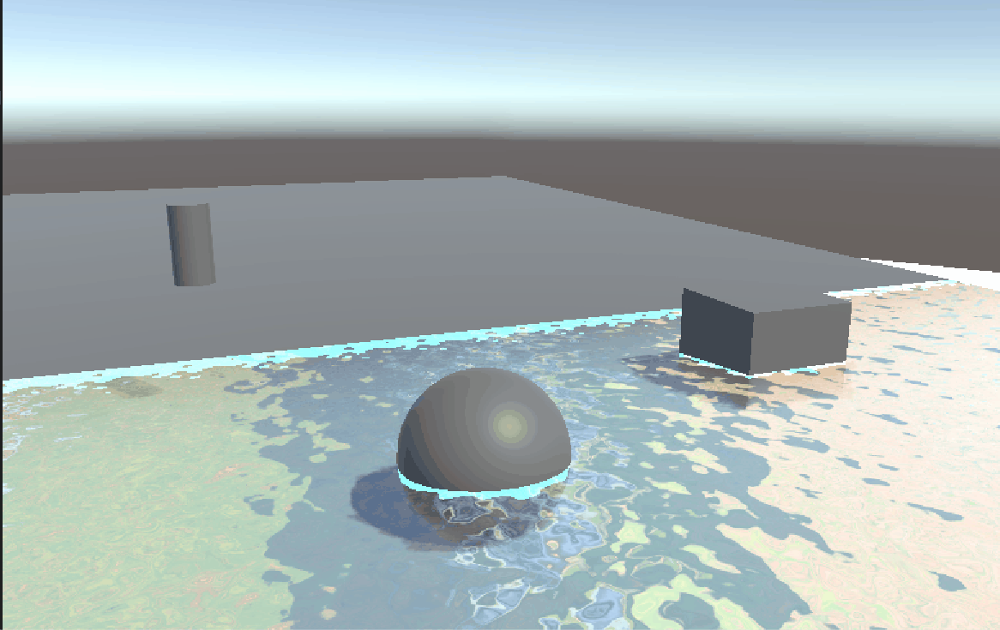

### 水的焦散
利用深度贴花

```glsl
float4 depthVS=1;
depthVS.xy=i.positionVS.xy*depthScene/-i.positionVS.z;
depthVS.z=depthScene;
float3 depthWS=mul(unity_CameraToWorld,depthVS).xyz;
```
`i.positionVS` 是水面当前像素在观察空间的位置。注意：
- 在 Unity 观察空间里，相机朝 -Z 看，所以水面点通常 i.positionVS.z < 0。
- `i.positionVS.xy / -i.positionVS.z` 可以理解为：这条视线方向在 VS 下的“归一化投影比例”（相当于把点投到 `z=−1` 的平面上得到的比例）。

接着

- 用 unity_CameraToWorld 把它变成世界坐标 depthWS
- 再用 depthWS.xz（或 xy）当作 UV 去采样焦散贴图，让焦散“贴在水底/物体表面”上

使用2张纹理来制造动态的随机性，但关键的是这里使用`causticTex=min(causticTex1,causticTex2);`,取min而不是multiply！！！！！这是一个小技巧
```glsl
float2 causticUV1=depthWS.xz*_CausticTex_ST.xy+_CausticSpeed*_Time.y;
half4 causticTex1=SAMPLE_TEXTURE2D(_CausticTex,sampler_CausticTex,causticUV1);
float2 causticUV2=depthWS.xz*_CausticTex_ST.xy+_CausticSpeed*_Time.y*float2(-1.07,1.13);
half4 causticTex2=SAMPLE_TEXTURE2D(_CausticTex,sampler_CausticTex,causticUV2);
//为什么用取小？
half4 causticTex=min(causticTex1,causticTex2);
half4 caustic=causticTex*_CausticIntensity;
```
效果如下：

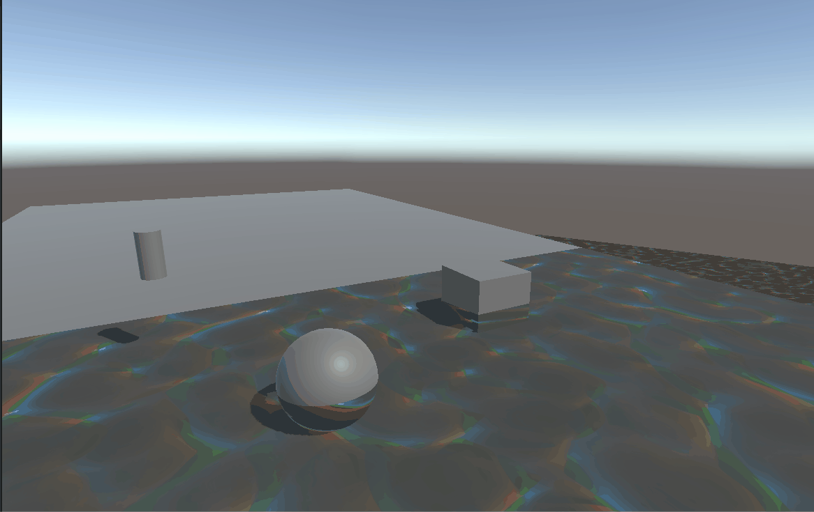

### 整合

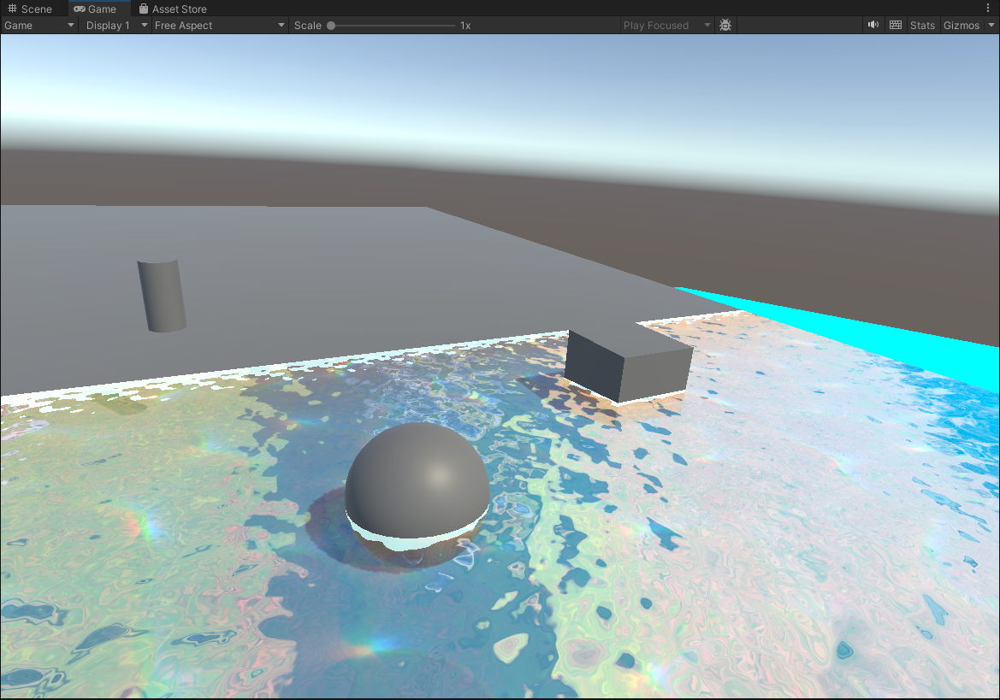

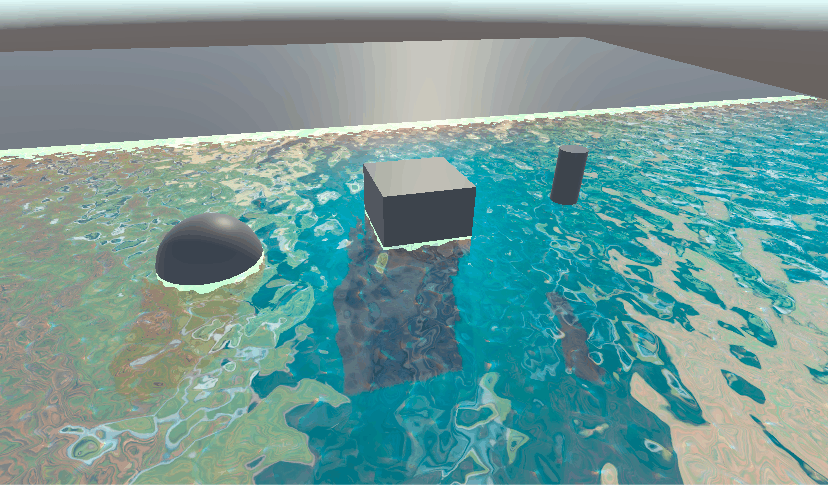


### 顶点
[使用顶点变换制作波浪](https://catlikecoding.com/unity/tutorials/flow/waves/)

加上3层gestner波改变顶点着色器的效果：


同时添加了可以控制岸边泡沫的部分：
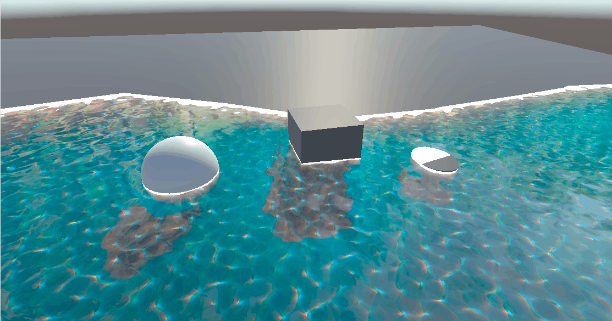


## Mesh生成WaterPool

### 具体怎么做（按我这套网格脚本）
- **1）场景准备**：新建空物体 `GridRuntime`，挂 `RuntimeWaterGridController`（可再挂 `RuntimeGridPlacementOnGUI` 用来点格子）。
- **2）参数填写**（`RuntimeWaterGridController`）
  - **gridOrigin**：网格左下角的世界坐标
  - **gridSize**：列(x) / 行(z)
  - **cellWorldSize**：每个地块的边长（米）
  - **waterHeight**：水体高度（米）
  - **waterTileSize**：StylisedWater 的 `TileSize`（想“一块地=一整块水面”就设为 `cellWorldSize`）
  - **waterMaterial**：水材质（给 `MeshRenderer.sharedMaterial`）
  - **placePrefab / placeOffset**：要生成的物体预制体与偏移（可选）
- **3）运行交互**：
  - 点格子选中行列 → 调 `PlaceObject(col,row)` 在该地块中心实例化物体
  - （可选）调 `ToggleCell(col,row)` 创建/删除该格子的 `WaterVolumeBox`

### 原理（为什么能“按行列生成水块/物体”）
- **行列 → 世界坐标**：把格子当作平面网格，格子中心点：
  - `center = gridOrigin + (col * cellWorldSize + cellWorldSize/2, 0, row * cellWorldSize + cellWorldSize/2)`
- **生成水块（StylisedWater）**：
  - `new GameObject` → `AddComponent<WaterVolumeBox>()`
  - 设置 `Dimensions = (cellWorldSize, waterHeight, cellWorldSize)`、`TileSize = waterTileSize`
  - 给 `MeshRenderer` 赋 `waterMaterial`
  - 最后 `Rebuild()`：根据 tiles 生成网格 Mesh（顶点/三角形/UV/颜色）
- **生成物体**：`Instantiate(placePrefab, center + placeOffset, ...)`；用字典按 cell 记录，支持重复生成时替换/清理。

### C#里怎么写（最小实现思路）
- **数据结构**：用 `Vector2Int` 表示格子坐标，用 `Dictionary<Vector2Int, T>` 记录“某格子已生成的对象”，方便切换/清理。
- **核心代码骨架**（精简示例）：

```csharp
public Vector2Int gridSize = new(8, 8);
public float cellWorldSize = 2f;
public Vector3 gridOrigin;
public Material waterMaterial;
public float waterTileSize = 2f;
public float waterHeight = 1f;
public GameObject placePrefab;

Dictionary<Vector2Int, Bitgem.VFX.StylisedWater.WaterVolumeBox> waters = new();
Dictionary<Vector2Int, GameObject> placed = new();

Vector3 CellCenter(Vector2Int cell)
{
    return gridOrigin + new Vector3(
        cell.x * cellWorldSize + cellWorldSize * 0.5f,
        0f,
        cell.y * cellWorldSize + cellWorldSize * 0.5f
    );
}

void CreateWater(Vector2Int cell)
{
    var go = new GameObject($"Water_{cell.x}_{cell.y}");
    go.transform.position = CellCenter(cell);

    var box = go.AddComponent<Bitgem.VFX.StylisedWater.WaterVolumeBox>();
    box.Dimensions = new Vector3(cellWorldSize, waterHeight, cellWorldSize);
    box.TileSize = Mathf.Max(0.1f, waterTileSize);

    var mr = go.GetComponent<MeshRenderer>();
    mr.sharedMaterial = waterMaterial;

    box.Rebuild(); // 关键：生成 Mesh
    waters[cell] = box;
}

void PlaceObject(Vector2Int cell)
{
    var pos = CellCenter(cell);
    var go = Object.Instantiate(placePrefab, pos, Quaternion.identity);
    placed[cell] = go;
}
```
- **要点**：
  - Unity 里通常把这些写在 `MonoBehaviour` 里，字段设成 `public`（或 `[SerializeField]`）便于 Inspector 配置。
  - `Rebuild()` 代替你自己写“顶点/三角形”流程：StylisedWater 在内部把 tile 体素转成 Mesh。
  - “格子索引越界”要先判断（`cell.x`/`cell.y` 在 `gridSize` 范围内），避免创建到不该创建的位置。

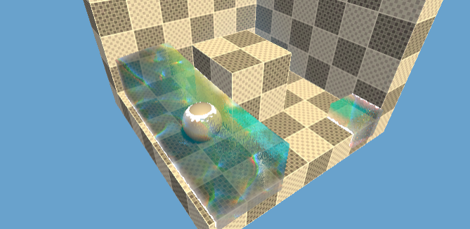
  

## Q&A
1. `half foamTex=SAMPLE_TEXTURE2D(_FoamTex,sampler_FoamTex,i.position.xy);`和`half foamTex=SAMPLE_TEXTURE2D(_FoamTex,sampler_FoamTex,i.uv);`的区别是什么?

`i.position.xy`采样

**区别本质是：用“世界坐标当 UV” vs 用“模型 UV 当 UV”，会导致泡沫纹理“贴在世界上”还是“贴在模型上”。**
效果：
- 泡沫图案像“铺在地面/水面世界里”，物体移动、缩放水面模型时，泡沫**不会跟着模型 UV 拉伸**，更像真实的“世界空间噪声”

- 但因为世界坐标不是 0~1，通常要自己做 **缩放/平铺**（比如乘一个 tiling，再 frac），否则会采样得很乱/频率不受控
(需要通过Tiling控制泡沫大小和移动速度)
`i.uv`采样

效果：

- 泡沫严格跟着模型 UV 走：模型缩放/UV 拉伸会导致泡沫一起被拉伸或压缩
- 如果水面是一个 plane 且 UV 规整，这种方式简单直观；但换成不规则网格容易变形


2. **我的问题是抓屏怎么只抓水面下的部分，而不是把整个屏幕都抓了？**

URP 的 _CameraOpaqueTexture（或 SampleSceneColor）是相机在某个时刻把整张屏幕渲染结果拷贝出来的纹理，它不可能只生成“水面下的区域”。

能做的是：采样时只让“水面下方的像素”使用抓屏颜色，水面上方不使用（或直接返回水面自身颜色）——也就是“只在水面下显示抓屏”。