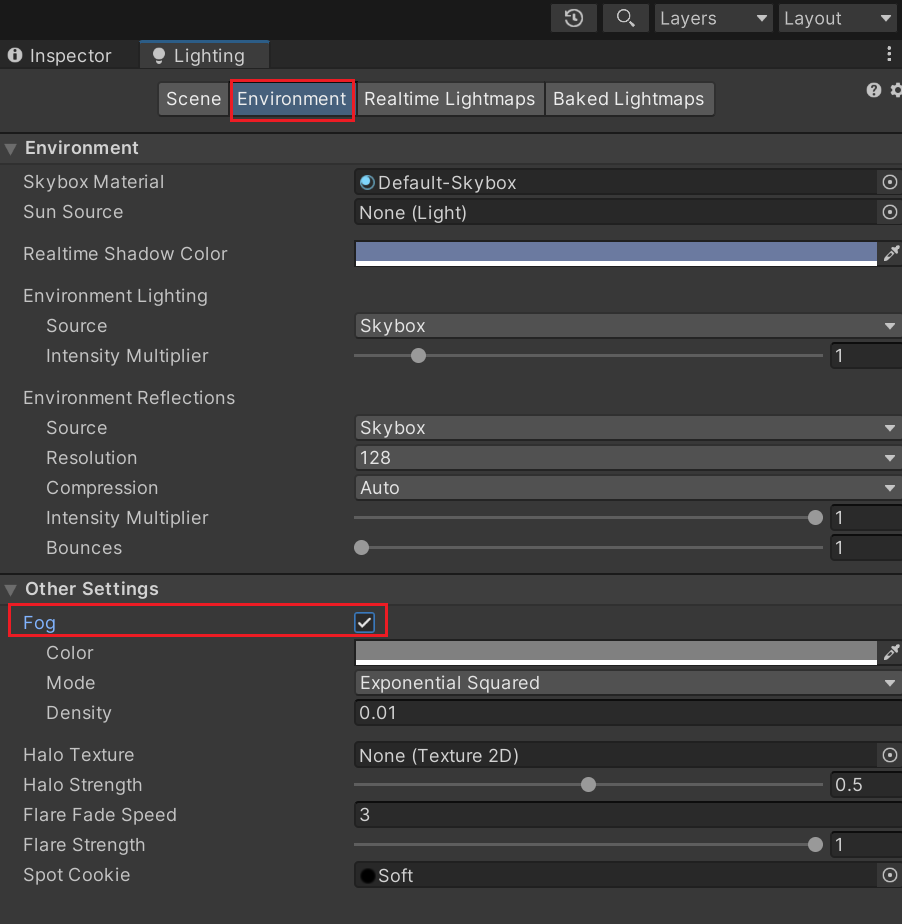
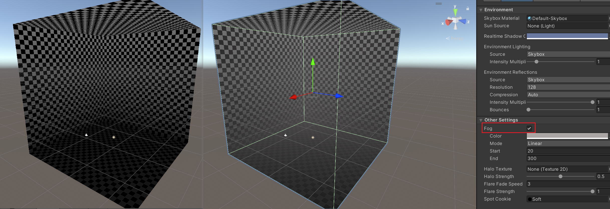

# 雾效的混合公式 
### 原理
**基本公式：最终颜色 = lerp(物体颜色，雾效颜色，雾效混合因子)**

物体颜色：
```unity_FogColor```

- 混合因子：
  * 包含物体离视角的距离（决定雾效强度）
  * 包含雾的浓度（决定雾效的浓淡程度）
- 实现原理：通过差值计算在物体颜色和雾效颜色之间进行混合
  

#### 线性雾效衰减 

公式：
$$ fogFactor=\frac{end-z}{end-start} $$

参数说明：
- start：雾开始的位置
- end：雾结束的位置
- z：物体的深度值（这里指物体到摄像机的距离）

特点：衰减呈直线变化，在Unity中可调节start和end参数

#### 指数雾效衰减 
1) 普通指数衰减：
公式：
$$ fogFactor=e^{-density·z}$$
参数：仅需调节density（雾的浓度）
特点：衰减曲线呈指数下降

2) 平方指数衰减：
公式：
$$ fogFactor=e^{-(density·z)^2}$$
特点：衰减曲线更陡峭
区别：指数衰减不需要设置start和end参数，通过浓度控制整体效果

## 打开雾效
网上unity雾效教程说勾选 Windows->Rendering->LightingSettings->OtherSettings->Fog 即可开启unity 默认雾效，但unity更新后，需要在Windows->Rendering->LightingSettings->Environment->OtherSettings->Fog 中才能找到



## 实现方法
需要实现远处的物体颜色与雾色集合，变得模糊。
共有三种
``` C#
  struct v2f
  {
      float2 uv : TEXCOORD0;

      float4 vertex : SV_POSITION;
      float3 worldPos : TEXCOORD2;
      //方法一：自定义雾效插值器
      float fogFactor: TEXCOORD3;
      //方法二：等于开启雾效时定义一个float类型的变量fogCoord
      //UNITY_FOG_COORDS(1)
      //方法三
      //无需额外定义雾效插值器，但需要将worldPos定义为float4，将计算出来的fogFactor存入worldPos.w中

  };
```
以下为第一种自定义的写法，用于展示原理
``` C#
  v2f vert (appdata v)
  {
      v2f o;
      o.vertex = UnityObjectToClipPos(v.vertex);
      o.uv = TRANSFORM_TEX(v.uv, _MainTex);
      o.worldPos = mul(unity_ObjectToWorld,v.vertex);
      float z= length(o.worldPos-_WorldSpaceCameraPos);//计算物体位置到摄像机的距离
          // x = density / sqrt(ln(2)), useful for Exp2 mode
          // y = density / ln(2), useful for Exp mode
          // z = -1/(end-start), useful for Linear mode
          // w = end/(end-start), useful for Linear mode
          //float4 unity_FogParams;以上为其4个参数含义，可以用于获取end start的值
      #if defined(FOG_LINEAR)
          o.fogFactor= saturate( z*unity_FogParams.z + unity_FogParams.w);//不能直接-z！！！！
      #elif defined(FOG_EXP)   
          o.fogFactor=exp2(-z*unity_FogParams.y);
      #elif defined(FOG_EXP2)
          
          o.fogFactor=exp2(-pow(z*unity_FogParams.x,2));
      #endif
      //Unity内部雾效方法
      //UNITY_TRANSFER_FOG(o,o.vertex);
      return o;
  }
```
对物体颜色和雾色做线性插值，是三种雾效共同的做法
```    c#
  fixed4 frag (v2f i) : SV_Target
  {
    // sample the texture
    fixed4 c =1;

    #if defined (FOG_LINEAR)||(FOG_EXP)||(FOG_EXP2)  
        c=lerp( unity_FogColor,c,i.fogFactor);
    #endif

    // apply fog unity 内部方法
    //UNITY_APPLY_FOG(i.fogCoord, c);
    return c;
  }
```


## URP下的雾效
**步骤**

1.加变体
```#pragma multi_compile_fog```

2.顶点着色器中计算雾效因子
```half fogFactor;```

```o.fogFactor = ComputeFogFactor(o.vertex.z);```

3.片元着色器中混合雾效```o.rgb = MixFog(o.rgb, i.fogFactor)```


在lighting-environment中打开雾效：



### 精度修饰符real
为条件编译而生，提供跨平台精度适配方案，在性能受限平台自动降级为half精度，根据运行平台自动选择half或float精度返回雾效因子


### Q & A
在computeFogFactor中有这句话 z= UNITY_Z_FAR_FROM_LIPSPAE(z)，这句话什么意思，为什么要有这句话，传入的z不就已经是物体的深度了吗?

UNITY_Z_0_FAR_FROM_CLIPSPACE(z) 的作用是**将裁剪空间深度值标准化为 [0,1] 范围**，其中 0 表示近裁剪面，1 表示远裁剪面。（因为某些平台使用反向Z（1=近，0=远），需要做标准处理：转换为 [0,1] 范围）

**近裁剪面 (Near Clipping Plane)**

- 位置：离相机最近的平面

- 作用：剔除离相机太近的物体（避免渲染问题）

- 默认值：通常很小（如0.3单位）

**远裁剪面 (Far Clipping Plane)**

- 位置：离相机最远的平面

- 作用：剔除离相机太远的物体（优化性能）

- 默认值：通常较大（如1000单位）

      3D世界空间 → 视图空间 → 裁剪空间 → 屏幕空间
                            ↑
            近/远裁剪面在这里起作用
            

        相机位置
        │
        │   近裁剪面 (Near) ← 这里开始渲染
        │   [可见区域：视锥体]
        │   远裁剪面 (Far)  ← 这里停止渲染
        │
        ▼
        
```C
// 在裁剪阶段，GPU会自动剔除：
if (vertexCS.z < nearClipPlane || vertexCS.z > farClipPlane) {
    discard; // 不渲染这个片段
}
```