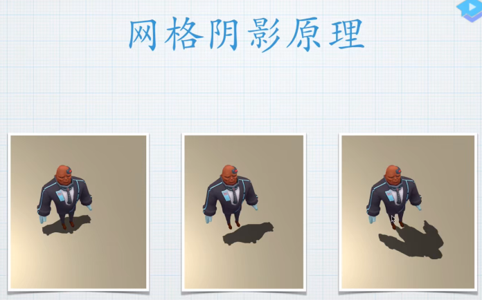
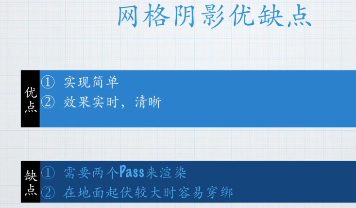
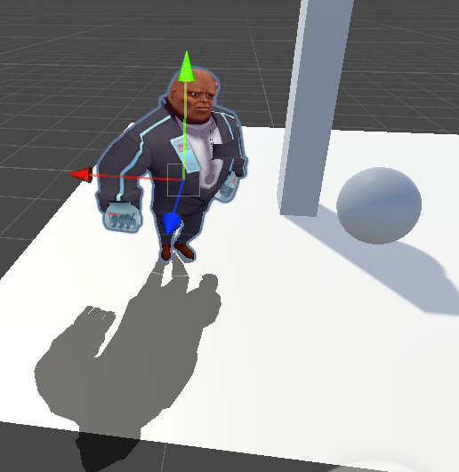
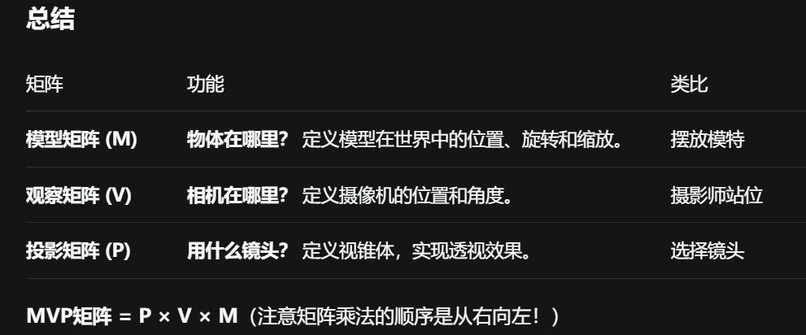
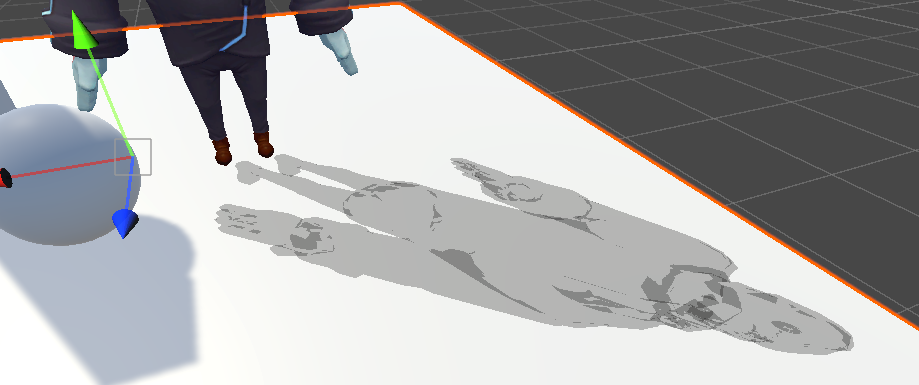

# 网格阴影

### 需求分析
 
* **实现原理**：将角色模型沿世界空间Y轴压缩成面片，赋予固定颜色后移动到角色脚底位置

**“压扁”:**   ``` worldPos.y = _Shadow.y; ```


这是最关键的一步：它强行把物体上每一个顶点的Y坐标都设置成了一个固定值 _Shadow.y。
想象一下：一个复杂的角色模型，它所有的顶点，无论是头部的、手臂的还是脚部的，全都被拉到了同一个水平面上。这一步之后，这个3D模型就变成了一个完全平坦的、紧贴在地面（_Shadow.y 定义的高度）上的“剪纸”或“皮影”。

* **偏移处理**：在XZ平面移动阴影面片时，根据顶点Y轴高度进行动态偏移（脚底偏移量最小，高处偏移量最大）  

* **数学关系**：偏移量 = 基础偏移 × y_height，实现阴影随高度变化的渐变效果
 
**“扭曲”:**  ```worldPos.xz += _Shadow.xz * (worldPosY - _Shadow.y);``` 

 如果只是压扁，那得到的就是一个完全不透光的、僵硬的黑色色块（就像正午的阴影），非常不真实。这一步的目的就是模拟透视效果，让阴影产生“近小远大”的拉伸：

```(worldPosY - _Shadow.y)```：计算这个顶点原始位置离地面的高度。头顶点比脚顶点的高度值更大。

```_Shadow.xz * (...)```：用高度差乘以一个控制缩放程度的系数（_Shadow.xz）。离地面越远的顶点（如头部），其偏移量就越大。

```worldPos.xz += ...```：将偏移量应用到X和Z方向上。结果是，物体的顶部会比底部拉伸得更开。

 

#### 实现效果
 
  

### Q&A

1. **MVP矩阵是什么?**
   
  本地坐标 → (× M矩阵) → 世界坐标 → (× V矩阵) → 观察坐标 → (× P矩阵) → 裁剪坐标
  
  

  ``` C#
  v2f vert(appdata v) 
  {
    v2f o;
    float4 worldPos=mul(,unity_ObjectToWorld,v.vertex);//顶点空间变换到世界
    o.pos=mul(UNITY_MATRIX_VP,worldPos);//世界空间变换到裁剪空间
    //o.pos = UnityObjectToClipPos(v.vertex);// 这内部其实就是 MVP * v.vertex    // 等同于：mul(UNITY_MATRIX_VP, mul(unity_ObjectToWorld, v.vertex));
    return o;
  }
  ```
**之后发生了什么？（透视除法和视口变换）**

1. 透视除法（Perspective Divide）：

- 由GPU自动完成。
- 将裁剪坐标的各个分量（x, y, z）同时除以它的w分量（ homogeneous coordinate）。
- 结果是一个标准化设备坐标（Normalized Device Coordinates, NDC），其x, y, z坐标都在[-1, 1]的范围内。

2. 视口变换（Viewport Transform）：
- 同样由GPU自动完成。
- 将NDC坐标映射到最终的屏幕坐标（Screen Space）（即你的窗口或屏幕的像素位置）。


2.  为什么用模板测试来解决阴影的问题，而不是直接写ZTEST LESS？
  

  非常好的问题！如果只用 ZTest Less，阴影在角色脚部的那些像素会因为深度值与角色太接近而无法通过深度测试（不是更近），或者产生深度冲突导致闪烁。
  
  这涉及到渲染管线中模板测试（Stencil Test） 和深度测试（ZTest/Depth Test） 的根本区别。
  

  简单来说，它们的核心区别是：

| 特性	| 模板测试 (Stencil Test)|深度测试 (ZTest/Depth Test)| 
|--- | --- | --- |
| 目的	| 标记像素，基于用户定义的逻辑	|判断远近关系，基于深度缓冲区的值| 
| 数据	| 8位整数（0-255）的模板缓冲区	|24/32位浮点数的深度缓冲区| 
| 应用	| 特效、遮罩、轮廓、复杂裁剪	| 物体遮挡、前后排序| 

解决方案的核心是：**让阴影不要绘制在它所属的物体本身上**。

**总结**

ZTest（深度测试） 解决的是 “谁在前，谁在后” 的几何空间问题。

Stencil（模板测试） 解决的是 “哪里能画，哪里不能画” 的逻辑标记问题。

对于阴影渲染中的自阴影冲突这个特定问题，它是一个逻辑问题（“不要画在自己身上”），而不是一个几何问题（“谁更近”）。因此，使用模板测试来基于逻辑规则接受或拒绝像素，是比依赖深度值的深度测试更精确、更可靠的解决方案。
```C#
Stencil
{
    Ref 100 // 定义一个参考值 100
    Comp NotEqual // 【模板测试条件】：只有当模板缓冲区中的值 ≠ 100 时，才通过测试
    Pass Replace // 【模板操作】：如果深度测试和模板测试都通过了，则将参考值 100 写入模板缓冲区
}
```